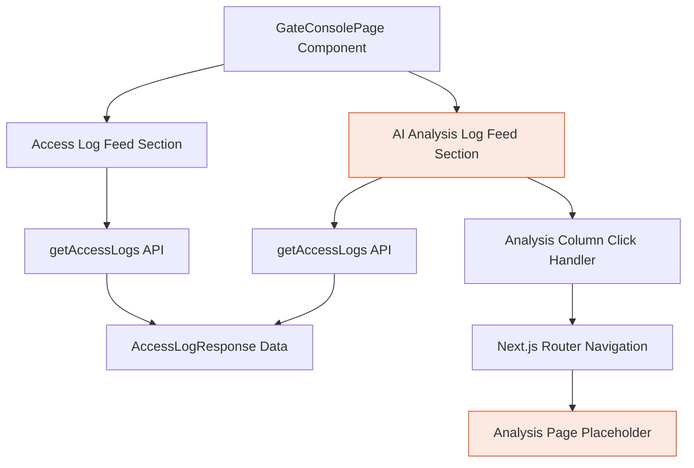
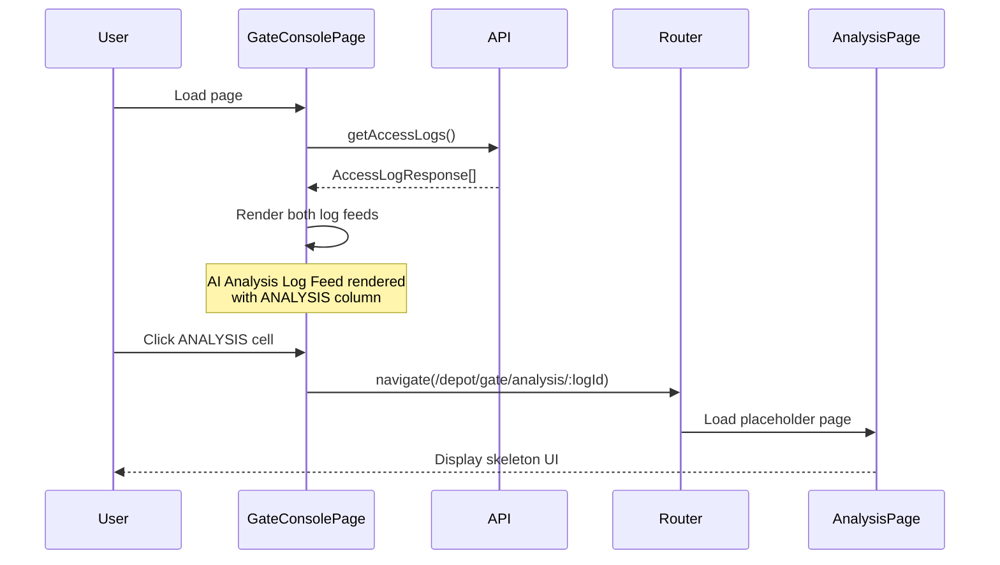

# Design Document: AI Analysis Log Feed

## Overview

The AI Analysis Log Feed is a duplicate of the existing ACCESS LOG FEED in the Gate Console, with a key modification: replacing the "CONFIDENCE" column with an "ANALYSIS" column. This new column will be clickable and navigate to a placeholder analysis page. The feature is designed to display AI-driven analysis results for vehicle access events while maintaining complete isolation from the original ACCESS LOG FEED to ensure no unintended side effects.

The implementation follows the existing design patterns in GateConsolePage.tsx, using the same styling system, data fetching patterns, and component structure. The analysis page will be a skeleton/placeholder implementation, ready for future enhancement when AI analysis capabilities are integrated.

## Architecture



### Component Hierarchy

```mermaid
graph LR
    A[GateConsolePage] --> B[Gate Status Bar]
    A --> C[Live LPR Scanner]
    A --> D[Access Log Feed]
    A --> E[AI Analysis Log Feed]
    A --> F[Vehicle Registry]
    A --> G[Visitor Management]
    
    E --> H[Analysis Column]
    H --> I[Click Handler]
    I --> J[/depot/gate/analysis/:logId]
    
    style E fill:#22D3A120,stroke:#22D3A1
    style H fill:#22D3A120,stroke:#22D3A1
    style J fill:#22D3A120,stroke:#22D3A1
```

## Main Algorithm/Workflow



## Components and Interfaces

### Component 1: AI Analysis Log Feed Section

**Purpose**: Display a duplicate of the ACCESS LOG FEED with ANALYSIS column instead of CONFIDENCE

**Interface**:
```typescript
interface AIAnalysisLogFeedProps {
  accessLogs: AccessLogResponse[];
  logFilter: "all" | "granted" | "denied" | "blacklisted";
  logSearch: string;
  onFilterChange: (filter: "all" | "granted" | "denied" | "blacklisted") => void;
  onSearchChange: (search: string) => void;
  onAnalysisClick: (logId: string) => void;
}
```

**Responsibilities**:
- Render table with TIME, GATE, PLATE, DIRECTION, DECISION, ANALYSIS, REASON columns
- Apply filters and search to log entries
- Handle click events on ANALYSIS column cells
- Maintain visual consistency with existing ACCESS LOG FEED
- Export functionality (PDF/CSV) with ANALYSIS column

### Component 2: Analysis Page (Placeholder)

**Purpose**: Placeholder page for future AI analysis display

**Interface**:
```typescript
interface AnalysisPageProps {
  params: {
    logId: string;
  };
}
```

**Responsibilities**:
- Display log ID and basic information
- Show skeleton/placeholder UI for future analysis content
- Provide navigation back to Gate Console
- Follow existing page layout patterns

## Data Models

### AccessLogResponse (Existing)

```typescript
interface AccessLogResponse {
  id: string;
  gate_id: string;
  gate_code: string | null;
  plate_number: string;
  plate_confidence: number;
  vehicle_id: string | null;
  decision: string;
  direction: string;
  denied_reason: string | null;
  processed_at: string;
  created_at: string;
}
```

**Validation Rules**:
- `id` must be a valid UUID
- `plate_confidence` is a number between 0 and 1
- `decision` must be one of: "granted", "denied", "blacklisted"
- `direction` must be one of: "entry", "exit"
- `processed_at` and `created_at` must be valid ISO 8601 timestamps

### Future: AIAnalysisResponse (Placeholder)

```typescript
interface AIAnalysisResponse {
  id: string;
  access_log_id: string;
  analysis_type: string;
  confidence_score: number;
  risk_level: "low" | "medium" | "high";
  anomalies_detected: string[];
  recommendations: string[];
  analyzed_at: string;
  created_at: string;
}
```

**Note**: This interface is for future implementation and not used in the current placeholder design.

## Key Functions with Formal Specifications

### Function 1: handleAnalysisClick()

```typescript
function handleAnalysisClick(logId: string): void
```

**Preconditions:**
- `logId` is a non-empty string
- `logId` corresponds to a valid access log entry
- Next.js router is available in component context

**Postconditions:**
- Navigation to `/depot/gate/analysis/${logId}` is triggered
- No state mutations occur in the current component
- Browser history is updated with new route

**Loop Invariants:** N/A (no loops in function)

### Function 2: filterAIAnalysisLogs()

```typescript
function filterAIAnalysisLogs(
  logs: AccessLogResponse[],
  filter: "all" | "granted" | "denied" | "blacklisted",
  search: string
): AccessLogResponse[]
```

**Preconditions:**
- `logs` is a valid array (may be empty)
- `filter` is one of the allowed filter values
- `search` is a string (may be empty)

**Postconditions:**
- Returns filtered array based on decision filter and plate search
- Original `logs` array is not mutated
- Returned array length ≤ input array length
- If `filter === "all"` and `search === ""`, returns original array

**Loop Invariants:**
- For each iteration in filter operation: all previously processed items match filter criteria
- Search comparison is case-insensitive

### Function 3: exportAIAnalysisLog()

```typescript
function exportAIAnalysisLog(
  logs: AccessLogResponse[],
  format: "pdf" | "csv"
): void
```

**Preconditions:**
- `logs` is a non-empty array
- `format` is either "pdf" or "csv"
- Export utility functions are available

**Postconditions:**
- File download is triggered in browser
- File contains all log entries with ANALYSIS column
- Original data is not mutated
- File naming follows pattern: `ai-analysis-log-${date}.${format}`

**Loop Invariants:**
- For CSV export: each row corresponds to one log entry
- All required columns are present in export

## Algorithmic Pseudocode

### Main Rendering Algorithm

```typescript
// Algorithm: Render AI Analysis Log Feed
// INPUT: accessLogs (array of AccessLogResponse)
// OUTPUT: Rendered React component

function AIAnalysisLogFeed({ accessLogs, logFilter, logSearch }: AIAnalysisLogFeedProps) {
  // Step 1: Filter logs based on decision and search criteria
  const filteredLogs = useMemo(() => {
    return accessLogs.filter((log) => {
      // Apply decision filter
      if (logFilter !== "all" && log.decision.toLowerCase() !== logFilter) {
        return false;
      }
      
      // Apply plate search filter
      if (logSearch && !log.plate_number.toLowerCase().includes(logSearch.toLowerCase())) {
        return false;
      }
      
      return true;
    });
  }, [accessLogs, logFilter, logSearch]);
  
  // Step 2: Render table with ANALYSIS column
  return (
    <div className="rounded-[16px] border border-[#1E2F50] bg-[#14203A] p-4 mb-4">
      {/* Header with filters and export buttons */}
      <TableHeader />
      
      {/* Table body */}
      <table>
        <thead>
          <tr>
            <th>TIME</th>
            <th>GATE</th>
            <th>PLATE</th>
            <th>DIRECTION</th>
            <th>DECISION</th>
            <th>ANALYSIS</th>  {/* Replaces CONFIDENCE */}
            <th>REASON</th>
          </tr>
        </thead>
        <tbody>
          {filteredLogs.map((log) => (
            <tr key={log.id}>
              <td>{formatTimestamp(log.processed_at)}</td>
              <td>{log.gate_code}</td>
              <td>{log.plate_number}</td>
              <td>{log.direction}</td>
              <td>{renderDecisionBadge(log.decision)}</td>
              <td>
                <button onClick={() => handleAnalysisClick(log.id)}>
                  View Analysis
                </button>
              </td>
              <td>{log.denied_reason || "—"}</td>
            </tr>
          ))}
        </tbody>
      </table>
    </div>
  );
}
```

**Preconditions:**
- `accessLogs` is a valid array of AccessLogResponse objects
- `logFilter` and `logSearch` are valid filter values

**Postconditions:**
- Component renders table with filtered logs
- ANALYSIS column is clickable for each row
- Original ACCESS LOG FEED remains unaffected

**Loop Invariants:**
- Each filtered log entry produces exactly one table row
- All table rows have consistent column structure

### Navigation Algorithm

```typescript
// Algorithm: Handle Analysis Click
// INPUT: logId (string)
// OUTPUT: Navigation to analysis page

function handleAnalysisClick(logId: string): void {
  // Precondition check
  if (!logId || logId.trim() === "") {
    console.error("Invalid log ID");
    return;
  }
  
  // Step 1: Get Next.js router instance
  const router = useRouter();
  
  // Step 2: Navigate to analysis page
  router.push(`/depot/gate/analysis/${logId}`);
  
  // Postcondition: Browser navigates to new route
}
```

**Preconditions:**
- `logId` is a non-empty string
- Next.js router is available

**Postconditions:**
- Navigation is triggered
- URL changes to `/depot/gate/analysis/${logId}`
- No component state is mutated

### Export Algorithm

```typescript
// Algorithm: Export AI Analysis Log
// INPUT: logs (array), format (string)
// OUTPUT: Downloaded file

function exportAIAnalysisLog(logs: AccessLogResponse[], format: "pdf" | "csv"): void {
  // Precondition check
  if (!logs || logs.length === 0) {
    console.warn("No logs to export");
    return;
  }
  
  // Step 1: Prepare data with ANALYSIS column
  const exportData = logs.map((log) => ({
    time: new Date(log.processed_at || log.created_at).toLocaleString(),
    gate: log.gate_code || "—",
    plate: log.plate_number,
    direction: log.direction,
    decision: log.decision,
    analysis: "Pending", // Placeholder until AI analysis is implemented
    reason: log.denied_reason || "",
  }));
  
  // Step 2: Export based on format
  if (format === "csv") {
    const headers = ["Time", "Gate", "Plate", "Direction", "Decision", "Analysis", "Reason"];
    const rows = exportData.map(Object.values);
    downloadCsv(`ai-analysis-log-${new Date().toISOString().slice(0, 10)}.csv`, headers, rows);
  } else if (format === "pdf") {
    exportVehicleLog(exportData);
  }
  
  // Postcondition: File download initiated
}
```

**Preconditions:**
- `logs` is a non-empty array
- `format` is "pdf" or "csv"
- Export utility functions are available

**Postconditions:**
- File download is triggered
- File contains all log entries with ANALYSIS column
- Filename includes current date

**Loop Invariants:**
- Each log entry is transformed to export format exactly once
- All required columns are present in each row

## Example Usage

```typescript
// Example 1: Basic AI Analysis Log Feed rendering
import { useState, useEffect } from "react";
import { getAccessLogs, type AccessLogResponse } from "@/services/depotGate";

export default function GateConsolePage() {
  const [accessLogs, setAccessLogs] = useState<AccessLogResponse[]>([]);
  const [logFilter, setLogFilter] = useState<"all" | "granted" | "denied" | "blacklisted">("all");
  const [logSearch, setLogSearch] = useState("");
  
  useEffect(() => {
    const loadLogs = async () => {
      const data = await getAccessLogs({ limit: 20 });
      setAccessLogs(data);
    };
    loadLogs();
  }, []);
  
  const handleAnalysisClick = (logId: string) => {
    router.push(`/depot/gate/analysis/${logId}`);
  };
  
  return (
    <div>
      {/* Original ACCESS LOG FEED */}
      <AccessLogFeed logs={accessLogs} />
      
      {/* New AI ANALYSIS LOG FEED */}
      <AIAnalysisLogFeed
        accessLogs={accessLogs}
        logFilter={logFilter}
        logSearch={logSearch}
        onFilterChange={setLogFilter}
        onSearchChange={setLogSearch}
        onAnalysisClick={handleAnalysisClick}
      />
    </div>
  );
}

// Example 2: Analysis Page placeholder
export default function AnalysisPage({ params }: { params: { logId: string } }) {
  const [log, setLog] = useState<AccessLogResponse | null>(null);
  
  useEffect(() => {
    // Fetch log details
    const loadLog = async () => {
      const logs = await getAccessLogs();
      const found = logs.find((l) => l.id === params.logId);
      setLog(found || null);
    };
    loadLog();
  }, [params.logId]);
  
  if (!log) {
    return <div>Loading...</div>;
  }
  
  return (
    <div className="p-5 bg-[#0D1526] min-h-screen">
      <h1>AI Analysis for {log.plate_number}</h1>
      <div className="mt-4 p-4 border border-[#1E2F50] rounded-lg">
        <p className="text-[#4E6090]">Analysis placeholder - Coming soon</p>
        <div className="mt-4">
          <p>Log ID: {log.id}</p>
          <p>Gate: {log.gate_code}</p>
          <p>Decision: {log.decision}</p>
          <p>Time: {new Date(log.processed_at).toLocaleString()}</p>
        </div>
      </div>
    </div>
  );
}

// Example 3: Filtering and searching
const filteredLogs = useMemo(() => {
  return accessLogs.filter((log) => {
    // Filter by decision
    if (logFilter !== "all" && log.decision.toLowerCase() !== logFilter) {
      return false;
    }
    
    // Filter by plate search
    if (logSearch && !log.plate_number.toLowerCase().includes(logSearch.toLowerCase())) {
      return false;
    }
    
    return true;
  });
}, [accessLogs, logFilter, logSearch]);
```

## Correctness Properties

### Property 1: Data Isolation
**Universal Quantification**: ∀ operations on AI Analysis Log Feed, the original ACCESS LOG FEED state remains unchanged

**Verification**: 
- Both feeds use the same `accessLogs` state (read-only)
- No mutations to shared state
- Separate filter states for each feed (if needed in future)

### Property 2: Navigation Correctness
**Universal Quantification**: ∀ log entries with valid ID, clicking ANALYSIS column navigates to `/depot/gate/analysis/${logId}`

**Verification**:
- Click handler receives correct log ID
- Router.push is called with correct path
- URL pattern matches expected format

### Property 3: Filter Consistency
**Universal Quantification**: ∀ filter operations, filtered logs ⊆ original logs AND all filtered logs match filter criteria

**Verification**:
- Filter function is pure (no side effects)
- Decision filter matches log.decision field
- Search filter performs case-insensitive substring match on plate_number

### Property 4: Column Replacement
**Universal Quantification**: ∀ rows in AI Analysis Log Feed, ANALYSIS column appears where CONFIDENCE column would be in ACCESS LOG FEED

**Verification**:
- Table structure has 7 columns: TIME, GATE, PLATE, DIRECTION, DECISION, ANALYSIS, REASON
- ANALYSIS column is at index 5 (same position as CONFIDENCE in original)
- Column header reads "ANALYSIS" not "CONFIDENCE"

### Property 5: Export Integrity
**Universal Quantification**: ∀ export operations, exported data contains all visible log entries with ANALYSIS column

**Verification**:
- Export function receives filtered logs
- Each log entry produces one row in export
- ANALYSIS column is included in export headers and data

## Error Handling

### Error Scenario 1: Invalid Log ID Click

**Condition**: User clicks ANALYSIS cell but log ID is null or undefined
**Response**: Log error to console, prevent navigation
**Recovery**: Display error toast notification, remain on current page

### Error Scenario 2: Analysis Page Not Found

**Condition**: User navigates to `/depot/gate/analysis/:logId` but log ID doesn't exist
**Response**: Display "Log not found" message on analysis page
**Recovery**: Provide "Back to Gate Console" button for navigation

### Error Scenario 3: API Failure

**Condition**: `getAccessLogs()` API call fails
**Response**: Catch error, display empty state with error message
**Recovery**: Provide "Retry" button to reload data

### Error Scenario 4: Export Failure

**Condition**: Export function fails (e.g., browser blocks download)
**Response**: Catch error, log to console
**Recovery**: Display error toast, allow user to retry export

## Testing Strategy

### Unit Testing Approach

**Test Coverage Goals**: 80%+ coverage for new components and functions

**Key Test Cases**:
1. **Component Rendering**
   - AI Analysis Log Feed renders with correct columns
   - ANALYSIS column appears instead of CONFIDENCE
   - Table rows render correctly for each log entry

2. **Filtering Logic**
   - Filter by decision type (granted, denied, blacklisted, all)
   - Search by plate number (case-insensitive)
   - Combined filter and search operations

3. **Click Handlers**
   - Analysis click triggers navigation with correct log ID
   - Invalid log ID prevents navigation

4. **Export Functions**
   - CSV export includes ANALYSIS column
   - PDF export includes ANALYSIS column
   - Export handles empty log arrays

### Property-Based Testing Approach

**Property Test Library**: fast-check (for TypeScript/React)

**Properties to Test**:

1. **Filter Idempotence**
   ```typescript
   // Property: Filtering twice with same criteria produces same result
   fc.assert(
     fc.property(
       fc.array(accessLogArbitrary),
       fc.constantFrom("all", "granted", "denied", "blacklisted"),
       fc.string(),
       (logs, filter, search) => {
         const filtered1 = filterAIAnalysisLogs(logs, filter, search);
         const filtered2 = filterAIAnalysisLogs(filtered1, filter, search);
         return JSON.stringify(filtered1) === JSON.stringify(filtered2);
       }
     )
   );
   ```

2. **Filter Subset Property**
   ```typescript
   // Property: Filtered logs are always a subset of original logs
   fc.assert(
     fc.property(
       fc.array(accessLogArbitrary),
       fc.constantFrom("all", "granted", "denied", "blacklisted"),
       fc.string(),
       (logs, filter, search) => {
         const filtered = filterAIAnalysisLogs(logs, filter, search);
         return filtered.length <= logs.length &&
                filtered.every(log => logs.includes(log));
       }
     )
   );
   ```

3. **Navigation Path Correctness**
   ```typescript
   // Property: All log IDs produce valid navigation paths
   fc.assert(
     fc.property(
       fc.uuid(),
       (logId) => {
         const path = `/depot/gate/analysis/${logId}`;
         return path.startsWith("/depot/gate/analysis/") &&
                path.length > "/depot/gate/analysis/".length;
       }
     )
   );
   ```

### Integration Testing Approach

**Integration Test Scenarios**:

1. **Full Page Rendering**
   - Load GateConsolePage
   - Verify both ACCESS LOG FEED and AI ANALYSIS LOG FEED render
   - Verify both feeds display same data with different columns

2. **Navigation Flow**
   - Click ANALYSIS cell in AI Analysis Log Feed
   - Verify navigation to analysis page
   - Verify analysis page displays correct log information
   - Navigate back to Gate Console

3. **Filter Synchronization**
   - Apply filters to AI Analysis Log Feed
   - Verify filtered results are correct
   - Verify original ACCESS LOG FEED is unaffected

4. **Export Integration**
   - Export AI Analysis Log Feed as CSV
   - Verify file download
   - Verify file contains ANALYSIS column
   - Repeat for PDF export

## Performance Considerations

### Rendering Optimization

- Use `useMemo` for filtered logs to prevent unnecessary recalculations
- Implement virtual scrolling if log count exceeds 100 entries
- Debounce search input to reduce filter operations (300ms delay)

### Data Fetching

- Share `accessLogs` state between both feeds (no duplicate API calls)
- Implement auto-refresh with 15-second interval (matching existing pattern)
- Use React Query or SWR for caching and background updates (future enhancement)

### Memory Management

- Limit log display to most recent 20 entries (matching existing pattern)
- Implement pagination for historical log viewing (future enhancement)
- Clear old log entries from state when count exceeds 100

## Security Considerations

### Access Control

- Analysis page should respect same authentication as Gate Console
- Verify user has permission to view access logs before displaying analysis
- Log ID validation to prevent unauthorized access to other depot's logs

### Data Privacy

- Plate numbers are sensitive data - ensure proper access controls
- Analysis results may contain PII - implement data masking if needed
- Audit log access for compliance purposes

### Input Validation

- Validate log ID format before navigation (UUID format)
- Sanitize search input to prevent XSS attacks
- Validate filter values against allowed enum values

## Dependencies

### Frontend Dependencies (Existing)

- **Next.js**: App Router for page routing and navigation
- **React**: Component framework (hooks: useState, useEffect, useMemo, useCallback)
- **Lucide React**: Icon library for UI elements
- **TypeScript**: Type safety and interfaces

### Services (Existing)

- `@/services/depotGate`: API service for access logs
  - `getAccessLogs()`: Fetch access log data
  - `AccessLogResponse`: Type definition for log entries

### Utilities (Existing)

- `@/lib/exportUtils`: Export functionality
  - `exportVehicleLog()`: PDF export
  - `downloadCsv()`: CSV export

### Styling (Existing)

- Tailwind CSS with custom color palette
- Design system colors:
  - Primary: `#E5521A` (orange)
  - Background: `#0D1526` (dark blue)
  - Border: `#1E2F50` (medium blue)
  - Text: `#E8EDF8` (light), `#8A9BBF` (medium), `#4E6090` (dim)
  - Success: `#22D3A1` (green)
  - Error: `#F04A4A` (red)

### Future Dependencies (Placeholder)

- AI Analysis API endpoint (to be implemented)
- AI Analysis data model and types
- Real-time analysis updates via WebSocket (optional)
