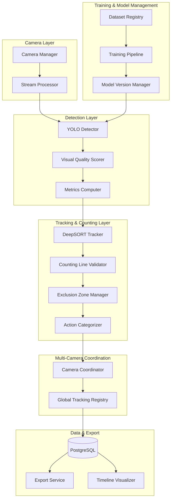

# Design Document: Bag Counting Detection Enhancement

## Overview

This design document specifies the technical architecture for enhancing the IntelliDepo bag counting detection system. The current system uses YOLOv8-based detection with real-time counting capabilities but requires significant improvements to achieve production-grade reliability for warehouse operations.

### Current System Architecture

The existing vision system consists of:
- **Camera Management** (`camera.py`): RTSP/IP camera stream ingestion with OpenCV, supporting both real streams and simulated feeds
- **Detection Module** (`detection.py`): YOLOv8 integration for bag/box detection with confidence thresholding (default 85%)
- **Counting Module** (`counting.py`): Frame-by-frame counting with manifest reconciliation and mismatch alerting
- **Training Module** (`training.py`): YOLO training pipeline for custom model fine-tuning
- **Tracking Module** (`tracking.py`): DeepSORT-based object tracking for persistent ID assignment

### Enhancement Scope

This enhancement addresses 15 key requirements across five major areas:

1. **Detection Accuracy & Monitoring** (Requirements 1, 7, 8, 14)
   - Precision/recall/F1 metrics computation and storage
   - Real-time detection monitoring with confidence alerts
   - Visual quality scoring to reduce false positives from reflections/shadows
   - False positive/negative logging for analysis

2. **Training Dataset Integration** (Requirements 2, 3, 11, 13)
   - Dataset registry with metadata cataloging
   - YOLO format validation and quality checks
   - Model training pipeline with data augmentation
   - Model versioning and performance tracking

3. **Action Categorization & Timeline** (Requirements 4, 15)
   - Multi-class action detection (loading, unloading, stacking, etc.)
   - Action timeline visualization with confidence overlays
   - Temporal pattern analysis for operational insights

4. **Counting Line Geometry** (Requirements 5, 10)
   - Horizontal line enforcement with ±5° tolerance
   - Perspective correction for angled cameras
   - Visual calibration interface with grid overlay

5. **Exclusion Zones & Multi-Camera** (Requirements 6, 9, 12)
   - Polygonal exclusion zone definition and IoU-based suppression
   - Multi-camera coordination with spatial-temporal correlation
   - Detection result export in CSV/JSON formats

### Key Design Decisions

**Decision 1: Metrics Storage Strategy**
- Store per-run aggregate metrics (precision, recall, F1) in `DetectionRun` table
- Store per-detection confidence scores in `DetectedObject` table
- Use PostgreSQL for persistence (no Redis dependency for metrics)
- **Rationale**: Simplifies querying, enables historical analysis, avoids cache invalidation complexity

**Decision 2: Visual Quality Scoring**
- Implement lightweight CV-based quality scoring (color distribution, edge density, saturation, aspect ratio)
- Apply adaptive thresholds based on detected lighting conditions
- Suppress detections with quality score < 0.20 even if model confidence is high
- **Rationale**: Reduces false positives from reflections/shadows without retraining the model

**Decision 3: Action Categorization Approach**
- Use direction vector analysis (crossing line direction) + zone context
- Implement temporal grouping for batch transfers (multiple bags moving together)
- Use dwell time analysis for quality inspection detection
- **Rationale**: Avoids training a separate action classifier; leverages existing tracking data

**Decision 4: Counting Line Geometry**
- Enforce strict horizontal constraint (constant y-coordinate across frame width)
- Apply perspective correction using camera calibration matrix
- Validate line position doesn't intersect top/bottom 10% of frame
- **Rationale**: Ensures consistent counting regardless of camera mounting angle

**Decision 5: Multi-Camera Coordination**
- Use spatial overlap detection (camera FOV intersection) + temporal correlation (10s window)
- Maintain global tracking registry with unique bag IDs across cameras
- Implement distributed locking for count updates
- **Rationale**: Prevents double-counting in overlapping camera views

## Architecture

### System Components



### Component Responsibilities

#### 1. Enhanced Detection Module

**Metrics Computer**
- Computes precision, recall, F1-score per detection run
- Aggregates confidence score distributions
- Logs false positives/negatives with frame references
- Stores metrics in `DetectionRun` and `DetectionMetrics` tables

**Visual Quality Scorer**
- Analyzes color distribution (HSV histogram)
- Computes edge density using Canny edge detection
- Measures saturation levels
- Validates aspect ratio against expected bag dimensions
- Outputs quality score [0.0-1.0]
- Adapts thresholds based on lighting conditions (daylight/warehouse/low-light)

#### 2. Dataset Registry & Training Pipeline

**Dataset Registry**
- Catalogs available training datasets with metadata:
  - Source (internal/external)
  - Size (image count, annotation count)
  - Annotation format (YOLO/COCO/Pascal VOC)
  - Scene conditions (lighting, weather, bag types)
  - Quality metrics (annotation completeness, bbox validity)
- Provides filtering interface by scene type, lighting, bag type
- Tracks dataset-to-model lineage for reproducibility

**Training Pipeline Enhancements**
- Data augmentation: rotation (±15°), brightness (±30%), scaling (0.8-1.2x)
- Hyperparameter logging: learning rate, batch size, epochs, confidence threshold
- Validation reporting: mAP50, precision-recall curves, loss curves
- A/B testing support: parallel model execution on same stream

**Model Version Manager**
- Assigns unique version IDs (semantic versioning: v1.0.0, v1.1.0, etc.)
- Logs deployment timestamp, training dataset version, hyperparameters
- Maintains performance history (mAP50, precision, recall over time)
- Supports rollback to previous versions
- Comparison table for side-by-side metric analysis

#### 3. Action Categorization System

**Action Categories**
- `loading`: Bags crossing line into loading zone
- `unloading`: Bags crossing line out of loading zone
- `stacking`: Vertical movement detected (y-coordinate decreasing)
- `unstacking`: Vertical movement detected (y-coordinate increasing)
- `movement`: Horizontal translation without line crossing
- `idle`: No movement for >5 seconds
- `quality_inspection`: Worker detected near bags without bag movement for >5s
- `batch_transfer`: Multiple bags (≥3) moving together with coordinated velocity

**Action Detection Logic**
```python
def categorize_action(track: TrackedObject, zone_context: str, worker_nearby: bool) -> str:
    if track.crossed_counting_line:
        direction = track.velocity_vector.direction
        if direction == "inbound" and zone_context == "loading_dock":
            return "loading"
        elif direction == "outbound" and zone_context == "loading_dock":
            return "unloading"
    
    if track.velocity_vector.magnitude < 0.1 and track.dwell_time > 5.0:
        if worker_nearby:
            return "quality_inspection"
        return "idle"
    
    if track.velocity_vector.y < -0.5:  # Moving up in frame
        return "stacking"
    elif track.velocity_vector.y > 0.5:  # Moving down in frame
        return "unstacking"
    
    # Check for batch transfer
    nearby_tracks = get_nearby_tracks(track, radius=50px)
    if len(nearby_tracks) >= 2:
        velocities = [t.velocity_vector for t in nearby_tracks]
        if are_velocities_coordinated(velocities, threshold=0.8):
            return "batch_transfer"
    
    return "movement"
```

**Action Timeline Storage**
- Store action transitions in `ActionEvent` table:
  - `session_id`: Links to counting session
  - `track_id`: Persistent object ID
  - `action_category`: Enum value
  - `start_time`: Timestamp when action began
  - `end_time`: Timestamp when action ended
  - `duration_seconds`: Computed duration
  - `avg_confidence`: Average detection confidence during action
  - `zone`: Spatial zone where action occurred

#### 4. Counting Line Geometry Validator

**Horizontal Enforcement**
- Validates line equation: `y = constant` (no slope)
- Rejects configurations with angle > ±5° from horizontal
- Provides visual grid overlay during configuration (10x10 grid)
- Displays angle indicator in real-time

**Perspective Correction**
- Computes camera calibration matrix using checkerboard pattern
- Applies homography transformation to correct perspective distortion
- Ensures counting line remains horizontal relative to physical floor plane
- Stores calibration matrix per camera in `CameraCalibration` table

**Position Validation**
- Rejects lines intersecting top 10% or bottom 10% of frame (edge artifacts)
- Validates line doesn't intersect exclusion zones (>15% IoU)
- Checks line is within bag transfer corridor (not in truck/worker zones)

#### 5. Exclusion Zone Manager

**Zone Definition**
- Supports polygonal regions (3-8 vertices)
- Stores zones in `ExclusionZone` table with JSON polygon coordinates
- Persists per-camera configurations
- Provides manual adjustment interface

**Automatic Zone Detection**
- Detects truck bodies using "Truck", "Truck Back", "Truck space" classes
- Creates temporary exclusion zones around person detections (COCO model)
- Expands person bounding box by 20% margin
- Removes temporary zones when person leaves frame

**Suppression Logic**
```python
def should_suppress_detection(bbox: BoundingBox, exclusion_zones: List[Polygon]) -> bool:
    for zone in exclusion_zones:
        iou = compute_iou(bbox, zone)
        if iou > 0.15:  # 15% overlap threshold
            return True
    return False
```

#### 6. Multi-Camera Coordinator

**Spatial Overlap Detection**
- Computes camera FOV intersection using calibration data
- Identifies overlapping regions in world coordinates
- Stores overlap matrix in `CameraOverlap` table

**Temporal Correlation**
- Maintains global tracking registry with unique bag IDs
- Correlates detections across cameras using:
  - Spatial proximity (world coordinates)
  - Temporal proximity (within 10s window)
  - Visual similarity (color histogram matching)
- Marks bags as counted in global registry
- Prevents re-counting within 10s window

**Distributed Locking**
- Uses PostgreSQL advisory locks for count updates
- Ensures atomic increment operations across cameras
- Handles race conditions in overlapping views

#### 7. Export Service

**CSV Export Format**
```csv
frame_number,timestamp,class_label,confidence,bbox_x,bbox_y,bbox_w,bbox_h,action_category,camera_id,model_version,confidence_threshold,counting_line_position
1,2025-01-15T10:30:45.123Z,bag,0.92,0.45,0.30,0.15,0.20,loading,cam-001,v1.2.0,0.85,y=0.60
```

**JSON Summary Format**
```json
{
  "session_id": "uuid",
  "camera_id": "uuid",
  "model_version": "v1.2.0",
  "confidence_threshold": 0.85,
  "counting_line_position": {"y": 0.60},
  "total_counts": {
    "bag": 145,
    "box": 23,
    "pallet": 8
  },
  "accuracy_metrics": {
    "precision": 0.94,
    "recall": 0.91,
    "f1_score": 0.925
  },
  "discrepancy_analysis": {
    "false_positives": 8,
    "false_negatives": 12,
    "correct_detections": 145
  }
}
```

**Annotated Frame Export**
- Renders detection overlays on frames
- Includes bounding boxes, class labels, confidence scores
- Highlights suppressed detections in red
- Exports as JPEG sequence or MP4 video

## Components and Interfaces

### Database Schema Extensions

#### New Tables

**1. DetectionMetrics**
```sql
CREATE TABLE depot_detection_metrics (
    id UUID PRIMARY KEY DEFAULT gen_random_uuid(),
    run_id UUID NOT NULL REFERENCES depot_detection_runs(id),
    precision FLOAT NOT NULL,
    recall FLOAT NOT NULL,
    f1_score FLOAT NOT NULL,
    true_positives INTEGER NOT NULL,
    false_positives INTEGER NOT NULL,
    false_negatives INTEGER NOT NULL,
    confidence_distribution JSONB,  -- histogram bins
    created_at TIMESTAMPTZ DEFAULT NOW()
);
```

**2. TrainingDataset**
```sql
CREATE TABLE depot_training_datasets (
    id UUID PRIMARY KEY DEFAULT gen_random_uuid(),
    name VARCHAR NOT NULL UNIQUE,
    source VARCHAR NOT NULL,  -- 'internal', 'roboflow', 'cvat', etc.
    size_images INTEGER NOT NULL,
    size_annotations INTEGER NOT NULL,
    annotation_format VARCHAR NOT NULL,  -- 'yolo', 'coco', 'pascal_voc'
    scene_conditions JSONB,  -- {lighting: 'daylight', bag_type: 'cement', weather: 'clear'}
    quality_score FLOAT,  -- 0.0-1.0
    is_active BOOLEAN DEFAULT TRUE,
    created_at TIMESTAMPTZ DEFAULT NOW()
);
```

**3. ModelVersion**
```sql
CREATE TABLE depot_model_versions (
    id UUID PRIMARY KEY DEFAULT gen_random_uuid(),
    version_name VARCHAR NOT NULL UNIQUE,  -- 'v1.0.0', 'v1.1.0', etc.
    model_id UUID NOT NULL REFERENCES depot_detection_models(id),
    dataset_id UUID REFERENCES depot_training_datasets(id),
    weights_path VARCHAR NOT NULL,
    hyperparameters JSONB,  -- {lr: 0.001, batch_size: 16, epochs: 50}
    performance_metrics JSONB,  -- {map50: 0.89, precision: 0.92, recall: 0.87}
    deployed_at TIMESTAMPTZ,
    is_active BOOLEAN DEFAULT FALSE,
    created_at TIMESTAMPTZ DEFAULT NOW()
);
```

**4. ActionEvent**
```sql
CREATE TABLE depot_action_events (
    id UUID PRIMARY KEY DEFAULT gen_random_uuid(),
    session_id UUID NOT NULL REFERENCES depot_count_sessions(id),
    track_id INTEGER NOT NULL,
    action_category VARCHAR NOT NULL,  -- 'loading', 'unloading', 'stacking', etc.
    start_time TIMESTAMPTZ NOT NULL,
    end_time TIMESTAMPTZ,
    duration_seconds FLOAT,
    avg_confidence FLOAT,
    zone VARCHAR,
    created_at TIMESTAMPTZ DEFAULT NOW()
);
```

**5. ExclusionZone**
```sql
CREATE TABLE depot_exclusion_zones (
    id UUID PRIMARY KEY DEFAULT gen_random_uuid(),
    camera_id UUID NOT NULL REFERENCES depot_cameras(id),
    name VARCHAR NOT NULL,
    polygon_coords JSONB NOT NULL,  -- [[x1,y1], [x2,y2], ...]
    zone_type VARCHAR NOT NULL,  -- 'manual', 'auto_truck', 'auto_person'
    is_temporary BOOLEAN DEFAULT FALSE,
    expires_at TIMESTAMPTZ,
    created_at TIMESTAMPTZ DEFAULT NOW()
);
```

**6. CountingLine**
```sql
CREATE TABLE depot_counting_lines (
    id UUID PRIMARY KEY DEFAULT gen_random_uuid(),
    camera_id UUID NOT NULL REFERENCES depot_cameras(id),
    y_coordinate FLOAT NOT NULL,  -- normalized 0.0-1.0
    angle_degrees FLOAT NOT NULL DEFAULT 0.0,
    is_valid BOOLEAN DEFAULT TRUE,
    validation_errors JSONB,
    calibration_matrix JSONB,  -- perspective correction matrix
    created_at TIMESTAMPTZ DEFAULT NOW()
);
```

**7. CameraOverlap**
```sql
CREATE TABLE depot_camera_overlaps (
    id UUID PRIMARY KEY DEFAULT gen_random_uuid(),
    camera_a_id UUID NOT NULL REFERENCES depot_cameras(id),
    camera_b_id UUID NOT NULL REFERENCES depot_cameras(id),
    overlap_region JSONB,  -- polygon in world coordinates
    overlap_percentage FLOAT,
    created_at TIMESTAMPTZ DEFAULT NOW(),
    UNIQUE(camera_a_id, camera_b_id)
);
```

**8. GlobalTrackingRegistry**
```sql
CREATE TABLE depot_global_tracking_registry (
    id UUID PRIMARY KEY DEFAULT gen_random_uuid(),
    bag_id VARCHAR NOT NULL UNIQUE,  -- global unique ID
    first_seen_camera_id UUID NOT NULL REFERENCES depot_cameras(id),
    first_seen_at TIMESTAMPTZ NOT NULL,
    last_seen_camera_id UUID REFERENCES depot_cameras(id),
    last_seen_at TIMESTAMPTZ,
    is_counted BOOLEAN DEFAULT FALSE,
    counted_at TIMESTAMPTZ,
    counted_by_camera_id UUID REFERENCES depot_cameras(id),
    visual_signature JSONB,  -- color histogram for matching
    created_at TIMESTAMPTZ DEFAULT NOW()
);
```

**9. FalseDetectionLog**
```sql
CREATE TABLE depot_false_detection_log (
    id UUID PRIMARY KEY DEFAULT gen_random_uuid(),
    run_id UUID NOT NULL REFERENCES depot_detection_runs(id),
    frame_number INTEGER NOT NULL,
    detection_type VARCHAR NOT NULL,  -- 'false_positive', 'false_negative'
    bbox_x FLOAT,
    bbox_y FLOAT,
    bbox_w FLOAT,
    bbox_h FLOAT,
    confidence FLOAT,
    expected_class VARCHAR,
    detected_class VARCHAR,
    notes TEXT,
    created_at TIMESTAMPTZ DEFAULT NOW()
);
```

### API Endpoints

#### Detection Accuracy & Monitoring

**POST /depot/vision/detection/runs/{run_id}/compute-metrics**
- Computes precision, recall, F1-score for a detection run
- Requires ground truth annotations for comparison
- Stores results in `DetectionMetrics` table

**GET /depot/vision/detection/runs/{run_id}/metrics**
- Returns computed metrics for a run
- Includes confidence distribution histogram

**POST /depot/vision/detection/false-detections**
- Logs a false positive or false negative
- Payload: `{run_id, frame_number, detection_type, bbox, confidence, notes}`

**GET /depot/vision/detection/false-detections**
- Lists false detections with filtering
- Query params: `run_id`, `detection_type`, `confidence_min`, `confidence_max`

**GET /depot/vision/detection/live-monitor/{camera_id}**
- WebSocket endpoint for real-time detection monitoring
- Streams detection events with confidence scores
- Sends alerts when avg confidence drops below 0.60 for >10 frames

#### Training Dataset & Model Management

**POST /depot/vision/training/datasets**
- Registers a new training dataset
- Payload: `{name, source, size_images, size_annotations, annotation_format, scene_conditions}`

**GET /depot/vision/training/datasets**
- Lists datasets with filtering
- Query params: `scene_type`, `lighting_condition`, `bag_type`

**POST /depot/vision/training/datasets/{dataset_id}/validate**
- Validates dataset annotations
- Checks: bbox validity, duplicate annotations, size/aspect ratio distribution

**POST /depot/vision/training/models/{model_id}/versions**
- Creates a new model version after training
- Payload: `{version_name, dataset_id, weights_path, hyperparameters, performance_metrics}`

**GET /depot/vision/training/models/{model_id}/versions**
- Lists all versions for a model
- Includes performance comparison table

**POST /depot/vision/training/models/{model_id}/versions/{version_id}/deploy**
- Deploys a specific model version
- Sets `is_active=true`, updates detection pipeline

**POST /depot/vision/training/models/{model_id}/versions/{version_id}/rollback**
- Rolls back to a previous model version

#### Action Categorization & Timeline

**GET /depot/vision/counting/sessions/{session_id}/actions**
- Returns action timeline for a counting session
- Includes action transitions with timestamps and durations

**GET /depot/vision/counting/sessions/{session_id}/timeline**
- Generates action timeline visualization
- Returns HTML or image format
- Highlights low-confidence segments

**POST /depot/vision/counting/sessions/{session_id}/export-timeline**
- Exports timeline as PNG or interactive HTML

#### Counting Line & Exclusion Zones

**POST /depot/vision/cameras/{camera_id}/counting-line**
- Configures counting line for a camera
- Payload: `{y_coordinate, calibration_matrix}`
- Validates horizontal constraint and position

**GET /depot/vision/cameras/{camera_id}/counting-line**
- Returns current counting line configuration
- Includes validation status and errors

**POST /depot/vision/cameras/{camera_id}/exclusion-zones**
- Creates an exclusion zone
- Payload: `{name, polygon_coords, zone_type}`

**GET /depot/vision/cameras/{camera_id}/exclusion-zones**
- Lists exclusion zones for a camera

**DELETE /depot/vision/cameras/{camera_id}/exclusion-zones/{zone_id}**
- Removes an exclusion zone

#### Multi-Camera Coordination

**POST /depot/vision/cameras/compute-overlaps**
- Computes FOV overlaps between all cameras
- Stores results in `CameraOverlap` table

**GET /depot/vision/cameras/overlaps**
- Returns camera overlap matrix

**GET /depot/vision/tracking/global-registry**
- Returns global tracking registry
- Shows bags tracked across multiple cameras

#### Export

**POST /depot/vision/detection/runs/{run_id}/export-csv**
- Exports detection results as CSV
- Returns download URL

**POST /depot/vision/counting/sessions/{session_id}/export-json**
- Exports counting summary as JSON

**POST /depot/vision/detection/runs/{run_id}/export-annotated-frames**
- Exports frames with detection overlays
- Query params: `format` (jpeg_sequence | mp4)

## Data Models

### Enhanced DetectionRun Model

```python
class DetectionRun(DBBaseModel):
    # ... existing fields ...
    
    # New fields for metrics
    precision: Optional[float] = None
    recall: Optional[float] = None
    f1_score: Optional[float] = None
    true_positives: int = 0
    false_positives: int = 0
    false_negatives: int = 0
    
    # Visual quality scoring
    avg_visual_quality_score: Optional[float] = None
    suppressed_by_quality: int = 0
```

### Enhanced DetectedObject Model

```python
class DetectedObject(DBBaseModel):
    # ... existing fields ...
    
    # New fields
    visual_quality_score: Optional[float] = None
    suppressed_by_quality: bool = False
    suppressed_by_exclusion_zone: bool = False
    exclusion_zone_id: Optional[UUID] = None
    action_category: Optional[str] = None
```

### ActionEvent Model

```python
class ActionEvent(DBBaseModel):
    __tablename__ = "depot_action_events"
    
    session_id: UUID
    track_id: int
    action_category: str  # Enum: loading, unloading, stacking, etc.
    start_time: datetime
    end_time: Optional[datetime]
    duration_seconds: Optional[float]
    avg_confidence: float
    zone: Optional[str]
```

### TrainingDataset Model

```python
class TrainingDataset(DBBaseModel):
    __tablename__ = "depot_training_datasets"
    
    name: str
    source: str
    size_images: int
    size_annotations: int
    annotation_format: str
    scene_conditions: dict  # JSON
    quality_score: Optional[float]
    is_active: bool = True
```

### ModelVersion Model

```python
class ModelVersion(DBBaseModel):
    __tablename__ = "depot_model_versions"
    
    version_name: str  # Semantic versioning
    model_id: UUID
    dataset_id: Optional[UUID]
    weights_path: str
    hyperparameters: dict  # JSON
    performance_metrics: dict  # JSON: {map50, precision, recall}
    deployed_at: Optional[datetime]
    is_active: bool = False
```

## Correctness Properties

*A property is a characteristic or behavior that should hold true across all valid executions of a system—essentially, a formal statement about what the system should do. Properties serve as the bridge between human-readable specifications and machine-verifiable correctness guarantees.*

### Property Reflection

After analyzing all 75 acceptance criteria across 15 requirements, I identified 56 criteria suitable for property-based testing. Through reflection, I've consolidated these into 35 unique properties by:

1. **Combining related validation properties**: Multiple bbox validation checks (non-zero dimensions, boundary checks) consolidated into comprehensive validation properties
2. **Merging geometric properties**: Line validation properties (horizontal enforcement, position validation) combined where they test the same underlying constraint
3. **Consolidating export properties**: CSV and JSON export completeness merged into general export completeness properties
4. **Unifying suppression logic**: IoU-based suppression and quality-based suppression combined into comprehensive suppression properties

The following properties provide comprehensive coverage while eliminating redundancy:

### Property 1: Metrics Computation Correctness

*For any* detection run with ground truth annotations, the computed precision SHALL equal TP/(TP+FP), recall SHALL equal TP/(TP+FN), and F1-score SHALL equal 2×(precision×recall)/(precision+recall), where TP, FP, and FN are the counts of true positives, false positives, and false negatives respectively.

**Validates: Requirements 1.1**

### Property 2: False Detection Logging Completeness

*For any* false positive or false negative detection, the log entry SHALL contain frame_number, bbox coordinates (x, y, w, h), confidence score, expected_class, and detected_class fields.

**Validates: Requirements 1.3**

### Property 3: Discrepancy Report Accuracy

*For any* manifest with expected counts and detection run with actual counts, the discrepancy report SHALL correctly compute the difference for each class (bags, boxes, pallets, cartons) and the total discrepancy.

**Validates: Requirements 1.5**

### Property 4: Dataset Annotation Validation

*For any* training dataset registration with YOLO format annotations, the validation SHALL accept datasets where all annotations contain bounding boxes, class labels, and confidence scores, and SHALL reject datasets missing any required field.

**Validates: Requirements 2.2**

### Property 5: Dataset Filtering Correctness

*For any* set of training datasets with metadata (scene_type, lighting_condition, bag_type) and filter criteria, the filtered results SHALL contain only datasets where all specified criteria match the dataset metadata.

**Validates: Requirements 2.4**

### Property 6: Model-Dataset Lineage Preservation

*For any* model version created from a training dataset, querying the model version SHALL return the correct dataset_id that was used for training, preserving the lineage relationship.

**Validates: Requirements 2.5**

### Property 7: Training Hyperparameter Logging

*For any* training run with specified hyperparameters (learning_rate, batch_size, epochs, confidence_threshold), all hyperparameters SHALL be logged and retrievable from the training run record.

**Validates: Requirements 3.3**

### Property 8: Parallel Model Execution Independence

*For any* video frame and set of model versions, running all models on the same frame SHALL produce independent detection results where each model's output is unaffected by other models' execution.

**Validates: Requirements 3.5**

### Property 9: Action Categorization Correctness

*For any* tracked bag with movement data (velocity vector, position, dwell time) and context (zone, worker proximity), the assigned action category SHALL match the categorization rules: loading (inbound crossing in loading zone), unloading (outbound crossing), stacking (upward movement), unstacking (downward movement), idle (velocity < 0.1 for >5s), quality_inspection (idle with worker nearby), batch_transfer (≥3 bags with coordinated movement), or movement (default).

**Validates: Requirements 4.1, 4.2, 4.3, 4.4**

### Property 10: Action Timeline Completeness

*For any* counting session with tracked bags, the action timeline SHALL contain an entry for every action category transition, with each entry including track_id, action_category, start_time, end_time, and duration_seconds.

**Validates: Requirements 4.5**

### Property 11: Counting Line Angle Validation

*For any* counting line configuration with angle θ from horizontal, the validation SHALL accept the configuration if |θ| ≤ 5° and SHALL reject if |θ| > 5°.

**Validates: Requirements 5.1, 10.2**

### Property 12: Counting Line Exclusion Zone Intersection

*For any* counting line and set of exclusion zones, the validation SHALL reject the line configuration if the line intersects any exclusion zone (IoU > 0).

**Validates: Requirements 5.3**

### Property 13: Class-Based Counting Filter

*For any* detection crossing the counting line, the count SHALL increment if and only if the detected object class is "bag".

**Validates: Requirements 5.4**

### Property 14: IoU-Based Detection Suppression

*For any* detection with bounding box B and set of exclusion zones Z, the detection SHALL be suppressed if there exists any zone z ∈ Z where IoU(B, z) > 0.15.

**Validates: Requirements 6.2**

### Property 15: Automatic Truck Zone Creation

*For any* frame containing detections with class labels "Truck", "Truck Back", or "Truck space", an exclusion zone SHALL be created with polygon coordinates matching the detection bounding box.

**Validates: Requirements 6.3**

### Property 16: Temporary Person Zone Creation

*For any* person detection from the COCO model, a temporary exclusion zone SHALL be created with polygon coordinates encompassing the person bounding box expanded by 20% margin, and the zone SHALL have is_temporary=true.

**Validates: Requirements 6.4**

### Property 17: Confidence Threshold Metric Recomputation

*For any* validation set of detections and confidence threshold τ, recomputing metrics SHALL produce precision, recall, and F1-score values based only on detections with confidence ≥ τ.

**Validates: Requirements 7.2**

### Property 18: Optimal Threshold F1 Maximization

*For any* set of historical detection runs with computed F1-scores at different thresholds, the recommended optimal threshold SHALL be the value that produces the maximum F1-score across all runs.

**Validates: Requirements 7.3**

### Property 19: Low Threshold Warning

*For any* confidence threshold value τ, a warning SHALL be displayed if τ < 0.40 and no warning SHALL be displayed if τ ≥ 0.40.

**Validates: Requirements 7.4**

### Property 20: Low Confidence Alert Generation

*For any* sequence of N consecutive frames where N > 10, if the average confidence score across all detections in those frames is < 0.60, a low-confidence alert SHALL be generated.

**Validates: Requirements 8.3**

### Property 21: CSV Export Completeness

*For any* detection run with D detections, the exported CSV file SHALL contain exactly D rows (excluding header), and each row SHALL contain all required columns: frame_number, timestamp, class_label, confidence, bbox_x, bbox_y, bbox_w, bbox_h, action_category, camera_id, model_version, confidence_threshold, counting_line_position.

**Validates: Requirements 9.1**

### Property 22: JSON Export Completeness

*For any* completed counting session, the exported JSON report SHALL contain all required fields: session_id, camera_id, model_version, confidence_threshold, counting_line_position, total_counts (by class), accuracy_metrics (precision, recall, f1_score), and discrepancy_analysis (false_positives, false_negatives, correct_detections).

**Validates: Requirements 9.2**

### Property 23: Export Metadata Completeness

*For any* exported detection data (CSV or JSON), the export SHALL include metadata fields: camera_id, model_version, confidence_threshold, and counting_line_position.

**Validates: Requirements 9.5**

### Property 24: Counting Line Horizontal Constraint

*For any* counting line configuration, the y-coordinate SHALL be constant across all x-coordinates in the frame (i.e., for all x₁, x₂ in [0, frame_width], y(x₁) = y(x₂)).

**Validates: Requirements 10.1**

### Property 25: Perspective Correction Horizontal Preservation

*For any* camera with calibration matrix M and counting line with y-coordinate y₀, applying perspective correction SHALL produce a transformed line where the angle from horizontal is ≤ 1° in the corrected coordinate system.

**Validates: Requirements 10.4**

### Property 26: Counting Line Position Validation

*For any* counting line with normalized y-coordinate y ∈ [0, 1], the validation SHALL reject the configuration if y < 0.10 or y > 0.90 (top/bottom 10% of frame).

**Validates: Requirements 10.5**

### Property 27: Bounding Box Dimension Validation

*For any* training dataset with annotations, the validation SHALL flag all bounding boxes where width ≤ 0 or height ≤ 0, and SHALL accept all bounding boxes where width > 0 and height > 0.

**Validates: Requirements 11.1**

### Property 28: Bounding Box Boundary Validation

*For any* annotation with bounding box (x, y, w, h) in an image of dimensions (W, H), the validation SHALL flag the annotation if x < 0 or y < 0 or x+w > W or y+h > H.

**Validates: Requirements 11.2**

### Property 29: Bounding Box Distribution Computation

*For any* training dataset with N annotations, the computed distribution SHALL include: mean width, mean height, mean aspect ratio, standard deviation of width, standard deviation of height, and standard deviation of aspect ratio, computed correctly from all N bounding boxes.

**Validates: Requirements 11.3**

### Property 30: Duplicate Annotation Detection

*For any* set of annotations for the same image and class, if there exist two annotations A₁ and A₂ where IoU(A₁, A₂) > 0.90, both annotations SHALL be flagged as duplicates.

**Validates: Requirements 11.4**

### Property 31: Multi-Camera Duplicate Suppression

*For any* set of detections from multiple cameras with overlapping fields of view, if two detections D₁ from camera C₁ and D₂ from camera C₂ have spatial proximity < 50cm in world coordinates and temporal proximity < 2s, only one detection SHALL be counted.

**Validates: Requirements 12.1**

### Property 32: Global Tracking ID Uniqueness

*For any* bag tracked across multiple cameras, the global tracking registry SHALL assign exactly one unique bag_id, and all detections of the same bag across cameras SHALL reference the same bag_id.

**Validates: Requirements 12.2**

### Property 33: Temporal Deduplication

*For any* bag with bag_id B counted by camera C₁ at time T₁, if camera C₂ detects the same bag_id B at time T₂ where |T₂ - T₁| < 10 seconds, the detection SHALL NOT increment the count.

**Validates: Requirements 12.3**

### Property 34: Consolidated Report Deduplication

*For any* set of counting sessions from multiple cameras with duplicate bag_ids, the consolidated report SHALL count each unique bag_id exactly once, regardless of how many cameras detected it.

**Validates: Requirements 12.5**

### Property 35: Model Version ID Uniqueness

*For any* two trained models M₁ and M₂, the assigned version identifiers SHALL be distinct (version_id(M₁) ≠ version_id(M₂)).

**Validates: Requirements 13.1**

### Property 36: Model Deployment Logging

*For any* model version deployment, the deployment log SHALL contain deployment_timestamp, model_version, and dataset_version fields.

**Validates: Requirements 13.2**

### Property 37: Model Comparison Table Completeness

*For any* set of N model versions, the comparison table SHALL contain exactly N rows, and each row SHALL include model_version, precision, recall, and mAP50 metrics.

**Validates: Requirements 13.4**

### Property 38: Model Performance History Tracking

*For any* deployed model version, the performance history SHALL contain entries for each time period the model was active, with each entry including timestamp and accuracy metrics (precision, recall, mAP50).

**Validates: Requirements 13.5**

### Property 39: Visual Quality Score Computation

*For any* bag detection with image region R, the visual quality score SHALL be computed as a weighted combination of: color_distribution_score(R), edge_density_score(R), saturation_score(R), and aspect_ratio_score(R), producing a value in [0.0, 1.0].

**Validates: Requirements 14.1**

### Property 40: Quality-Based Detection Suppression

*For any* detection with visual_quality_score < 0.20, the detection SHALL be suppressed regardless of the model confidence score.

**Validates: Requirements 14.2**

### Property 41: Adaptive Quality Threshold

*For any* frame with detected lighting condition L ∈ {daylight, warehouse, low_light}, the visual quality threshold SHALL be adjusted according to lighting-specific thresholds: daylight → 0.20, warehouse → 0.15, low_light → 0.10.

**Validates: Requirements 14.3**

### Property 42: Reflection Zone Stricter Validation

*For any* detection with bounding box B overlapping a reflection zone R (IoU(B, R) > 0), the visual quality threshold SHALL be increased by 0.10 compared to the base threshold for the current lighting condition.

**Validates: Requirements 14.4**

### Property 43: Suppressed Detection Logging

*For any* detection suppressed due to visual quality score, the log entry SHALL contain detection_id, visual_quality_score, suppression_reason, and timestamp.

**Validates: Requirements 14.5**

### Property 44: Timeline Visualization Completeness

*For any* counting session with N action events, the generated timeline visualization SHALL display all N events with their action categories and time ranges.

**Validates: Requirements 15.1**

### Property 45: Action Duration Computation

*For any* action event with start_time T₁ and end_time T₂, the displayed duration SHALL equal T₂ - T₁ in seconds.

**Validates: Requirements 15.2**

### Property 46: Low Confidence Timeline Highlighting

*For any* timeline segment with average confidence score < 0.60, the segment SHALL be visually highlighted (e.g., with a distinct color or marker).

**Validates: Requirements 15.3**

### Property 47: Mismatch Alert Timeline Annotation

*For any* mismatch alert triggered at time T with discrepancy D, the timeline SHALL contain an annotation at time T displaying the alert details including discrepancy value D.

**Validates: Requirements 15.4**


## Error Handling

### Detection Errors

**1. Model Loading Failures**
- **Scenario**: YOLO model weights file not found or corrupted
- **Handling**: 
  - Log error with model path and exception details
  - Fall back to default yolov8n.pt if custom weights unavailable
  - Return HTTP 503 with error message if no model can be loaded
  - Set detection run status to "failed" with error_message field populated

**2. Low Confidence Detection**
- **Scenario**: Average confidence drops below 0.60 for >10 frames
- **Handling**:
  - Generate low-confidence alert via notification system
  - Log alert in `MismatchAlert` table with severity="low"
  - Continue detection but flag affected frames
  - Display warning in real-time monitoring UI

**3. Visual Quality Suppression**
- **Scenario**: Detection has high model confidence but low visual quality score
- **Handling**:
  - Suppress detection (do not count)
  - Log suppression in `FalseDetectionLog` with reason="low_visual_quality"
  - Store visual_quality_score for offline analysis
  - Optionally display suppressed detection with red bounding box

### Training Errors

**4. Dataset Validation Failures**
- **Scenario**: Training dataset has invalid annotations (bbox outside boundaries, zero dimensions, missing labels)
- **Handling**:
  - Reject dataset registration with HTTP 400
  - Return detailed validation errors listing all invalid annotations
  - Provide annotation review interface for manual correction
  - Log validation failure for audit trail

**5. Training Pipeline Failures**
- **Scenario**: YOLO training crashes due to OOM, invalid hyperparameters, or corrupted data
- **Handling**:
  - Catch exception and set training status to "failed"
  - Log full stack trace and training configuration
  - Clean up partial weights files
  - Send notification to user who initiated training
  - Preserve training logs for debugging

**6. Model Deployment Failures**
- **Scenario**: Deployed model produces significantly worse results than previous version
- **Handling**:
  - Monitor first 100 detections after deployment
  - Compare metrics to previous version baseline
  - Auto-rollback if precision drops >10% or recall drops >10%
  - Send critical alert to administrators
  - Log rollback event with reason

### Counting Line Errors

**7. Invalid Line Configuration**
- **Scenario**: User configures non-horizontal line or line in top/bottom 10% of frame
- **Handling**:
  - Reject configuration with HTTP 400
  - Return validation errors: `{angle_error: "Line angle 12° exceeds ±5° tolerance", position_error: "Line at y=0.95 in bottom 10% exclusion zone"}`
  - Preserve previous valid configuration
  - Display error message in calibration UI

**8. Perspective Correction Failure**
- **Scenario**: Camera calibration matrix is invalid or produces distorted results
- **Handling**:
  - Validate calibration matrix determinant ≠ 0
  - Test correction on sample points
  - Reject if corrected line angle > 10° from horizontal
  - Fall back to uncorrected line with warning
  - Log calibration failure for manual review

### Multi-Camera Errors

**9. Camera Overlap Computation Failure**
- **Scenario**: Camera calibration data missing or FOV intersection cannot be computed
- **Handling**:
  - Log warning with camera IDs
  - Assume no overlap (conservative approach)
  - Continue counting without deduplication for affected camera pair
  - Display warning in multi-camera view
  - Prompt administrator to calibrate cameras

**10. Global Tracking Registry Conflicts**
- **Scenario**: Two cameras assign different bag_ids to the same physical bag
- **Handling**:
  - Use visual similarity (color histogram matching) to detect conflict
  - Merge bag_ids if similarity > 0.85
  - Update all references to use canonical bag_id
  - Log merge event for audit
  - Recompute consolidated counts

**11. Distributed Lock Timeout**
- **Scenario**: PostgreSQL advisory lock cannot be acquired within timeout (5s)
- **Handling**:
  - Retry with exponential backoff (3 attempts)
  - If all retries fail, log error and skip count update
  - Send alert to administrators
  - Queue count update for retry in background job
  - Display warning in UI that counts may be delayed

### Export Errors

**12. CSV/JSON Export Failures**
- **Scenario**: Export file cannot be written due to disk space or permissions
- **Handling**:
  - Return HTTP 507 (Insufficient Storage) or 500
  - Log error with file path and exception
  - Suggest alternative export location
  - Offer streaming export for large datasets
  - Retry with temporary directory

**13. Annotated Frame Export Failures**
- **Scenario**: Frame rendering fails due to missing frames or codec issues
- **Handling**:
  - Skip corrupted frames and continue with remaining frames
  - Log skipped frame numbers
  - Include warning in export metadata
  - Return partial export with success count
  - Offer frame-by-frame export as fallback

### Action Categorization Errors

**14. Ambiguous Action Detection**
- **Scenario**: Bag movement doesn't clearly match any action category
- **Handling**:
  - Default to "movement" category
  - Log ambiguous case with movement data for analysis
  - Compute confidence score for categorization
  - Display low-confidence indicator in timeline
  - Allow manual recategorization in review interface

**15. Worker Detection False Positives**
- **Scenario**: Non-person object detected as person, creating unnecessary exclusion zones
- **Handling**:
  - Apply secondary validation using person detection confidence threshold (>0.70)
  - Limit temporary exclusion zone lifetime to 30 seconds
  - Remove zone if no person detected in subsequent frames
  - Log false positive for model improvement
  - Provide manual zone removal in UI

### Recovery Strategies

**Graceful Degradation**
- If YOLO model unavailable: Use simulated detection (if ALLOW_SIMULATED_VISION=true)
- If camera stream fails: Switch to simulated frames
- If database unavailable: Queue operations in memory with periodic retry
- If Redis unavailable: Use in-memory tracking state (already implemented)

**Automatic Retry**
- Camera connection failures: Retry every 30s with exponential backoff
- Training pipeline failures: Offer manual retry with adjusted hyperparameters
- Export failures: Retry with smaller batch sizes
- Lock acquisition failures: Retry with exponential backoff (3 attempts)

**Monitoring & Alerting**
- All errors logged to structured logging system (JSON format)
- Critical errors trigger notifications via NotificationService
- Error rates monitored with thresholds: >10 errors/min → alert
- Weekly error summary reports generated automatically

## Testing Strategy

### Overview

This feature requires a comprehensive testing strategy combining unit tests, property-based tests, integration tests, and manual validation. Given the complexity of computer vision, real-time processing, and multi-camera coordination, we employ a multi-layered approach.

### Property-Based Testing

**Framework**: Hypothesis (Python)

**Configuration**:
- Minimum 100 iterations per property test
- Seed-based reproducibility for failed tests
- Shrinking enabled to find minimal failing examples
- Timeout: 60 seconds per property test

**Property Test Implementation**:

Each of the 47 correctness properties defined above will be implemented as a property-based test. Tests will be tagged with comments referencing the design property:

```python
from hypothesis import given, strategies as st
import pytest

# Feature: bag-counting-detection-enhancement, Property 1: Metrics Computation Correctness
@given(
    true_positives=st.integers(min_value=0, max_value=1000),
    false_positives=st.integers(min_value=0, max_value=1000),
    false_negatives=st.integers(min_value=0, max_value=1000)
)
def test_metrics_computation_correctness(true_positives, false_positives, false_negatives):
    """For any detection run with ground truth, metrics formulas must hold."""
    # Arrange
    run = create_detection_run_with_ground_truth(
        tp=true_positives, fp=false_positives, fn=false_negatives
    )
    
    # Act
    metrics = compute_metrics(run)
    
    # Assert
    expected_precision = true_positives / (true_positives + false_positives) if (true_positives + false_positives) > 0 else 0
    expected_recall = true_positives / (true_positives + false_negatives) if (true_positives + false_negatives) > 0 else 0
    expected_f1 = 2 * (expected_precision * expected_recall) / (expected_precision + expected_recall) if (expected_precision + expected_recall) > 0 else 0
    
    assert abs(metrics.precision - expected_precision) < 0.0001
    assert abs(metrics.recall - expected_recall) < 0.0001
    assert abs(metrics.f1_score - expected_f1) < 0.0001
```

**Generator Strategies**:

```python
# Bounding box generator
@st.composite
def bounding_box(draw):
    x = draw(st.floats(min_value=0.0, max_value=0.9))
    y = draw(st.floats(min_value=0.0, max_value=0.9))
    w = draw(st.floats(min_value=0.01, max_value=1.0 - x))
    h = draw(st.floats(min_value=0.01, max_value=1.0 - y))
    return {"x": x, "y": y, "w": w, "h": h}

# Detection generator
@st.composite
def detection(draw):
    return {
        "class_label": draw(st.sampled_from(["bag", "box", "pallet", "carton"])),
        "confidence": draw(st.floats(min_value=0.0, max_value=1.0)),
        "bbox": draw(bounding_box()),
        "visual_quality_score": draw(st.floats(min_value=0.0, max_value=1.0))
    }

# Exclusion zone (polygon) generator
@st.composite
def exclusion_zone(draw):
    num_vertices = draw(st.integers(min_value=3, max_value=8))
    vertices = [
        (draw(st.floats(min_value=0.0, max_value=1.0)),
         draw(st.floats(min_value=0.0, max_value=1.0)))
        for _ in range(num_vertices)
    ]
    return {"polygon": vertices, "zone_type": draw(st.sampled_from(["manual", "auto_truck", "auto_person"]))}

# Action event generator
@st.composite
def action_event(draw):
    start_time = draw(st.datetimes(min_value=datetime(2025, 1, 1), max_value=datetime(2025, 12, 31)))
    duration = draw(st.floats(min_value=0.1, max_value=300.0))
    return {
        "track_id": draw(st.integers(min_value=1, max_value=10000)),
        "action_category": draw(st.sampled_from(["loading", "unloading", "stacking", "unstacking", "movement", "idle", "quality_inspection", "batch_transfer"])),
        "start_time": start_time,
        "end_time": start_time + timedelta(seconds=duration),
        "avg_confidence": draw(st.floats(min_value=0.0, max_value=1.0))
    }
```

**Property Test Coverage**:
- **Metrics & Validation** (Properties 1-7, 11-12, 17-19, 27-30): 15 properties
- **Action Categorization** (Properties 9-10): 2 properties
- **Counting Line Geometry** (Properties 11-13, 24-26): 6 properties
- **Exclusion Zones & Suppression** (Properties 14-16, 40-43): 7 properties
- **Export & Logging** (Properties 2, 21-23, 43): 5 properties
- **Multi-Camera Coordination** (Properties 31-34): 4 properties
- **Model Versioning** (Properties 35-38): 4 properties
- **Timeline Visualization** (Properties 44-47): 4 properties

**Total**: 47 property-based tests

### Unit Testing

**Framework**: pytest

**Coverage Target**: >85% line coverage for new code

**Unit Test Categories**:

1. **Visual Quality Scoring** (10 tests)
   - Color distribution computation
   - Edge density calculation (Canny)
   - Saturation measurement
   - Aspect ratio validation
   - Weighted score combination
   - Lighting condition detection
   - Adaptive threshold adjustment
   - Reflection zone detection
   - Quality-based suppression logic
   - Suppression logging

2. **Action Categorization** (12 tests)
   - Direction vector computation
   - Zone context determination
   - Worker proximity detection
   - Dwell time calculation
   - Batch transfer detection (coordinated movement)
   - Quality inspection detection (worker + idle)
   - Stacking/unstacking detection (vertical movement)
   - Loading/unloading detection (line crossing + direction)
   - Action transition recording
   - Timeline generation
   - Duration computation
   - Category assignment edge cases

3. **Counting Line Validation** (8 tests)
   - Horizontal angle validation (±5°)
   - Position validation (top/bottom 10%)
   - Exclusion zone intersection detection
   - Perspective correction matrix application
   - Calibration matrix validation
   - Line configuration persistence
   - Visual grid overlay generation
   - Class-based counting filter

4. **Exclusion Zone Management** (8 tests)
   - Polygon definition and storage
   - IoU computation
   - Suppression logic (>15% IoU)
   - Automatic truck zone creation
   - Temporary person zone creation
   - Zone expiration handling
   - Manual zone adjustment
   - Per-camera zone persistence

5. **Dataset Validation** (10 tests)
   - YOLO format validation
   - Bbox dimension validation (non-zero)
   - Bbox boundary validation
   - Duplicate annotation detection (IoU > 0.90)
   - Size/aspect ratio distribution computation
   - Outlier detection
   - Annotation completeness check
   - Quality score computation
   - Dataset filtering
   - Dataset-model lineage tracking

6. **Model Versioning** (6 tests)
   - Version ID generation (uniqueness)
   - Deployment logging
   - Rollback functionality
   - Performance history tracking
   - Comparison table generation
   - A/B testing setup

7. **Multi-Camera Coordination** (10 tests)
   - FOV overlap computation
   - Spatial proximity calculation (world coordinates)
   - Temporal correlation (10s window)
   - Visual similarity matching (color histogram)
   - Global tracking ID assignment
   - Duplicate suppression
   - Temporal deduplication
   - Consolidated report generation
   - Distributed lock acquisition
   - Lock timeout handling

8. **Export Services** (6 tests)
   - CSV export format validation
   - JSON export format validation
   - Metadata inclusion
   - Annotated frame rendering
   - Export completeness verification
   - Large dataset streaming

**Total**: ~70 unit tests

### Integration Testing

**Framework**: pytest with async support (pytest-asyncio)

**Integration Test Categories**:

1. **End-to-End Detection Pipeline** (5 tests)
   - Camera → Detection → Tracking → Counting → Export
   - Multi-model A/B testing
   - Real-time monitoring with alerts
   - Visual quality suppression in pipeline
   - Exclusion zone suppression in pipeline

2. **Training Pipeline** (3 tests)
   - Dataset registration → Validation → Training → Deployment
   - Training with data augmentation
   - Model rollback after deployment

3. **Multi-Camera Workflow** (4 tests)
   - Multiple cameras → Overlap detection → Duplicate suppression → Consolidated report
   - Global tracking across cameras
   - Temporal deduplication
   - Distributed counting with locks

4. **Action Timeline Workflow** (3 tests)
   - Detection → Tracking → Action categorization → Timeline generation → Export
   - Timeline with low-confidence highlighting
   - Timeline with mismatch alert annotations

5. **Database Integration** (4 tests)
   - All new tables (DetectionMetrics, TrainingDataset, ModelVersion, ActionEvent, ExclusionZone, CountingLine, CameraOverlap, GlobalTrackingRegistry, FalseDetectionLog)
   - Foreign key constraints
   - Index performance
   - Migration scripts

**Total**: ~19 integration tests

### Manual Testing & Validation

**Visual Validation**:
1. Real-time detection overlay rendering
2. Counting line visual overlay with grid
3. Exclusion zone polygon rendering
4. Action timeline visualization
5. Suppressed detection indicators (red boxes)
6. Multi-camera view synchronization

**Calibration Testing**:
1. Counting line horizontal alignment with grid overlay
2. Perspective correction with angled cameras
3. Exclusion zone polygon drawing interface
4. Camera FOV overlap visualization

**Performance Testing**:
1. Real-time detection latency (<100ms per frame)
2. Multi-camera coordination overhead (<50ms)
3. Export performance (1000 detections in <5s)
4. Database query performance (metrics retrieval <200ms)

**Accuracy Validation**:
1. Manual ground truth annotation of 500 frames
2. Precision/recall computation against ground truth
3. Visual quality score validation (manual review of suppressed detections)
4. Action categorization accuracy (manual review of 100 action sequences)

### Test Data

**Synthetic Test Data**:
- Generated using Hypothesis strategies
- Covers edge cases: empty datasets, single detection, 1000+ detections
- Boundary conditions: confidence=0.0, confidence=1.0, bbox at frame edges
- Invalid inputs: negative dimensions, out-of-bounds coordinates

**Real Test Data**:
- 500 manually annotated frames from depot videos
- 10 video clips (30s each) with ground truth counts
- 5 multi-camera scenarios with known overlaps
- 20 action sequences with manual categorization

**Test Datasets**:
- Small dataset: 100 images, 200 annotations (for fast tests)
- Medium dataset: 1000 images, 3000 annotations (for training tests)
- Large dataset: 5000 images, 15000 annotations (for performance tests)

### Continuous Integration

**CI Pipeline** (GitHub Actions):
1. **Lint & Format**: black, flake8, mypy
2. **Unit Tests**: pytest with coverage report (target >85%)
3. **Property Tests**: Hypothesis tests (100 iterations per property)
4. **Integration Tests**: pytest-asyncio with test database
5. **Performance Tests**: Benchmark critical paths (detection, export)
6. **Documentation**: Verify all API endpoints documented

**Test Execution Time**:
- Unit tests: ~5 minutes
- Property tests: ~15 minutes (47 properties × 100 iterations)
- Integration tests: ~10 minutes
- **Total**: ~30 minutes

### Test Maintenance

**Property Test Maintenance**:
- Review failed property tests for genuine bugs vs. incorrect properties
- Update generators when data models change
- Add new properties when requirements are added
- Maintain seed database for reproducible failures

**Unit Test Maintenance**:
- Update tests when implementation changes
- Add regression tests for discovered bugs
- Remove obsolete tests when features are deprecated
- Keep test data fixtures up to date

**Integration Test Maintenance**:
- Update test database schema with migrations
- Refresh test video clips periodically
- Update ground truth annotations when model improves
- Maintain test camera configurations

### Testing Tools & Libraries

**Python Testing Stack**:
- `pytest`: Test framework
- `pytest-asyncio`: Async test support
- `pytest-cov`: Coverage reporting
- `hypothesis`: Property-based testing
- `faker`: Test data generation
- `factory_boy`: Model factories
- `freezegun`: Time mocking
- `responses`: HTTP mocking
- `pytest-benchmark`: Performance testing

**Computer Vision Testing**:
- `opencv-python`: Image manipulation for test data
- `numpy`: Numerical computations
- `pillow`: Image generation
- `scikit-image`: Image quality metrics

**Database Testing**:
- `pytest-postgresql`: Test database fixtures
- `sqlalchemy-utils`: Database utilities
- `alembic`: Migration testing

### Success Criteria

**Property Tests**: All 47 properties pass with 100 iterations
**Unit Tests**: >85% line coverage, all tests pass
**Integration Tests**: All 19 tests pass
**Manual Validation**: 
- Visual quality suppression reduces false positives by >30%
- Action categorization accuracy >90%
- Multi-camera deduplication accuracy >95%
- Counting line calibration time <2 minutes per camera

**Performance**:
- Detection latency <100ms per frame
- Export 1000 detections in <5s
- Multi-camera coordination overhead <50ms
- Database queries <200ms

**Reliability**:
- Zero critical bugs in production
- Error rate <1% of operations
- Automatic recovery from transient failures >95%
- No data loss in export operations

---

## Implementation Notes

### Phase 1: Core Infrastructure (Week 1-2)
- Database schema migrations (9 new tables)
- API endpoint scaffolding
- Error handling framework
- Logging infrastructure

### Phase 2: Detection Enhancements (Week 3-4)
- Visual quality scoring implementation
- Metrics computation (precision, recall, F1)
- False detection logging
- Real-time monitoring with alerts

### Phase 3: Training & Versioning (Week 5-6)
- Dataset registry and validation
- Model versioning system
- Training pipeline enhancements
- A/B testing support

### Phase 4: Action Categorization (Week 7-8)
- Action detection logic
- Timeline generation
- Timeline visualization
- Export functionality

### Phase 5: Counting Line & Zones (Week 9-10)
- Counting line validation
- Perspective correction
- Exclusion zone management
- Automatic zone detection

### Phase 6: Multi-Camera Coordination (Week 11-12)
- Overlap computation
- Global tracking registry
- Duplicate suppression
- Consolidated reporting

### Phase 7: Testing & Validation (Week 13-14)
- Property-based test implementation (47 tests)
- Unit test completion (~70 tests)
- Integration test completion (~19 tests)
- Manual validation and calibration

### Phase 8: Documentation & Deployment (Week 15-16)
- API documentation
- User guides (calibration, configuration)
- Performance tuning
- Production deployment

**Total Estimated Timeline**: 16 weeks (4 months)

**Team Requirements**:
- 2 Backend Engineers (Python, FastAPI, PostgreSQL)
- 1 Computer Vision Engineer (YOLO, OpenCV, tracking algorithms)
- 1 QA Engineer (property-based testing, manual validation)
- 1 DevOps Engineer (CI/CD, deployment, monitoring)

**Dependencies**:
- Existing vision system (camera.py, detection.py, counting.py, tracking.py)
- PostgreSQL database
- YOLO model weights
- Test video footage with ground truth annotations

**Risks**:
1. **Visual quality scoring accuracy**: May require tuning thresholds per deployment environment
2. **Multi-camera coordination complexity**: Spatial-temporal correlation may need adjustment
3. **Property test execution time**: 47 properties × 100 iterations may exceed CI time limits
4. **Perspective correction accuracy**: May require manual calibration per camera

**Mitigation**:
1. Provide adaptive thresholds based on lighting conditions
2. Start with conservative deduplication (high similarity threshold)
3. Run property tests in parallel, reduce iterations to 50 for CI
4. Provide visual calibration interface with real-time feedback
