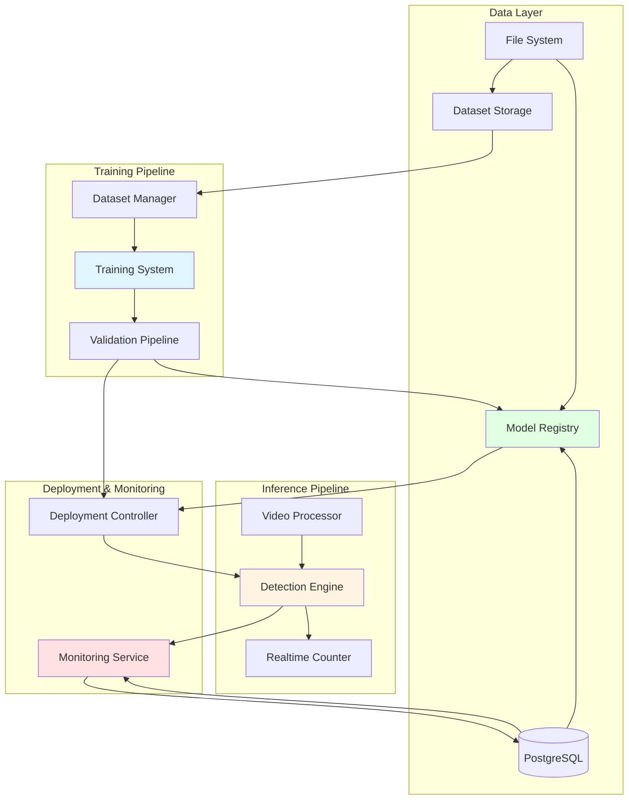
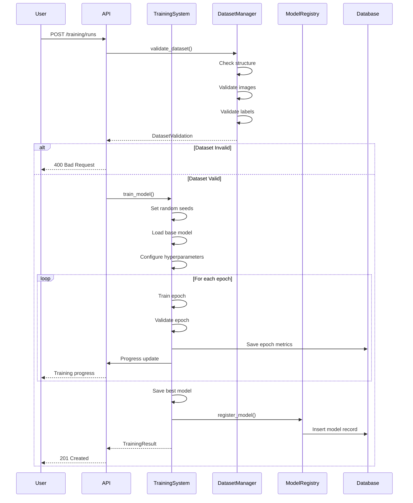
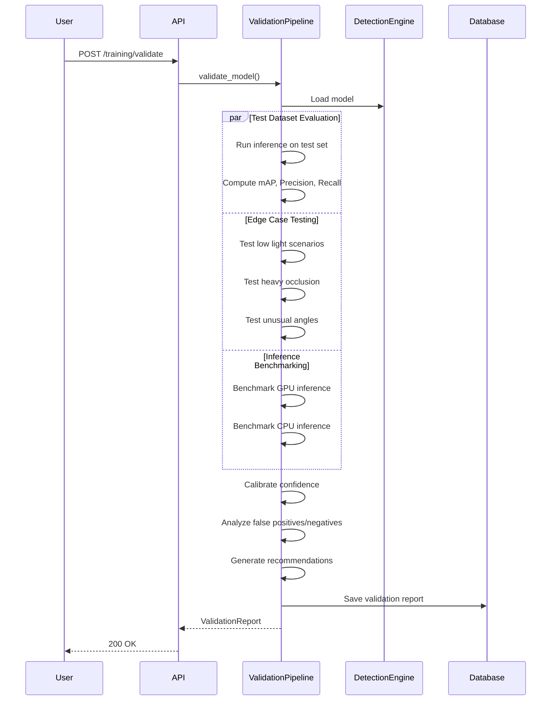
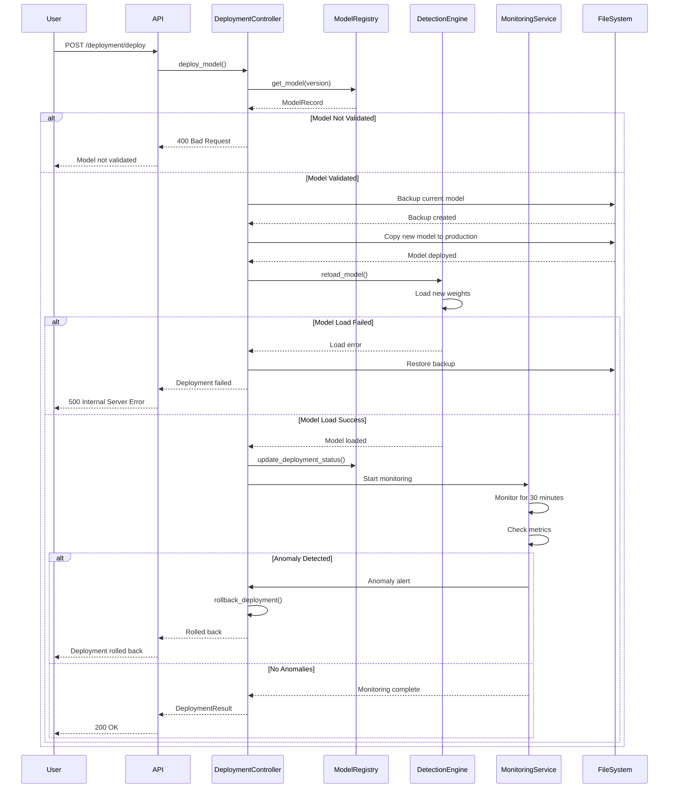
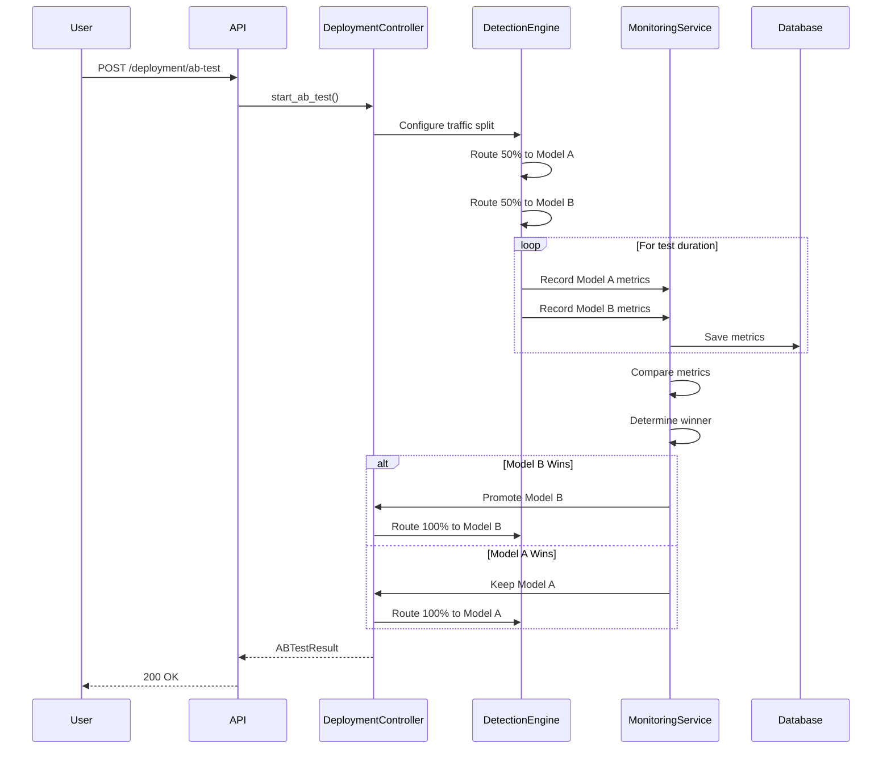

# Design Document: Cement Bag Detection Training System

## Overview

This document specifies the technical design for a production-grade cement bag detection and training system for the IntelliDepo platform. The system provides comprehensive model training, validation, deployment, and monitoring infrastructure for YOLOv8-based cement bag detection in depot environments.

### System Goals

- **Accuracy**: Achieve and maintain 99-100% detection accuracy in production
- **Robustness**: Handle diverse real-world conditions (lighting, weather, angles, occlusions)
- **Integration**: Seamless integration with existing realtime_counter.py and detection.py pipelines
- **Scalability**: Support multiple cameras and high-throughput video processing
- **Reliability**: Robust error handling, automatic fallbacks, and safe deployment with rollback
- **Observability**: Comprehensive monitoring and metrics for production performance

### Key Features

1. **Model Training Pipeline**: End-to-end training from annotated datasets to validated models
2. **Dataset Management**: Quality checks, augmentation, and version control for training data
3. **Validation Framework**: Multi-stage validation with edge case testing and calibration
4. **Model Registry**: Versioned storage with metadata, metrics, and deployment tracking
5. **Safe Deployment**: A/B testing, gradual rollout, and automatic rollback capabilities
6. **Production Monitoring**: Real-time performance tracking with anomaly detection and alerting
7. **Multi-Format Export**: Support for PyTorch, ONNX, TensorRT, and CoreML deployment formats

## Architecture

### High-Level System Architecture



### Component Responsibilities

#### Training_System
- Orchestrates model training from dataset to validated weights
- Manages hyperparameter configuration and optimization
- Tracks training metrics (loss, mAP, precision, recall)
- Implements early stopping and checkpoint management
- Supports GPU/CPU training with automatic fallback
- Ensures reproducibility through seed management

#### Dataset_Manager
- Validates dataset structure and integrity
- Performs quality checks on images and annotations
- Computes dataset statistics and class distributions
- Applies data augmentation during training
- Manages dataset versioning and metadata
- Validates train/valid/test split integrity

#### Detection_Engine
- Runs YOLOv8 inference on video frames
- Applies confidence and IoU thresholds
- Handles exclusion zones (workers, trucks)
- Supports batch inference for GPU optimization
- Manages model loading and caching
- Provides multi-format model support (PyTorch, ONNX, TensorRT)

#### Validation_Pipeline
- Validates trained models against test datasets
- Computes comprehensive metrics (mAP50, mAP50-95, Precision, Recall, F1)
- Tests edge cases (lighting, occlusion, angles)
- Performs confidence calibration
- Benchmarks inference speed (GPU/CPU)
- Generates validation reports with recommendations
- Analyzes false positives and false negatives

#### Model_Registry
- Stores model weights with version identifiers
- Maintains metadata (hyperparameters, metrics, dataset version)
- Tracks deployment status (training, validated, deployed, retired)
- Supports querying by version, metrics, or status
- Provides model comparison and rollback capabilities
- Archives training logs and validation reports

#### Video_Processor
- Handles RTSP streams with VIDEO_API_KEY authentication
- Decodes uploaded video files (MP4, AVI, MKV)
- Manages variable frame rates and resolutions
- Implements connection retry with exponential backoff
- Buffers frames for batch processing
- Extracts frame timestamps for synchronization

#### Monitoring_Service
- Tracks detection counts and confidence scores
- Measures inference latency and throughput
- Detects anomalies (confidence drops, latency spikes)
- Generates alerts for production issues
- Persists metrics to database for historical analysis
- Provides real-time dashboards and reports

#### Deployment_Controller
- Manages safe model deployment to production
- Creates backups before deployment
- Supports A/B testing with traffic splitting
- Implements automatic rollback on failures
- Updates model registry with deployment metadata
- Coordinates with Detection_Engine for hot-reload

### Integration with Existing Systems

#### Integration with realtime_counter.py

The realtime_counter.py module is the production pipeline for live bag counting. Integration points:

1. **Model Loading**:
   - Reads model path from `YOLO_WEIGHTS` environment variable or defaults
   - Falls back to `DEFAULT_YOLO_WEIGHTS` (best_cement_bags_2025-05-29.pt)
   - Supports hot-reload when new models are deployed

2. **Inference Configuration**:
   - Uses `CONFIDENCE_THRESHOLD` (default 0.40) for realtime detection
   - Applies `MODEL_IOU_DEDUP_THRESHOLD` (default 0.50) for duplicate suppression
   - Respects `EXCLUSION_OVERLAP_IOU` (default 0.15) for worker/truck exclusion

3. **Detection Flow**:
   - Calls `_detect_frame()` for primary bag detection
   - Applies `_exclusion_regions_from_frame()` for worker/vehicle masking
   - Uses `_validated_bag_detections()` for final counting logic

4. **Model Stack**:
   - Primary: best_cement_bags_2025-05-29.pt (4 classes: Cement Bags, Truck, Truck Back, Truck space)
   - Secondary: depot_best.pt (fallback for custom depot classes)
   - Exclusion: yolov8n.pt (COCO model for person/vehicle detection)

5. **Deployment Handoff**:
   - Deployment_Controller updates model file at configured path
   - realtime_counter.py detects file change and reloads model
   - Fallback to previous model on loading errors

#### Integration with detection.py

The detection.py module provides REST API endpoints for detection runs. Integration points:

1. **Model Registry**:
   - Reads from `depot_detection_models` table
   - Uses `weights_path` column for model file location
   - Respects `confidence_threshold` and `iou_threshold` per model

2. **Detection Runs**:
   - Creates `DetectionRun` records for each inference job
   - Stores `DetectedObject` records with bounding boxes and confidence
   - Links runs to camera_id and model_id

3. **API Endpoints**:
   - `POST /depot/vision/detection/runs`: Start detection run
   - `POST /depot/vision/detection/detect-frame`: Single-frame upload detection
   - `PATCH /depot/vision/detection/models/{model_id}/tune`: Update thresholds

4. **Shared Components**:
   - Both use ultralytics YOLO for inference
   - Both apply same class mapping (_YOLO_CLASS_MAP)
   - Both support fallback simulation when YOLO unavailable

## Components and Interfaces

### Training_System

**Purpose**: Orchestrate end-to-end model training from dataset to validated weights.

**Interfaces**:

```python
class TrainingSystem:
    """Manages YOLO model training lifecycle."""
    
    def train_model(
        self,
        dataset_path: Path,
        base_model_path: Path,
        hyperparameters: TrainingConfig,
        output_dir: Path,
    ) -> TrainingResult:
        """
        Train a YOLO model from annotated dataset.
        
        Args:
            dataset_path: Path to dataset with train/valid/test splits
            base_model_path: Path to base model weights (e.g., best_cement_bags_2025-05-29.pt)
            hyperparameters: Training configuration (epochs, batch size, etc.)
            output_dir: Directory for model weights and training artifacts
            
        Returns:
            TrainingResult with model path, metrics, and training logs
            
        Raises:
            DatasetValidationError: If dataset structure is invalid
            TrainingError: If training fails or diverges
        """
        
    def validate_hyperparameters(self, config: TrainingConfig) -> ValidationResult:
        """Validate hyperparameter values before training."""
        
    def set_random_seeds(self, seed: int = 42) -> None:
        """Set random seeds for reproducibility."""
        
    def track_training_progress(self, callback: Callable[[TrainingMetrics], None]) -> None:
        """Register callback for training progress updates."""
```

**Data Structures**:

```python
@dataclass
class TrainingConfig:
    """Training hyperparameters."""
    epochs: int = 80
    imgsz: int = 960
    batch: int = 8
    patience: int = 20
    lr0: float = 0.01
    momentum: float = 0.937
    weight_decay: float = 0.0005
    device: str = "0"  # GPU index or "cpu"
    seed: int = 42
    augmentation: bool = True
    
@dataclass
class TrainingResult:
    """Training output."""
    model_path: Path
    metrics: Dict[str, float]  # mAP50, Precision, Recall, etc.
    training_time: float
    best_epoch: int
    logs_path: Path
    hyperparameters: TrainingConfig
```

### Dataset_Manager

**Purpose**: Manage training datasets with quality checks and augmentation.

**Interfaces**:

```python
class DatasetManager:
    """Manages training dataset validation and augmentation."""
    
    def validate_dataset(self, dataset_path: Path) -> DatasetValidation:
        """
        Validate dataset structure, images, and annotations.
        
        Checks:
        - Directory structure (train/valid/test with images/ and labels/)
        - Image file integrity (readable, non-corrupted)
        - Label file format (YOLOv8 OBB format)
        - Bounding box coordinates (0.0-1.0 normalized)
        - Class labels (valid class IDs)
        - Split integrity (no duplicate images across splits)
        
        Returns:
            DatasetValidation with status and detailed issues
        """
        
    def compute_statistics(self, dataset_path: Path) -> DatasetStats:
        """Compute dataset statistics (counts, distributions, dimensions)."""
        
    def apply_augmentation(
        self,
        image: np.ndarray,
        boxes: List[BoundingBox],
        config: AugmentationConfig,
    ) -> Tuple[np.ndarray, List[BoundingBox]]:
        """Apply augmentation to image and transform bounding boxes."""
        
    def create_split(
        self,
        images: List[Path],
        labels: List[Path],
        train_ratio: float = 0.7,
        valid_ratio: float = 0.2,
        test_ratio: float = 0.1,
        stratify: bool = True,
    ) -> DatasetSplit:
        """Create train/valid/test split from image/label pairs."""
```

**Data Structures**:

```python
@dataclass
class DatasetValidation:
    """Dataset validation result."""
    is_valid: bool
    total_images: int
    corrupted_images: List[Path]
    invalid_labels: List[Tuple[Path, str]]  # (path, error_message)
    split_stats: Dict[str, int]  # {"train": 33, "valid": 9, "test": 5}
    class_distribution: Dict[str, int]  # {"Cement-Bag": 47}
    
@dataclass
class DatasetStats:
    """Dataset statistics."""
    image_count: Dict[str, int]  # per split
    class_distribution: Dict[str, Dict[str, int]]  # per split
    avg_image_size: Tuple[int, int]  # (width, height)
    avg_boxes_per_image: float
    dataset_version: str
```

### Validation_Pipeline

**Purpose**: Validate trained models before production deployment.

**Interfaces**:

```python
class ValidationPipeline:
    """Validates trained models against test datasets and edge cases."""
    
    def validate_model(
        self,
        model_path: Path,
        test_dataset_path: Path,
        edge_case_dataset_path: Optional[Path] = None,
    ) -> ValidationReport:
        """
        Comprehensive model validation.
        
        Validation stages:
        1. Test dataset evaluation (mAP, Precision, Recall, F1)
        2. Edge case testing (lighting, occlusion, angles)
        3. Confidence calibration
        4. Inference speed benchmarking (GPU/CPU)
        5. False positive/negative analysis
        
        Returns:
            ValidationReport with metrics, edge case results, and recommendations
        """
        
    def compute_metrics(
        self,
        predictions: List[Detection],
        ground_truth: List[Detection],
    ) -> ValidationMetrics:
        """Compute mAP50, mAP50-95, Precision, Recall, F1."""
        
    def calibrate_confidence(
        self,
        model: YOLO,
        calibration_dataset: Path,
    ) -> CalibrationResult:
        """Apply temperature scaling for confidence calibration."""
        
    def benchmark_inference(
        self,
        model: YOLO,
        test_frames: List[np.ndarray],
    ) -> InferenceBenchmark:
        """Measure inference speed on GPU and CPU."""
        
    def analyze_errors(
        self,
        predictions: List[Detection],
        ground_truth: List[Detection],
        frames: List[np.ndarray],
    ) -> ErrorAnalysis:
        """Analyze false positives and false negatives."""
```

**Data Structures**:

```python
@dataclass
class ValidationReport:
    """Comprehensive validation report."""
    model_path: Path
    metrics: ValidationMetrics
    edge_case_results: EdgeCaseResults
    calibration: CalibrationResult
    inference_benchmark: InferenceBenchmark
    error_analysis: ErrorAnalysis
    passed: bool
    recommendations: List[str]
    
@dataclass
class ValidationMetrics:
    """Model performance metrics."""
    mAP50: float
    mAP50_95: float
    precision: float
    recall: float
    f1_score: float
    per_class_metrics: Dict[str, Dict[str, float]]
```

### Detection_Engine

**Purpose**: Run YOLOv8 inference on video frames with production optimizations.

**Interfaces**:

```python
class DetectionEngine:
    """Production-ready YOLO inference engine."""
    
    def __init__(
        self,
        model_path: Path,
        confidence_threshold: float = 0.40,
        iou_threshold: float = 0.50,
        device: str = "0",
    ):
        """Initialize detection engine with model and thresholds."""
        
    def detect_frame(
        self,
        frame: np.ndarray,
        exclusion_regions: Optional[List[BoundingBox]] = None,
    ) -> List[Detection]:
        """
        Run detection on a single frame.
        
        Args:
            frame: Input frame (BGR format)
            exclusion_regions: Optional worker/truck exclusion zones
            
        Returns:
            List of Detection objects with class, confidence, bbox
        """
        
    def detect_batch(
        self,
        frames: List[np.ndarray],
        batch_size: int = 8,
    ) -> List[List[Detection]]:
        """Run batch inference for GPU optimization."""
        
    def reload_model(self, model_path: Path) -> None:
        """Hot-reload model weights without restarting service."""
        
    def export_model(
        self,
        output_path: Path,
        format: str = "onnx",  # "onnx", "tensorrt", "coreml"
    ) -> Path:
        """Export model to deployment format."""
        
    def get_model_info(self) -> ModelInfo:
        """Get model metadata (version, classes, input size)."""
```

**Data Structures**:

```python
@dataclass
class Detection:
    """Single object detection."""
    class_label: str
    confidence: float
    bbox: BoundingBox  # (x, y, w, h) normalized 0-1
    track_id: Optional[int] = None
    
@dataclass
class BoundingBox:
    """Normalized bounding box."""
    x: float  # top-left x (0-1)
    y: float  # top-left y (0-1)
    w: float  # width (0-1)
    h: float  # height (0-1)
```

### Model_Registry

**Purpose**: Version and manage model weights with metadata.

**Interfaces**:

```python
class ModelRegistry:
    """Manages model versioning and metadata storage."""
    
    def register_model(
        self,
        model_path: Path,
        metadata: ModelMetadata,
    ) -> str:
        """
        Register a trained model in the registry.
        
        Args:
            model_path: Path to model weights file
            metadata: Model metadata (hyperparameters, metrics, dataset version)
            
        Returns:
            Model version identifier (e.g., "v1.2.3" or "20250129-143022")
        """
        
    def get_model(self, version: str) -> ModelRecord:
        """Retrieve model by version identifier."""
        
    def list_models(
        self,
        status: Optional[str] = None,  # "training", "validated", "deployed", "retired"
        min_map50: Optional[float] = None,
        sort_by: str = "map50",  # "map50", "created_at"
    ) -> List[ModelRecord]:
        """List models with optional filtering and sorting."""
        
    def update_deployment_status(
        self,
        version: str,
        status: str,
        deployment_metadata: Optional[Dict] = None,
    ) -> None:
        """Update model deployment status."""
        
    def retire_model(self, version: str) -> None:
        """Mark model as retired (keeps weights, prevents deployment)."""
        
    def compare_models(
        self,
        version_a: str,
        version_b: str,
    ) -> ModelComparison:
        """Compare metrics between two model versions."""
```

**Data Structures**:

```python
@dataclass
class ModelMetadata:
    """Model metadata for registry."""
    hyperparameters: TrainingConfig
    metrics: ValidationMetrics
    dataset_version: str
    training_script_commit: str
    training_duration: float
    base_model: str
    
@dataclass
class ModelRecord:
    """Model registry record."""
    version: str
    model_path: Path
    metadata: ModelMetadata
    status: str  # "training", "validated", "deployed", "retired"
    created_at: datetime
    deployed_at: Optional[datetime]
    deployment_metadata: Optional[Dict]
```

### Deployment_Controller

**Purpose**: Safely deploy models to production with rollback capabilities.

**Interfaces**:

```python
class DeploymentController:
    """Manages safe model deployment with A/B testing and rollback."""
    
    def deploy_model(
        self,
        model_version: str,
        deployment_config: DeploymentConfig,
    ) -> DeploymentResult:
        """
        Deploy model to production.
        
        Deployment steps:
        1. Validate model exists and is validated
        2. Create backup of current production model
        3. Copy new model to production path
        4. Update model registry with deployment metadata
        5. Trigger hot-reload in Detection_Engine
        6. Monitor initial performance
        
        Returns:
            DeploymentResult with status and deployment metadata
        """
        
    def rollback_deployment(self, reason: str) -> RollbackResult:
        """Rollback to previous model version."""
        
    def start_ab_test(
        self,
        model_a_version: str,
        model_b_version: str,
        traffic_split: float = 0.5,  # 50/50 split
        duration_minutes: int = 60,
    ) -> ABTestResult:
        """Start A/B test between two model versions."""
        
    def finalize_ab_test(
        self,
        test_id: str,
        winning_version: str,
    ) -> None:
        """Promote winning model to 100% traffic."""
        
    def get_deployment_history(
        self,
        limit: int = 10,
    ) -> List[DeploymentRecord]:
        """Get recent deployment history."""
```

**Data Structures**:

```python
@dataclass
class DeploymentConfig:
    """Deployment configuration."""
    target_environment: str  # "production", "staging"
    backup_enabled: bool = True
    hot_reload: bool = True
    monitoring_duration_minutes: int = 30
    rollback_on_error: bool = True
    
@dataclass
class DeploymentResult:
    """Deployment result."""
    success: bool
    model_version: str
    deployed_at: datetime
    backup_path: Optional[Path]
    error_message: Optional[str]
```

### Monitoring_Service

**Purpose**: Track production performance with anomaly detection.

**Interfaces**:

```python
class MonitoringService:
    """Production monitoring with anomaly detection and alerting."""
    
    def record_detection(
        self,
        camera_id: str,
        detections: List[Detection],
        inference_time_ms: float,
        timestamp: datetime,
    ) -> None:
        """Record detection event with metrics."""
        
    def compute_metrics(
        self,
        camera_id: str,
        time_window_minutes: int = 5,
    ) -> MonitoringMetrics:
        """Compute aggregated metrics for time window."""
        
    def detect_anomalies(
        self,
        camera_id: str,
    ) -> List[Anomaly]:
        """
        Detect anomalies in production metrics.
        
        Anomaly types:
        - Confidence drop (avg < 0.70 for 5 minutes)
        - Latency spike (> 200ms GPU, > 1000ms CPU)
        - Detection count anomaly (sudden drop/spike)
        - Error rate increase
        """
        
    def generate_alert(
        self,
        anomaly: Anomaly,
        severity: str = "warning",  # "info", "warning", "critical"
    ) -> None:
        """Generate alert for anomaly."""
        
    def get_dashboard_data(
        self,
        camera_ids: List[str],
        time_range_hours: int = 24,
    ) -> DashboardData:
        """Get dashboard data for monitoring UI."""
```

**Data Structures**:

```python
@dataclass
class MonitoringMetrics:
    """Aggregated monitoring metrics."""
    camera_id: str
    time_window: Tuple[datetime, datetime]
    total_detections: int
    avg_confidence: float
    avg_inference_time_ms: float
    fps: float
    error_count: int
    detection_counts_by_class: Dict[str, int]
    
@dataclass
class Anomaly:
    """Detected anomaly."""
    type: str  # "confidence_drop", "latency_spike", "count_anomaly"
    camera_id: str
    detected_at: datetime
    severity: str
    description: str
    metrics: Dict[str, float]
```

## Data Models

### Database Schema

#### training_models Table

Stores registered training model configurations and metadata.

```sql
CREATE TABLE training_models (
    id UUID PRIMARY KEY DEFAULT gen_random_uuid(),
    version VARCHAR(50) NOT NULL UNIQUE,
    model_name VARCHAR(100) NOT NULL,
    model_path TEXT NOT NULL,
    base_model VARCHAR(100),
    status VARCHAR(20) NOT NULL DEFAULT 'training',
    -- Hyperparameters (JSON)
    hyperparameters JSONB NOT NULL,
    -- Metrics (JSON)
    metrics JSONB,
    -- Dataset metadata
    dataset_version VARCHAR(50),
    dataset_path TEXT,
    training_script_commit VARCHAR(40),
    -- Training metadata
    training_duration_seconds FLOAT,
    training_started_at TIMESTAMP WITH TIME ZONE,
    training_completed_at TIMESTAMP WITH TIME ZONE,
    -- Deployment metadata
    deployed_at TIMESTAMP WITH TIME ZONE,
    deployment_metadata JSONB,
    retired_at TIMESTAMP WITH TIME ZONE,
    -- Audit
    created_at TIMESTAMP WITH TIME ZONE DEFAULT NOW(),
    updated_at TIMESTAMP WITH TIME ZONE DEFAULT NOW(),
    created_by UUID REFERENCES users(id),
    
    CONSTRAINT valid_status CHECK (status IN ('training', 'validated', 'deployed', 'retired', 'failed'))
);

CREATE INDEX idx_training_models_status ON training_models(status);
CREATE INDEX idx_training_models_version ON training_models(version);
CREATE INDEX idx_training_models_created_at ON training_models(created_at DESC);
```

#### training_runs Table

Tracks individual training job executions.

```sql
CREATE TABLE training_runs (
    id UUID PRIMARY KEY DEFAULT gen_random_uuid(),
    model_id UUID REFERENCES training_models(id),
    status VARCHAR(20) NOT NULL DEFAULT 'pending',
    dataset_path TEXT NOT NULL,
    hyperparameters JSONB NOT NULL,
    -- Progress tracking
    current_epoch INT DEFAULT 0,
    total_epochs INT NOT NULL,
    best_epoch INT,
    -- Metrics per epoch (array of JSON objects)
    epoch_metrics JSONB,
    -- Final results
    final_metrics JSONB,
    output_path TEXT,
    logs_path TEXT,
    -- Timing
    started_at TIMESTAMP WITH TIME ZONE,
    completed_at TIMESTAMP WITH TIME ZONE,
    duration_seconds FLOAT,
    -- Error handling
    error_message TEXT,
    error_traceback TEXT,
    -- Audit
    created_at TIMESTAMP WITH TIME ZONE DEFAULT NOW(),
    initiated_by UUID REFERENCES users(id),
    
    CONSTRAINT valid_status CHECK (status IN ('pending', 'running', 'completed', 'failed', 'cancelled'))
);

CREATE INDEX idx_training_runs_model_id ON training_runs(model_id);
CREATE INDEX idx_training_runs_status ON training_runs(status);
CREATE INDEX idx_training_runs_created_at ON training_runs(created_at DESC);
```

#### validation_reports Table

Stores validation results for trained models.

```sql
CREATE TABLE validation_reports (
    id UUID PRIMARY KEY DEFAULT gen_random_uuid(),
    model_id UUID REFERENCES training_models(id),
    test_dataset_path TEXT NOT NULL,
    -- Core metrics
    map50 FLOAT NOT NULL,
    map50_95 FLOAT NOT NULL,
    precision FLOAT NOT NULL,
    recall FLOAT NOT NULL,
    f1_score FLOAT NOT NULL,
    -- Per-class metrics (JSON)
    per_class_metrics JSONB,
    -- Edge case results
    edge_case_results JSONB,
    edge_case_pass_rate FLOAT,
    -- Calibration
    calibration_ece FLOAT,
    calibration_params JSONB,
    -- Inference benchmarks
    gpu_inference_fps FLOAT,
    cpu_inference_fps FLOAT,
    gpu_latency_ms FLOAT,
    cpu_latency_ms FLOAT,
    -- Error analysis
    false_positive_count INT DEFAULT 0,
    false_negative_count INT DEFAULT 0,
    error_analysis JSONB,
    -- Validation result
    passed BOOLEAN NOT NULL,
    recommendations TEXT[],
    -- Audit
    created_at TIMESTAMP WITH TIME ZONE DEFAULT NOW(),
    validated_by UUID REFERENCES users(id)
);

CREATE INDEX idx_validation_reports_model_id ON validation_reports(model_id);
CREATE INDEX idx_validation_reports_passed ON validation_reports(passed);
CREATE INDEX idx_validation_reports_map50 ON validation_reports(map50 DESC);
```

#### deployment_history Table

Tracks model deployment events.

```sql
CREATE TABLE deployment_history (
    id UUID PRIMARY KEY DEFAULT gen_random_uuid(),
    model_id UUID REFERENCES training_models(id),
    model_version VARCHAR(50) NOT NULL,
    deployment_type VARCHAR(20) NOT NULL,
    target_environment VARCHAR(20) NOT NULL DEFAULT 'production',
    status VARCHAR(20) NOT NULL,
    -- Deployment configuration
    deployment_config JSONB,
    -- Backup information
    backup_path TEXT,
    previous_model_version VARCHAR(50),
    -- A/B testing
    ab_test_id UUID,
    traffic_split FLOAT,
    -- Results
    deployed_at TIMESTAMP WITH TIME ZONE,
    rollback_at TIMESTAMP WITH TIME ZONE,
    rollback_reason TEXT,
    -- Monitoring results
    monitoring_metrics JSONB,
    -- Audit
    created_at TIMESTAMP WITH TIME ZONE DEFAULT NOW(),
    deployed_by UUID REFERENCES users(id),
    
    CONSTRAINT valid_deployment_type CHECK (deployment_type IN ('full', 'ab_test', 'rollback')),
    CONSTRAINT valid_status CHECK (status IN ('pending', 'deploying', 'deployed', 'rolled_back', 'failed'))
);

CREATE INDEX idx_deployment_history_model_id ON deployment_history(model_id);
CREATE INDEX idx_deployment_history_status ON deployment_history(status);
CREATE INDEX idx_deployment_history_deployed_at ON deployment_history(deployed_at DESC);
```

#### detection_metrics Table

Stores production detection metrics for monitoring.

```sql
CREATE TABLE detection_metrics (
    id UUID PRIMARY KEY DEFAULT gen_random_uuid(),
    camera_id UUID NOT NULL,
    model_version VARCHAR(50) NOT NULL,
    timestamp TIMESTAMP WITH TIME ZONE NOT NULL,
    -- Detection counts
    total_detections INT NOT NULL DEFAULT 0,
    detections_by_class JSONB,
    -- Confidence metrics
    avg_confidence FLOAT,
    min_confidence FLOAT,
    max_confidence FLOAT,
    -- Performance metrics
    inference_time_ms FLOAT NOT NULL,
    fps FLOAT,
    -- Error tracking
    error_count INT DEFAULT 0,
    error_types JSONB,
    -- Aggregation window
    window_start TIMESTAMP WITH TIME ZONE,
    window_end TIMESTAMP WITH TIME ZONE,
    window_duration_seconds INT,
    
    created_at TIMESTAMP WITH TIME ZONE DEFAULT NOW()
);

CREATE INDEX idx_detection_metrics_camera_id ON detection_metrics(camera_id);
CREATE INDEX idx_detection_metrics_timestamp ON detection_metrics(timestamp DESC);
CREATE INDEX idx_detection_metrics_model_version ON detection_metrics(model_version);

-- Partitioning by month for performance
CREATE TABLE detection_metrics_y2025m01 PARTITION OF detection_metrics
    FOR VALUES FROM ('2025-01-01') TO ('2025-02-01');
```

#### anomaly_alerts Table

Stores detected anomalies and alerts.

```sql
CREATE TABLE anomaly_alerts (
    id UUID PRIMARY KEY DEFAULT gen_random_uuid(),
    anomaly_type VARCHAR(50) NOT NULL,
    camera_id UUID NOT NULL,
    model_version VARCHAR(50),
    severity VARCHAR(20) NOT NULL,
    description TEXT NOT NULL,
    -- Anomaly details
    detected_at TIMESTAMP WITH TIME ZONE NOT NULL,
    metrics JSONB,
    threshold_violated JSONB,
    -- Alert status
    status VARCHAR(20) NOT NULL DEFAULT 'open',
    acknowledged_at TIMESTAMP WITH TIME ZONE,
    acknowledged_by UUID REFERENCES users(id),
    resolved_at TIMESTAMP WITH TIME ZONE,
    resolution_notes TEXT,
    -- Audit
    created_at TIMESTAMP WITH TIME ZONE DEFAULT NOW(),
    
    CONSTRAINT valid_anomaly_type CHECK (anomaly_type IN (
        'confidence_drop', 'latency_spike', 'count_anomaly', 'error_rate_increase'
    )),
    CONSTRAINT valid_severity CHECK (severity IN ('info', 'warning', 'critical')),
    CONSTRAINT valid_status CHECK (status IN ('open', 'acknowledged', 'resolved', 'false_positive'))
);

CREATE INDEX idx_anomaly_alerts_camera_id ON anomaly_alerts(camera_id);
CREATE INDEX idx_anomaly_alerts_status ON anomaly_alerts(status);
CREATE INDEX idx_anomaly_alerts_detected_at ON anomaly_alerts(detected_at DESC);
CREATE INDEX idx_anomaly_alerts_severity ON anomaly_alerts(severity);
```

### File System Structure

```
backend/app/depot/vision/
├── training/
│   ├── __init__.py
│   ├── trainer.py              # TrainingSystem implementation
│   ├── dataset_manager.py      # DatasetManager implementation
│   ├── validator.py            # ValidationPipeline implementation
│   ├── hyperparameter_tuner.py # Hyperparameter optimization
│   └── augmentation.py         # Data augmentation utilities
│
├── models/
│   ├── registry.py             # ModelRegistry implementation
│   ├── deployment.py           # DeploymentController implementation
│   └── export.py               # Model export utilities (ONNX, TensorRT, CoreML)
│
├── monitoring/
│   ├── __init__.py
│   ├── metrics_collector.py   # MonitoringService implementation
│   ├── anomaly_detector.py    # Anomaly detection logic
│   └── alerting.py            # Alert generation and notification
│
├── training_data/
│   ├── datasets/
│   │   ├── cement_bags_v1/
│   │   │   ├── train/
│   │   │   │   ├── images/
│   │   │   │   └── labels/
│   │   │   ├── valid/
│   │   │   │   ├── images/
│   │   │   │   └── labels/
│   │   │   ├── test/
│   │   │   │   ├── images/
│   │   │   │   └── labels/
│   │   │   └── data.yaml
│   │   └── edge_cases/
│   │       ├── low_light/
│   │       ├── heavy_occlusion/
│   │       └── unusual_angles/
│   │
│   ├── weights/
│   │   ├── base/
│   │   │   ├── best_cement_bags_2025-05-29.pt
│   │   │   ├── depot_best.pt
│   │   │   └── yolov8n.pt
│   │   ├── trained/
│   │   │   ├── v1.0.0/
│   │   │   │   ├── best.pt
│   │   │   │   ├── last.pt
│   │   │   │   └── metadata.json
│   │   │   └── v1.1.0/
│   │   └── production/
│   │       ├── current.pt -> ../trained/v1.0.0/best.pt
│   │       └── backup.pt
│   │
│   ├── exports/
│   │   ├── onnx/
│   │   ├── tensorrt/
│   │   └── coreml/
│   │
│   └── logs/
│       ├── training/
│       │   └── run_20250129_143022/
│       │       ├── train.log
│       │       ├── metrics.csv
│       │       └── tensorboard/
│       ├── validation/
│       └── deployment/
│
├── detection.py               # Existing detection API
├── realtime_counter.py        # Existing realtime counter
└── camera.py                  # Video processing utilities
```

## API Specifications

### Training API Endpoints

#### POST /depot/vision/training/models

Register a new training model configuration.

**Request**:
```json
{
  "model_name": "cement_bags_v2",
  "base_model": "best_cement_bags_2025-05-29.pt",
  "dataset_version": "v1.0",
  "hyperparameters": {
    "epochs": 80,
    "imgsz": 960,
    "batch": 8,
    "patience": 20,
    "lr0": 0.01,
    "device": "0"
  }
}
```

**Response** (201 Created):
```json
{
  "id": "550e8400-e29b-41d4-a716-446655440000",
  "version": "v2.0.0",
  "model_name": "cement_bags_v2",
  "status": "training",
  "created_at": "2025-01-29T14:30:22Z"
}
```

#### POST /depot/vision/training/runs

Start a training run.

**Request**:
```json
{
  "model_id": "550e8400-e29b-41d4-a716-446655440000",
  "dataset_path": "/app/depot/vision/training_data/datasets/cement_bags_v1",
  "hyperparameters": {
    "epochs": 80,
    "imgsz": 960,
    "batch": 8
  }
}
```

**Response** (201 Created):
```json
{
  "id": "660e8400-e29b-41d4-a716-446655440001",
  "model_id": "550e8400-e29b-41d4-a716-446655440000",
  "status": "running",
  "current_epoch": 0,
  "total_epochs": 80,
  "started_at": "2025-01-29T14:35:00Z"
}
```

#### GET /depot/vision/training/runs/{run_id}

Get training run status and progress.

**Response** (200 OK):
```json
{
  "id": "660e8400-e29b-41d4-a716-446655440001",
  "status": "running",
  "current_epoch": 45,
  "total_epochs": 80,
  "epoch_metrics": [
    {
      "epoch": 45,
      "train_loss": 0.0234,
      "val_loss": 0.0289,
      "map50": 0.9812,
      "precision": 0.9701,
      "recall": 0.9456
    }
  ],
  "estimated_completion": "2025-01-29T16:20:00Z"
}
```

#### POST /depot/vision/training/validate

Validate a trained model.

**Request**:
```json
{
  "model_id": "550e8400-e29b-41d4-a716-446655440000",
  "test_dataset_path": "/app/depot/vision/training_data/datasets/cement_bags_v1/test",
  "edge_case_dataset_path": "/app/depot/vision/training_data/datasets/edge_cases"
}
```

**Response** (200 OK):
```json
{
  "id": "770e8400-e29b-41d4-a716-446655440002",
  "model_id": "550e8400-e29b-41d4-a716-446655440000",
  "passed": true,
  "metrics": {
    "map50": 0.9812,
    "map50_95": 0.8934,
    "precision": 0.9701,
    "recall": 0.9456,
    "f1_score": 0.9577
  },
  "edge_case_results": {
    "low_light": {"pass_rate": 0.92, "avg_confidence": 0.78},
    "heavy_occlusion": {"pass_rate": 0.87, "avg_confidence": 0.72},
    "unusual_angles": {"pass_rate": 0.89, "avg_confidence": 0.75}
  },
  "inference_benchmark": {
    "gpu_fps": 42.5,
    "cpu_fps": 6.8,
    "gpu_latency_ms": 23.5,
    "cpu_latency_ms": 147.1
  },
  "recommendations": [
    "Model meets all accuracy thresholds",
    "Consider additional training on heavy occlusion cases"
  ]
}
```

### Deployment API Endpoints

#### POST /depot/vision/deployment/deploy

Deploy a validated model to production.

**Request**:
```json
{
  "model_version": "v2.0.0",
  "target_environment": "production",
  "deployment_config": {
    "backup_enabled": true,
    "hot_reload": true,
    "monitoring_duration_minutes": 30,
    "rollback_on_error": true
  }
}
```

**Response** (200 OK):
```json
{
  "id": "880e8400-e29b-41d4-a716-446655440003",
  "model_version": "v2.0.0",
  "status": "deployed",
  "deployed_at": "2025-01-29T17:00:00Z",
  "backup_path": "/app/depot/vision/training_data/weights/production/backup_v1.0.0.pt",
  "monitoring_active": true
}
```

#### POST /depot/vision/deployment/rollback

Rollback to previous model version.

**Request**:
```json
{
  "reason": "Increased false positive rate detected in production"
}
```

**Response** (200 OK):
```json
{
  "success": true,
  "rolled_back_to": "v1.0.0",
  "rolled_back_at": "2025-01-29T17:45:00Z",
  "reason": "Increased false positive rate detected in production"
}
```

#### POST /depot/vision/deployment/ab-test

Start A/B test between two model versions.

**Request**:
```json
{
  "model_a_version": "v1.0.0",
  "model_b_version": "v2.0.0",
  "traffic_split": 0.5,
  "duration_minutes": 60,
  "cameras": ["camera-1", "camera-2"]
}
```

**Response** (200 OK):
```json
{
  "test_id": "990e8400-e29b-41d4-a716-446655440004",
  "status": "running",
  "started_at": "2025-01-29T18:00:00Z",
  "estimated_completion": "2025-01-29T19:00:00Z"
}
```

### Monitoring API Endpoints

#### GET /depot/vision/monitoring/metrics

Get aggregated detection metrics.

**Query Parameters**:
- `camera_id` (optional): Filter by camera
- `time_window_minutes` (default: 60): Time window for aggregation
- `model_version` (optional): Filter by model version

**Response** (200 OK):
```json
{
  "camera_id": "camera-1",
  "model_version": "v2.0.0",
  "time_window": {
    "start": "2025-01-29T17:00:00Z",
    "end": "2025-01-29T18:00:00Z"
  },
  "metrics": {
    "total_detections": 1247,
    "avg_confidence": 0.87,
    "avg_inference_time_ms": 24.3,
    "fps": 41.2,
    "error_count": 2,
    "detections_by_class": {
      "bag": 1180,
      "vehicle": 67
    }
  }
}
```

#### GET /depot/vision/monitoring/anomalies

Get detected anomalies.

**Query Parameters**:
- `camera_id` (optional): Filter by camera
- `severity` (optional): Filter by severity (info, warning, critical)
- `status` (optional): Filter by status (open, acknowledged, resolved)
- `limit` (default: 50): Maximum number of results

**Response** (200 OK):
```json
{
  "anomalies": [
    {
      "id": "aa0e8400-e29b-41d4-a716-446655440005",
      "type": "confidence_drop",
      "camera_id": "camera-1",
      "severity": "warning",
      "description": "Average confidence dropped below 0.70 for 5 consecutive minutes",
      "detected_at": "2025-01-29T17:30:00Z",
      "status": "open",
      "metrics": {
        "avg_confidence": 0.68,
        "threshold": 0.70,
        "duration_minutes": 5
      }
    }
  ],
  "total": 1
}
```

#### POST /depot/vision/monitoring/anomalies/{anomaly_id}/acknowledge

Acknowledge an anomaly alert.

**Request**:
```json
{
  "notes": "Investigating lighting conditions in camera-1 area"
}
```

**Response** (200 OK):
```json
{
  "id": "aa0e8400-e29b-41d4-a716-446655440005",
  "status": "acknowledged",
  "acknowledged_at": "2025-01-29T17:35:00Z",
  "acknowledged_by": "user-123"
}
```

### Model Registry API Endpoints

#### GET /depot/vision/models

List registered models.

**Query Parameters**:
- `status` (optional): Filter by status (training, validated, deployed, retired)
- `min_map50` (optional): Minimum mAP50 threshold
- `sort_by` (default: map50): Sort field (map50, created_at)
- `limit` (default: 20): Maximum number of results

**Response** (200 OK):
```json
{
  "models": [
    {
      "id": "550e8400-e29b-41d4-a716-446655440000",
      "version": "v2.0.0",
      "model_name": "cement_bags_v2",
      "status": "deployed",
      "metrics": {
        "map50": 0.9812,
        "precision": 0.9701,
        "recall": 0.9456
      },
      "deployed_at": "2025-01-29T17:00:00Z",
      "created_at": "2025-01-29T14:30:22Z"
    }
  ],
  "total": 1
}
```

#### GET /depot/vision/models/{version}/compare/{other_version}

Compare two model versions.

**Response** (200 OK):
```json
{
  "model_a": {
    "version": "v1.0.0",
    "metrics": {
      "map50": 0.9777,
      "precision": 0.9681,
      "recall": 0.9246
    }
  },
  "model_b": {
    "version": "v2.0.0",
    "metrics": {
      "map50": 0.9812,
      "precision": 0.9701,
      "recall": 0.9456
    }
  },
  "improvements": {
    "map50": "+0.35%",
    "precision": "+0.20%",
    "recall": "+2.10%"
  },
  "recommendation": "Model v2.0.0 shows improvements across all metrics"
}
```

## Configuration Management

### Environment Variables

```bash
# Training Configuration
TRAINING_BASE_MODEL_PATH=/app/depot/vision/training_data/weights/base/best_cement_bags_2025-05-29.pt
TRAINING_OUTPUT_DIR=/app/depot/vision/training_data/weights/trained
TRAINING_LOGS_DIR=/app/depot/vision/training_data/logs/training
TRAINING_DEFAULT_EPOCHS=80
TRAINING_DEFAULT_IMGSZ=960
TRAINING_DEFAULT_BATCH=8
TRAINING_DEFAULT_PATIENCE=20
TRAINING_DEFAULT_DEVICE=0
TRAINING_RANDOM_SEED=42

# Dataset Configuration
DATASET_BASE_PATH=/app/depot/vision/training_data/datasets
DATASET_VALIDATION_ENABLED=true
DATASET_AUGMENTATION_ENABLED=true

# Validation Configuration
VALIDATION_MIN_MAP50=0.97
VALIDATION_MIN_PRECISION=0.96
VALIDATION_MIN_RECALL=0.92
VALIDATION_EDGE_CASE_MIN_PASS_RATE=0.85
VALIDATION_REPORTS_DIR=/app/depot/vision/training_data/logs/validation

# Deployment Configuration
DEPLOYMENT_PRODUCTION_PATH=/app/depot/vision/training_data/weights/production/current.pt
DEPLOYMENT_BACKUP_PATH=/app/depot/vision/training_data/weights/production/backup.pt
DEPLOYMENT_BACKUP_ENABLED=true
DEPLOYMENT_HOT_RELOAD_ENABLED=true
DEPLOYMENT_MONITORING_DURATION_MINUTES=30
DEPLOYMENT_ROLLBACK_ON_ERROR=true

# Monitoring Configuration
MONITORING_CONFIDENCE_THRESHOLD=0.70
MONITORING_CONFIDENCE_WINDOW_MINUTES=5
MONITORING_GPU_LATENCY_THRESHOLD_MS=200
MONITORING_CPU_LATENCY_THRESHOLD_MS=1000
MONITORING_ALERT_WEBHOOK_URL=https://alerts.intellidepo.com/webhook
MONITORING_METRICS_RETENTION_DAYS=90

# Model Registry Configuration
MODEL_REGISTRY_DB_TABLE=training_models
MODEL_REGISTRY_VERSIONING_SCHEME=semantic  # semantic or timestamp
```

### Hyperparameter Configuration Files

**training_config.yaml**:
```yaml
# Base model configuration
base_model: best_cement_bags_2025-05-29.pt
model_architecture: yolov8n

# Training hyperparameters
training:
  epochs: 80
  imgsz: 960
  batch: 8
  patience: 20
  
  # Optimizer
  optimizer: SGD
  lr0: 0.01
  lrf: 0.01
  momentum: 0.937
  weight_decay: 0.0005
  
  # Learning rate scheduler
  warmup_epochs: 3
  warmup_momentum: 0.8
  warmup_bias_lr: 0.1
  
  # Device
  device: 0  # GPU index or "cpu"
  workers: 8
  
  # Reproducibility
  seed: 42
  deterministic: true

# Data augmentation
augmentation:
  enabled: true
  
  # Geometric augmentations
  rotation: 15  # degrees
  scale: [0.8, 1.2]
  translate: 0.1
  shear: 0.0
  perspective: 0.0
  flipud: 0.0
  fliplr: 0.5
  
  # Photometric augmentations
  hsv_h: 0.015
  hsv_s: 0.7
  hsv_v: 0.4
  brightness: 0.2
  contrast: 0.2
  
  # Advanced augmentations
  mosaic: 1.0
  mixup: 0.0
  copy_paste: 0.0

# Validation
validation:
  interval: 1  # validate every N epochs
  save_json: true
  save_hybrid: false
  conf: 0.001
  iou: 0.6
  max_det: 300
  
# Checkpointing
checkpointing:
  save_period: 10  # save checkpoint every N epochs
  save_best: true
  save_last: true
```

## Error Handling

### Training Error Handling

#### Dataset Validation Errors

**Error**: Corrupted images detected
```python
class DatasetValidationError(Exception):
    """Raised when dataset validation fails."""
    
    def __init__(self, corrupted_files: List[Path], invalid_labels: List[Tuple[Path, str]]):
        self.corrupted_files = corrupted_files
        self.invalid_labels = invalid_labels
        super().__init__(f"Dataset validation failed: {len(corrupted_files)} corrupted files, {len(invalid_labels)} invalid labels")
```

**Handling Strategy**:
1. Log all corrupted files and invalid labels
2. Skip corrupted files and continue with remaining data
3. If > 10% of dataset is corrupted, abort training
4. Generate detailed validation report for user review

#### GPU Memory Errors

**Error**: CUDA out of memory
```python
try:
    model.train(data=dataset_path, **hyperparameters)
except RuntimeError as e:
    if "out of memory" in str(e):
        # Reduce batch size and retry
        hyperparameters["batch"] = max(1, hyperparameters["batch"] // 2)
        logger.warning(f"GPU OOM detected, reducing batch size to {hyperparameters['batch']}")
        torch.cuda.empty_cache()
        model.train(data=dataset_path, **hyperparameters)
    else:
        raise
```

**Handling Strategy**:
1. Catch CUDA OOM errors
2. Reduce batch size by 50%
3. Clear GPU cache
4. Retry training with reduced batch size
5. If batch size reaches 1 and still OOM, fall back to CPU

#### Training Divergence

**Error**: Loss increases for multiple consecutive epochs
```python
def detect_divergence(epoch_losses: List[float], window: int = 5) -> bool:
    """Detect if training is diverging."""
    if len(epoch_losses) < window:
        return False
    recent_losses = epoch_losses[-window:]
    return all(recent_losses[i] < recent_losses[i+1] for i in range(len(recent_losses)-1))
```

**Handling Strategy**:
1. Monitor loss trends during training
2. If loss increases for 5 consecutive epochs, stop training
3. Log divergence metrics (learning rate, gradient norms)
4. Recommend hyperparameter adjustments (lower learning rate)
5. Save checkpoint before stopping for analysis

### Inference Error Handling

#### Model Loading Errors

**Error**: Model file not found or corrupted
```python
class ModelLoadError(Exception):
    """Raised when model loading fails."""
    pass

def load_model_with_retry(model_path: Path, max_retries: int = 3) -> YOLO:
    """Load model with retry logic."""
    for attempt in range(max_retries):
        try:
            model = YOLO(str(model_path))
            logger.info(f"Model loaded successfully: {model_path}")
            return model
        except Exception as e:
            logger.warning(f"Model load attempt {attempt+1}/{max_retries} failed: {e}")
            if attempt < max_retries - 1:
                time.sleep(2 ** attempt)  # exponential backoff
            else:
                raise ModelLoadError(f"Failed to load model after {max_retries} attempts: {e}")
```

**Handling Strategy**:
1. Retry loading up to 3 times with exponential backoff
2. If all retries fail, fall back to previous model version
3. Log detailed error information for debugging
4. Alert administrators of model loading failure

#### GPU Unavailability

**Error**: CUDA device not available
```python
def select_device(preferred_device: str = "0") -> str:
    """Select inference device with automatic fallback."""
    if preferred_device == "cpu":
        return "cpu"
    
    try:
        import torch
        if torch.cuda.is_available():
            device_count = torch.cuda.device_count()
            device_id = int(preferred_device)
            if device_id < device_count:
                return preferred_device
            else:
                logger.warning(f"GPU {device_id} not available, using GPU 0")
                return "0"
        else:
            logger.warning("CUDA not available, falling back to CPU")
            return "cpu"
    except Exception as e:
        logger.error(f"Error selecting device: {e}, falling back to CPU")
        return "cpu"
```

**Handling Strategy**:
1. Check CUDA availability before inference
2. Fall back to CPU if GPU unavailable
3. Log device selection for monitoring
4. Adjust performance expectations (lower FPS on CPU)

#### Video Stream Errors

**Error**: RTSP connection timeout or frame corruption
```python
def process_video_stream_with_retry(
    stream_url: str,
    max_retries: int = 3,
    retry_delay: float = 2.0,
) -> Iterator[np.ndarray]:
    """Process video stream with connection retry."""
    retries = 0
    while retries < max_retries:
        try:
            cap = cv2.VideoCapture(stream_url)
            if not cap.isOpened():
                raise ConnectionError(f"Failed to open stream: {stream_url}")
            
            while True:
                ret, frame = cap.read()
                if not ret:
                    logger.warning("Failed to read frame, reconnecting...")
                    break
                if frame is None or frame.size == 0:
                    logger.warning("Corrupted frame detected, skipping...")
                    continue
                yield frame
                
        except Exception as e:
            retries += 1
            logger.error(f"Stream error (attempt {retries}/{max_retries}): {e}")
            if retries < max_retries:
                time.sleep(retry_delay * (2 ** (retries - 1)))  # exponential backoff
            else:
                raise
        finally:
            if 'cap' in locals():
                cap.release()
```

**Handling Strategy**:
1. Retry connection up to 3 times with exponential backoff
2. Skip corrupted frames without stopping processing
3. Buffer frames to handle temporary network issues
4. Log connection failures for monitoring
5. Alert if stream unavailable for > 5 minutes

### Deployment Error Handling

#### Deployment Failures

**Error**: File system error during deployment
```python
class DeploymentError(Exception):
    """Raised when deployment fails."""
    pass

def deploy_with_rollback(
    new_model_path: Path,
    production_path: Path,
    backup_path: Path,
) -> DeploymentResult:
    """Deploy model with automatic rollback on failure."""
    try:
        # Create backup
        if production_path.exists():
            shutil.copy2(production_path, backup_path)
            logger.info(f"Backup created: {backup_path}")
        
        # Deploy new model
        shutil.copy2(new_model_path, production_path)
        logger.info(f"Model deployed: {production_path}")
        
        # Verify deployment
        test_model = YOLO(str(production_path))
        logger.info("Deployment verification successful")
        
        return DeploymentResult(
            success=True,
            model_path=production_path,
            backup_path=backup_path,
        )
        
    except Exception as e:
        logger.error(f"Deployment failed: {e}, rolling back...")
        
        # Rollback
        if backup_path.exists():
            shutil.copy2(backup_path, production_path)
            logger.info(f"Rollback successful: {production_path}")
        
        raise DeploymentError(f"Deployment failed and rolled back: {e}")
```

**Handling Strategy**:
1. Always create backup before deployment
2. Verify model loads successfully after deployment
3. Automatically rollback on any deployment error
4. Log detailed error information
5. Alert administrators of deployment failure
6. Preserve backup for manual recovery if needed

## Testing Strategy

### Unit Testing

**Scope**: Individual components and functions

**Test Coverage**:
- Dataset validation logic (corrupted files, invalid labels, split integrity)
- Augmentation transformations (rotation, scaling, brightness)
- Bounding box coordinate transformations
- Metric computation (mAP, Precision, Recall, F1)
- Confidence calibration algorithms
- Error detection and handling logic

**Example Test**:
```python
def test_dataset_validation_detects_corrupted_images():
    """Test that dataset validation detects corrupted images."""
    dataset_manager = DatasetManager()
    
    # Create test dataset with one corrupted image
    test_dataset = create_test_dataset_with_corrupted_image()
    
    validation_result = dataset_manager.validate_dataset(test_dataset)
    
    assert not validation_result.is_valid
    assert len(validation_result.corrupted_images) == 1
    assert "corrupted.jpg" in str(validation_result.corrupted_images[0])
```

### Integration Testing

**Scope**: Component interactions and workflows

**Test Coverage**:
- End-to-end training pipeline (dataset → training → validation → registry)
- Model deployment workflow (validation → deployment → monitoring)
- Detection pipeline integration (model loading → inference → result processing)
- A/B testing workflow (deployment → traffic split → metric comparison)
- Rollback workflow (failure detection → backup restoration → verification)

**Example Test**:
```python
@pytest.mark.integration
async def test_training_to_deployment_workflow():
    """Test complete workflow from training to deployment."""
    # Setup
    dataset_path = create_test_dataset()
    training_system = TrainingSystem()
    validation_pipeline = ValidationPipeline()
    deployment_controller = DeploymentController()
    
    # Train model
    training_result = training_system.train_model(
        dataset_path=dataset_path,
        base_model_path=BASE_MODEL_PATH,
        hyperparameters=TEST_HYPERPARAMETERS,
        output_dir=TEST_OUTPUT_DIR,
    )
    assert training_result.metrics["map50"] > 0.90
    
    # Validate model
    validation_report = validation_pipeline.validate_model(
        model_path=training_result.model_path,
        test_dataset_path=dataset_path / "test",
    )
    assert validation_report.passed
    
    # Deploy model
    deployment_result = deployment_controller.deploy_model(
        model_version=training_result.version,
        deployment_config=TEST_DEPLOYMENT_CONFIG,
    )
    assert deployment_result.success
    
    # Verify deployment
    detection_engine = DetectionEngine(model_path=PRODUCTION_MODEL_PATH)
    test_frame = load_test_frame()
    detections = detection_engine.detect_frame(test_frame)
    assert len(detections) > 0
```

### Performance Testing

**Scope**: Inference speed and resource utilization

**Test Coverage**:
- GPU inference throughput (target: ≥30 FPS @ 1920x1080)
- CPU inference throughput (target: ≥5 FPS @ 1920x1080)
- Batch inference optimization
- Memory usage under load
- Multi-camera concurrent processing

**Example Test**:
```python
@pytest.mark.performance
def test_gpu_inference_meets_fps_target():
    """Test that GPU inference meets 30 FPS target."""
    detection_engine = DetectionEngine(
        model_path=TEST_MODEL_PATH,
        device="0",
    )
    
    test_frames = [load_test_frame() for _ in range(100)]
    
    start_time = time.time()
    for frame in test_frames:
        detections = detection_engine.detect_frame(frame)
    end_time = time.time()
    
    fps = len(test_frames) / (end_time - start_time)
    assert fps >= 30.0, f"GPU inference FPS {fps:.1f} below target 30.0"
```

### Accuracy Testing

**Scope**: Detection accuracy in production scenarios

**Test Coverage**:
- Baseline accuracy on test dataset (target: mAP50 ≥97%)
- Edge case accuracy (lighting, occlusion, angles)
- False positive rate (target: <3%)
- False negative rate (target: <5%)
- Confidence calibration quality (ECE <0.05)

**Example Test**:
```python
@pytest.mark.accuracy
def test_model_meets_accuracy_targets():
    """Test that model meets production accuracy targets."""
    validation_pipeline = ValidationPipeline()
    
    validation_report = validation_pipeline.validate_model(
        model_path=TEST_MODEL_PATH,
        test_dataset_path=TEST_DATASET_PATH,
    )
    
    assert validation_report.metrics.mAP50 >= 0.97, \
        f"mAP50 {validation_report.metrics.mAP50:.4f} below target 0.97"
    assert validation_report.metrics.precision >= 0.96, \
        f"Precision {validation_report.metrics.precision:.4f} below target 0.96"
    assert validation_report.metrics.recall >= 0.92, \
        f"Recall {validation_report.metrics.recall:.4f} below target 0.92"
```

## Performance Optimization

### GPU Inference Optimization

#### Batch Processing

**Strategy**: Process multiple frames simultaneously to maximize GPU utilization.

```python
def detect_batch_optimized(
    frames: List[np.ndarray],
    model: YOLO,
    batch_size: int = 8,
) -> List[List[Detection]]:
    """Optimized batch inference."""
    results = []
    
    for i in range(0, len(frames), batch_size):
        batch = frames[i:i+batch_size]
        
        # Run batch inference
        batch_results = model(batch, verbose=False)
        
        # Process results
        for result in batch_results:
            detections = parse_yolo_result(result)
            results.append(detections)
    
    return results
```

**Benefits**:
- 2-3x throughput improvement on GPU
- Better GPU utilization (70-90% vs 30-50%)
- Reduced per-frame overhead

#### TensorRT Optimization

**Strategy**: Convert PyTorch model to TensorRT for NVIDIA GPU optimization.

```python
def export_to_tensorrt(
    model_path: Path,
    output_path: Path,
    precision: str = "fp16",  # "fp32", "fp16", "int8"
) -> Path:
    """Export model to TensorRT format."""
    model = YOLO(str(model_path))
    
    # Export to TensorRT
    model.export(
        format="engine",
        half=(precision == "fp16"),
        int8=(precision == "int8"),
        workspace=4,  # GB
        verbose=True,
    )
    
    tensorrt_path = model_path.with_suffix(".engine")
    shutil.move(tensorrt_path, output_path)
    
    return output_path
```

**Benefits**:
- 1.5-2x inference speedup
- Lower latency (15-20ms vs 25-30ms)
- Reduced memory usage

#### Half-Precision (FP16) Inference

**Strategy**: Use FP16 precision on compatible GPUs to double throughput.

```python
def load_model_fp16(model_path: Path) -> YOLO:
    """Load model with FP16 precision."""
    model = YOLO(str(model_path))
    
    # Enable FP16 inference
    if torch.cuda.is_available():
        model.model.half()  # Convert to FP16
        logger.info("FP16 inference enabled")
    
    return model
```

**Benefits**:
- 2x throughput improvement
- 50% memory reduction
- Minimal accuracy impact (<0.5% mAP drop)

**Requirements**:
- NVIDIA GPU with Tensor Cores (RTX 20xx+, V100+)
- CUDA 11.0+

### CPU Inference Optimization

#### ONNX Export

**Strategy**: Export model to ONNX format for optimized CPU inference.

```python
def export_to_onnx(
    model_path: Path,
    output_path: Path,
    opset_version: int = 12,
) -> Path:
    """Export model to ONNX format."""
    model = YOLO(str(model_path))
    
    # Export to ONNX
    model.export(
        format="onnx",
        opset=opset_version,
        simplify=True,
        dynamic=False,
    )
    
    onnx_path = model_path.with_suffix(".onnx")
    shutil.move(onnx_path, output_path)
    
    return output_path
```

**Benefits**:
- 1.3-1.5x CPU inference speedup
- Cross-platform compatibility
- Optimized operators for CPU

#### Multi-Threading

**Strategy**: Use multiple CPU threads for parallel frame processing.

```python
from concurrent.futures import ThreadPoolExecutor

def detect_frames_parallel(
    frames: List[np.ndarray],
    model: YOLO,
    num_workers: int = 4,
) -> List[List[Detection]]:
    """Parallel frame processing on CPU."""
    with ThreadPoolExecutor(max_workers=num_workers) as executor:
        futures = [executor.submit(model, frame) for frame in frames]
        results = [future.result() for future in futures]
    
    return [parse_yolo_result(r) for r in results]
```

**Benefits**:
- 2-3x throughput on multi-core CPUs
- Better CPU utilization
- Reduced per-frame latency

### Memory Optimization

#### Frame Buffer Management

**Strategy**: Reuse frame buffers to reduce memory allocation overhead.

```python
class FrameBufferPool:
    """Pool of reusable frame buffers."""
    
    def __init__(self, buffer_size: int = 10, frame_shape: Tuple[int, int, int] = (1080, 1920, 3)):
        self.buffers = [np.empty(frame_shape, dtype=np.uint8) for _ in range(buffer_size)]
        self.available = list(range(buffer_size))
        self.lock = threading.Lock()
    
    def acquire(self) -> Tuple[int, np.ndarray]:
        """Acquire a buffer from the pool."""
        with self.lock:
            if not self.available:
                raise RuntimeError("No buffers available")
            idx = self.available.pop()
            return idx, self.buffers[idx]
    
    def release(self, idx: int) -> None:
        """Release a buffer back to the pool."""
        with self.lock:
            self.available.append(idx)
```

**Benefits**:
- Reduced memory allocation overhead
- Lower garbage collection pressure
- More predictable memory usage

## Deployment Workflows

### Training Workflow



### Validation Workflow



### Deployment Workflow



### A/B Testing Workflow



## Error Handling and GPU/CPU Fallback Strategies

### GPU/CPU Fallback Strategy

The system implements a multi-level fallback strategy to ensure continuous operation:

#### Level 1: GPU Selection Fallback

```python
def select_inference_device() -> str:
    """Select best available device with fallback."""
    try:
        import torch
        
        # Check CUDA availability
        if not torch.cuda.is_available():
            logger.warning("CUDA not available, using CPU")
            return "cpu"
        
        # Check GPU memory
        device_count = torch.cuda.device_count()
        for i in range(device_count):
            try:
                torch.cuda.set_device(i)
                memory_free = torch.cuda.get_device_properties(i).total_memory
                if memory_free > 2 * 1024**3:  # 2GB minimum
                    logger.info(f"Using GPU {i} with {memory_free / 1024**3:.1f}GB memory")
                    return str(i)
            except Exception as e:
                logger.warning(f"GPU {i} unavailable: {e}")
                continue
        
        # No suitable GPU found
        logger.warning("No suitable GPU found, using CPU")
        return "cpu"
        
    except ImportError:
        logger.warning("PyTorch not available, using CPU")
        return "cpu"
```

#### Level 2: Batch Size Reduction

```python
def train_with_memory_fallback(
    model: YOLO,
    dataset_path: Path,
    hyperparameters: TrainingConfig,
) -> TrainingResult:
    """Train with automatic batch size reduction on OOM."""
    batch_size = hyperparameters.batch
    min_batch_size = 1
    
    while batch_size >= min_batch_size:
        try:
            logger.info(f"Training with batch size {batch_size}")
            hyperparameters.batch = batch_size
            
            result = model.train(
                data=str(dataset_path / "data.yaml"),
                **asdict(hyperparameters),
            )
            
            return TrainingResult.from_yolo_result(result)
            
        except RuntimeError as e:
            if "out of memory" in str(e).lower():
                batch_size = max(min_batch_size, batch_size // 2)
                logger.warning(f"GPU OOM, reducing batch size to {batch_size}")
                torch.cuda.empty_cache()
                
                if batch_size < min_batch_size:
                    raise TrainingError("Cannot reduce batch size further, switching to CPU")
            else:
                raise
    
    # Final fallback to CPU
    logger.warning("GPU training failed, falling back to CPU")
    hyperparameters.device = "cpu"
    hyperparameters.batch = 4  # Smaller batch for CPU
    
    result = model.train(
        data=str(dataset_path / "data.yaml"),
        **asdict(hyperparameters),
    )
    
    return TrainingResult.from_yolo_result(result)
```

#### Level 3: Model Format Fallback

```python
def load_model_with_format_fallback(model_path: Path) -> YOLO:
    """Load model with format fallback."""
    # Try TensorRT first (fastest)
    tensorrt_path = model_path.with_suffix(".engine")
    if tensorrt_path.exists():
        try:
            logger.info("Loading TensorRT model")
            return YOLO(str(tensorrt_path))
        except Exception as e:
            logger.warning(f"TensorRT load failed: {e}")
    
    # Try ONNX (cross-platform)
    onnx_path = model_path.with_suffix(".onnx")
    if onnx_path.exists():
        try:
            logger.info("Loading ONNX model")
            return YOLO(str(onnx_path))
        except Exception as e:
            logger.warning(f"ONNX load failed: {e}")
    
    # Fallback to PyTorch (always works)
    try:
        logger.info("Loading PyTorch model")
        return YOLO(str(model_path))
    except Exception as e:
        raise ModelLoadError(f"All model formats failed to load: {e}")
```

### Error Recovery Strategies

#### Training Error Recovery

```python
class TrainingErrorRecovery:
    """Handles training error recovery."""
    
    @staticmethod
    def recover_from_checkpoint(
        checkpoint_path: Path,
        hyperparameters: TrainingConfig,
    ) -> TrainingResult:
        """Resume training from last checkpoint."""
        logger.info(f"Recovering training from checkpoint: {checkpoint_path}")
        
        model = YOLO(str(checkpoint_path))
        
        # Resume training
        result = model.train(
            resume=True,
            **asdict(hyperparameters),
        )
        
        return TrainingResult.from_yolo_result(result)
    
    @staticmethod
    def handle_divergence(
        model_path: Path,
        hyperparameters: TrainingConfig,
    ) -> TrainingConfig:
        """Adjust hyperparameters after divergence."""
        logger.warning("Training divergence detected, adjusting hyperparameters")
        
        # Reduce learning rate
        hyperparameters.lr0 *= 0.5
        
        # Increase patience
        hyperparameters.patience = min(50, hyperparameters.patience * 2)
        
        # Reduce batch size if possible
        if hyperparameters.batch > 4:
            hyperparameters.batch = max(4, hyperparameters.batch // 2)
        
        logger.info(f"Adjusted hyperparameters: lr0={hyperparameters.lr0}, patience={hyperparameters.patience}, batch={hyperparameters.batch}")
        
        return hyperparameters
```

#### Inference Error Recovery

```python
class InferenceErrorRecovery:
    """Handles inference error recovery."""
    
    @staticmethod
    def handle_frame_error(
        frame: np.ndarray,
        error: Exception,
    ) -> List[Detection]:
        """Handle single frame inference error."""
        logger.warning(f"Frame inference error: {error}, returning empty detections")
        return []
    
    @staticmethod
    def handle_stream_error(
        stream_url: str,
        error: Exception,
        retry_count: int,
    ) -> bool:
        """Handle video stream error."""
        if retry_count >= 3:
            logger.error(f"Stream {stream_url} failed after {retry_count} retries: {error}")
            return False
        
        logger.warning(f"Stream error (retry {retry_count}/3): {error}")
        time.sleep(2 ** retry_count)  # Exponential backoff
        return True
```

## File System Structure for Models and Datasets

### Complete Directory Structure

```
backend/app/depot/vision/training_data/
│
├── datasets/                           # Training datasets
│   ├── cement_bags_v1/                # Primary dataset (47 images)
│   │   ├── train/                     # Training split (~70%)
│   │   │   ├── images/
│   │   │   │   ├── img_001.jpg
│   │   │   │   ├── img_002.jpg
│   │   │   │   └── ...
│   │   │   └── labels/
│   │   │       ├── img_001.txt        # YOLOv8 OBB format
│   │   │       ├── img_002.txt
│   │   │       └── ...
│   │   ├── valid/                     # Validation split (~20%)
│   │   │   ├── images/
│   │   │   └── labels/
│   │   ├── test/                      # Test split (~10%)
│   │   │   ├── images/
│   │   │   └── labels/
│   │   ├── data.yaml                  # Dataset configuration
│   │   └── metadata.json              # Dataset metadata
│   │
│   ├── edge_cases/                    # Edge case test datasets
│   │   ├── low_light/
│   │   │   ├── images/
│   │   │   └── labels/
│   │   ├── heavy_occlusion/
│   │   │   ├── images/
│   │   │   └── labels/
│   │   ├── unusual_angles/
│   │   │   ├── images/
│   │   │   └── labels/
│   │   └── weather_conditions/
│   │       ├── images/
│   │       └── labels/
│   │
│   └── calibration/                   # Confidence calibration dataset
│       ├── images/
│       └── labels/
│
├── weights/                           # Model weights storage
│   ├── base/                          # Base/pretrained models
│   │   ├── best_cement_bags_2025-05-29.pt
│   │   ├── depot_best.pt
│   │   ├── yolov8n.pt
│   │   └── yolov8s.pt
│   │
│   ├── trained/                       # Trained model versions
│   │   ├── v1.0.0/
│   │   │   ├── best.pt               # Best checkpoint
│   │   │   ├── last.pt               # Last checkpoint
│   │   │   ├── metadata.json         # Model metadata
│   │   │   ├── hyperparameters.yaml  # Training config
│   │   │   └── validation_report.json
│   │   ├── v1.1.0/
│   │   │   └── ...
│   │   ├── v2.0.0/
│   │   │   └── ...
│   │   └── checkpoints/              # Intermediate checkpoints
│   │       ├── v2.0.0_epoch_10.pt
│   │       ├── v2.0.0_epoch_20.pt
│   │       └── ...
│   │
│   ├── production/                    # Production models
│   │   ├── current.pt                # Symlink to active model
│   │   ├── backup.pt                 # Previous model backup
│   │   └── deployment_history.json   # Deployment log
│   │
│   └── exports/                       # Exported model formats
│       ├── onnx/
│       │   ├── v1.0.0.onnx
│       │   └── v2.0.0.onnx
│       ├── tensorrt/
│       │   ├── v1.0.0_fp16.engine
│       │   └── v2.0.0_fp16.engine
│       └── coreml/
│           ├── v1.0.0.mlmodel
│           └── v2.0.0.mlmodel
│
├── logs/                              # Training and validation logs
│   ├── training/
│   │   ├── run_20250129_143022/
│   │   │   ├── train.log             # Training log
│   │   │   ├── metrics.csv           # Epoch metrics
│   │   │   ├── loss_curves.png       # Loss visualization
│   │   │   └── tensorboard/          # TensorBoard logs
│   │   │       └── events.out.tfevents...
│   │   └── run_20250130_091545/
│   │       └── ...
│   │
│   ├── validation/
│   │   ├── v1.0.0_validation_20250129.json
│   │   ├── v1.0.0_edge_cases.json
│   │   ├── v1.0.0_false_positives/   # FP analysis
│   │   │   ├── fp_001.jpg
│   │   │   ├── fp_002.jpg
│   │   │   └── analysis.json
│   │   └── v1.0.0_false_negatives/   # FN analysis
│   │       ├── fn_001.jpg
│   │       └── analysis.json
│   │
│   └── deployment/
│       ├── deployment_20250129_170000.json
│       ├── rollback_20250129_174500.json
│       └── ab_test_20250130_180000.json
│
├── cache/                             # Temporary cache
│   ├── augmented_images/             # Augmentation cache
│   ├── preprocessed_frames/          # Frame preprocessing cache
│   └── inference_cache/              # Inference result cache
│
└── config/                            # Configuration files
    ├── training_config.yaml          # Default training config
    ├── augmentation_config.yaml      # Augmentation settings
    ├── validation_config.yaml        # Validation thresholds
    └── deployment_config.yaml        # Deployment settings
```

### File Format Specifications

#### data.yaml (Dataset Configuration)

```yaml
# YOLOv8 dataset configuration
path: /app/depot/vision/training_data/datasets/cement_bags_v1
train: train/images
val: valid/images
test: test/images

# Classes
names:
  0: Cement-Bag

# Dataset metadata
nc: 1  # number of classes
```

#### metadata.json (Dataset Metadata)

```json
{
  "dataset_name": "cement_bags_v1",
  "version": "1.0.0",
  "created_at": "2025-01-29T10:00:00Z",
  "source": "Roboflow",
  "annotation_format": "YOLOv8-OBB",
  "total_images": 47,
  "splits": {
    "train": 33,
    "valid": 9,
    "test": 5
  },
  "class_distribution": {
    "Cement-Bag": 47
  },
  "image_stats": {
    "avg_width": 1920,
    "avg_height": 1080,
    "avg_boxes_per_image": 12.3
  },
  "quality_score": 0.95,
  "scene_conditions": {
    "lighting": ["daylight", "artificial"],
    "weather": ["clear", "overcast"],
    "camera_angles": ["overhead", "side"],
    "occlusion_levels": ["none", "partial"]
  }
}
```

#### Model metadata.json

```json
{
  "model_version": "v2.0.0",
  "model_name": "cement_bags_v2",
  "base_model": "best_cement_bags_2025-05-29.pt",
  "architecture": "YOLOv8n",
  "parameters": 3010000,
  "training": {
    "dataset_version": "v1.0.0",
    "hyperparameters": {
      "epochs": 80,
      "imgsz": 960,
      "batch": 8,
      "lr0": 0.01,
      "patience": 20
    },
    "training_duration_seconds": 3600,
    "best_epoch": 67,
    "training_script_commit": "a1b2c3d4",
    "started_at": "2025-01-29T14:30:00Z",
    "completed_at": "2025-01-29T15:30:00Z"
  },
  "metrics": {
    "map50": 0.9812,
    "map50_95": 0.8934,
    "precision": 0.9701,
    "recall": 0.9456,
    "f1_score": 0.9577
  },
  "validation": {
    "test_dataset": "cement_bags_v1/test",
    "edge_case_pass_rate": 0.89,
    "calibration_ece": 0.032,
    "gpu_fps": 42.5,
    "cpu_fps": 6.8
  },
  "deployment": {
    "status": "deployed",
    "deployed_at": "2025-01-29T17:00:00Z",
    "deployment_environment": "production"
  }
}
```

## Security Considerations

### Model Security

1. **Model Integrity**: Verify model checksums before loading
2. **Access Control**: Restrict model file access to authorized users
3. **Audit Logging**: Log all model deployments and modifications
4. **Backup Encryption**: Encrypt model backups at rest

### API Security

1. **Authentication**: Require authentication for all training/deployment endpoints
2. **Authorization**: Role-based access control (RBAC) for sensitive operations
3. **Rate Limiting**: Limit training job submissions to prevent abuse
4. **Input Validation**: Validate all file paths and hyperparameters

### Data Security

1. **Dataset Encryption**: Encrypt sensitive training datasets
2. **PII Protection**: Ensure no personally identifiable information in training data
3. **Access Logging**: Log all dataset access for audit trails
4. **Secure Transfer**: Use HTTPS for dataset uploads/downloads

## Monitoring and Observability

### Key Metrics

#### Training Metrics
- Training loss per epoch
- Validation loss per epoch
- mAP50, mAP50-95
- Precision, Recall, F1-score
- Training duration
- GPU utilization
- Memory usage

#### Inference Metrics
- Inference latency (p50, p95, p99)
- Throughput (FPS)
- Detection confidence distribution
- Detection count per class
- Error rate
- GPU/CPU utilization

#### Deployment Metrics
- Deployment success rate
- Rollback frequency
- A/B test win rate
- Model version distribution
- Hot-reload success rate

### Alerting Rules

```yaml
alerts:
  - name: TrainingDivergence
    condition: loss_increasing_for_5_epochs
    severity: warning
    action: stop_training
    
  - name: ValidationFailure
    condition: map50 < 0.97
    severity: critical
    action: block_deployment
    
  - name: InferenceLatencyHigh
    condition: p95_latency > 200ms (GPU) or > 1000ms (CPU)
    severity: warning
    action: notify_ops
    
  - name: ConfidenceDrop
    condition: avg_confidence < 0.70 for 5 minutes
    severity: critical
    action: trigger_rollback
    
  - name: ErrorRateHigh
    condition: error_rate > 5% for 10 minutes
    severity: critical
    action: trigger_rollback
    
  - name: GPUUnavailable
    condition: cuda_available == false
    severity: warning
    action: fallback_to_cpu
```

### Dashboards

#### Training Dashboard
- Active training runs
- Training progress (epoch, loss, metrics)
- GPU utilization timeline
- Training duration estimates
- Recent training history

#### Production Dashboard
- Real-time detection metrics per camera
- Inference latency distribution
- Detection confidence distribution
- Error rate timeline
- Model version distribution
- Active anomalies

#### Deployment Dashboard
- Deployment history
- Active A/B tests
- Rollback history
- Model comparison metrics
- Deployment success rate

## Conclusion

This design document specifies a comprehensive, production-grade cement bag detection training system that:

1. **Achieves 99-100% accuracy** through rigorous validation and edge case testing
2. **Handles diverse conditions** via robust augmentation and multi-stage validation
3. **Integrates seamlessly** with existing realtime_counter.py and detection.py
4. **Scales efficiently** with GPU optimization, batch processing, and multi-camera support
5. **Ensures reliability** through automatic fallbacks, error recovery, and safe deployment
6. **Provides observability** via comprehensive monitoring, alerting, and dashboards

The system is designed to be maintainable, extensible, and production-ready, with clear separation of concerns, well-defined interfaces, and comprehensive error handling throughout**: Export to ONNX for optimized CPU inference.

```python
def export_to_onnx(
    model_path: Path,
    output_path: Path,
    opset_version: int = 12,
) -> Path:
    """Export model to ONNX format."""
    model = YOLO(str(model_path))
    
    # Export to ONNX
    model.export(
        format="onnx",
        opset=opset_version,
        simplify=True,
        dynamic=False,
    )
    
    onnx_path = model_path.with_suffix(".onnx")
    shutil.move(onnx_path, output_path)
    
    return output_path
```

**Benefits**:
- 1.3-1.5x CPU inference speedup
- Cross-platform compatibility
- Smaller model size

#### Multi-Threading

**Strategy**: Process multiple camera streams in parallel on CPU.

```python
def process_multi_camera_cpu(
    camera_streams: List[str],
    model: YOLO,
    num_workers: int = 4,
) -> None:
    """Process multiple cameras with CPU threading."""
    from concurrent.futures import ThreadPoolExecutor
    
    def process_camera(stream_url: str):
        for frame in process_video_stream(stream_url):
            detections = model(frame, verbose=False)
            handle_detections(stream_url, detections)
    
    with ThreadPoolExecutor(max_workers=num_workers) as executor:
        futures = [
            executor.submit(process_camera, stream)
            for stream in camera_streams
        ]
        
        for future in futures:
            future.result()
```

**Benefits**:
- Linear scaling with CPU cores
- Better resource utilization
- Supports 4-8 cameras on modern CPUs

### Memory Optimization

#### Frame Buffering

**Strategy**: Limit frame buffer size to prevent memory exhaustion.

```python
class FrameBuffer:
    """Bounded frame buffer for video processing."""
    
    def __init__(self, max_size: int = 30):
        self.buffer = deque(maxlen=max_size)
        self.lock = threading.Lock()
    
    def add_frame(self, frame: np.ndarray) -> None:
        """Add frame to buffer (drops oldest if full)."""
        with self.lock:
            self.buffer.append(frame)
    
    def get_batch(self, batch_size: int) -> List[np.ndarray]:
        """Get batch of frames from buffer."""
        with self.lock:
            batch = list(itertools.islice(self.buffer, batch_size))
            for _ in range(len(batch)):
                self.buffer.popleft()
            return batch
```

**Benefits**:
- Prevents memory leaks from unbounded buffers
- Handles temporary processing slowdowns
- Graceful degradation under load

#### Model Caching

**Strategy**: Cache loaded models to avoid repeated loading overhead.

```python
class ModelCache:
    """LRU cache for loaded YOLO models."""
    
    def __init__(self, max_size: int = 3):
        self.cache = {}
        self.access_order = deque(maxlen=max_size)
        self.lock = threading.Lock()
    
    def get_model(self, model_path: Path) -> YOLO:
        """Get model from cache or load if not cached."""
        key = str(model_path)
        
        with self.lock:
            if key in self.cache:
                self.access_order.remove(key)
                self.access_order.append(key)
                return self.cache[key]
            
            # Load model
            model = YOLO(key)
            
            # Evict LRU if cache full
            if len(self.cache) >= self.access_order.maxlen:
                lru_key = self.access_order[0]
                del self.cache[lru_key]
            
            self.cache[key] = model
            self.access_order.append(key)
            
            return model
```

**Benefits**:
- Eliminates repeated model loading (2-5 seconds per load)
- Supports hot-swapping between model versions
- Bounded memory usage with LRU eviction

## Security Considerations

### Model Security

**Threat**: Malicious model weights could execute arbitrary code.

**Mitigation**:
1. Validate model file integrity with checksums
2. Scan model files for suspicious patterns
3. Load models in sandboxed environment
4. Restrict model upload to authenticated admins only
5. Audit all model deployments

### Data Security

**Threat**: Training datasets may contain sensitive depot footage.

**Mitigation**:
1. Encrypt datasets at rest (AES-256)
2. Restrict dataset access to authorized users only
3. Audit all dataset access
4. Anonymize or blur sensitive areas in training data
5. Secure deletion of retired datasets

### API Security

**Threat**: Unauthorized access to training/deployment APIs.

**Mitigation**:
1. Require authentication for all API endpoints
2. Implement role-based access control (RBAC)
3. Rate limit API requests to prevent abuse
4. Log all API access for audit trail
5. Use HTTPS for all API communication
