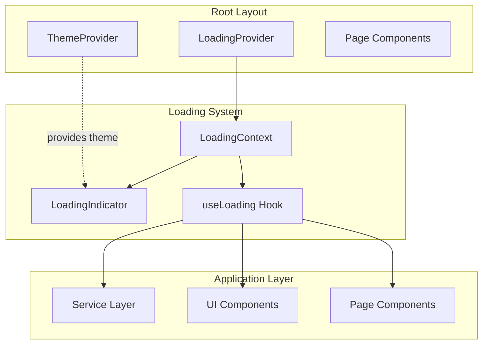
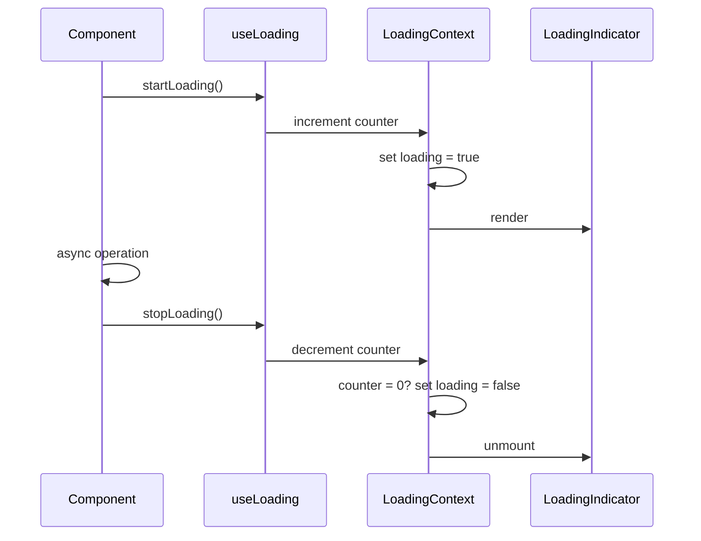

# Design Document: Global Loading Indicator

## Overview

The global loading indicator feature provides consistent, application-wide visual feedback during asynchronous operations in the IntelliDepo frontend. This design implements a centralized loading state management system using React Context API, integrated with the existing Next.js App Router architecture, Zustand state management patterns, and Tailwind CSS theme system.

### Core Design Principles

1. **Centralized State Management**: Single source of truth for loading state using React Context
2. **Developer Experience**: Simple, intuitive APIs for controlling loading state
3. **Performance**: GPU-accelerated animations, minimal re-renders
4. **Accessibility**: WCAG 2.1 AA compliant with proper ARIA attributes
5. **Theme Integration**: Seamless integration with existing light/dark theme system
6. **Resilience**: Automatic timeout recovery and error handling

### Key Features

- Global loading context accessible to all components
- Visual spinner with semi-transparent backdrop
- Automatic show/hide based on async operation lifecycle
- Support for concurrent operations via reference counting
- Theme-aware styling using CSS variables
- Accessibility features including ARIA live regions
- Developer-friendly hooks and utilities
- Automatic 30-second timeout safety mechanism

## Architecture

### System Context



### Component Hierarchy

The loading system integrates into the application at the root layout level:

```
RootLayout (app/layout.tsx)
└── ThemeProvider
    └── LoadingProvider (new)
        ├── LoadingIndicator (new, conditional render)
        └── {children} (all pages and components)
```

### State Flow




## Components and Interfaces

### 1. LoadingContext

**Purpose**: Centralized state management for global loading indicator

**Location**: `src/contexts/LoadingContext.tsx`

**Interface**:

```typescript
interface LoadingContextValue {
  loading: boolean;
  startLoading: () => void;
  stopLoading: () => void;
  withLoading: <T>(fn: () => Promise<T>) => Promise<T>;
}
```

**State Structure**:

```typescript
interface LoadingState {
  loading: boolean;
  counter: number;  // Reference counter for concurrent operations
  timeoutId: NodeJS.Timeout | null;  // For automatic timeout recovery
}
```

**Key Behaviors**:

1. **Reference Counting**: Tracks multiple concurrent operations
   - `startLoading()` increments counter
   - `stopLoading()` decrements counter
   - Loading state is true when counter > 0
   - Loading state is false when counter === 0

2. **Timeout Safety**: Prevents stuck loading states
   - Starts 30-second timeout when counter becomes > 0
   - Clears timeout when counter reaches 0
   - Force-stops loading and logs warning if timeout expires
   - Each new operation resets the timeout

3. **Memory Management**:
   - Clears all timeouts on unmount
   - Resets counter on unmount
   - No memory leaks from pending operations


### 2. LoadingProvider

**Purpose**: Context provider component wrapping the application

**Location**: `src/contexts/LoadingContext.tsx` (exported from same file)

**Props**:

```typescript
interface LoadingProviderProps {
  children: React.ReactNode;
}
```

**Implementation Details**:

```typescript
export function LoadingProvider({ children }: LoadingProviderProps) {
  const [state, setState] = useState<LoadingState>({
    loading: false,
    counter: 0,
    timeoutId: null
  });

  const startLoading = useCallback(() => {
    setState(prev => {
      const newCounter = prev.counter + 1;
      const newLoading = newCounter > 0;
      
      // Clear existing timeout and start new one
      if (prev.timeoutId) {
        clearTimeout(prev.timeoutId);
      }
      
      const timeoutId = setTimeout(() => {
        console.warn('[LoadingContext] Automatic timeout recovery triggered');
        setState({ loading: false, counter: 0, timeoutId: null });
      }, 30000);
      
      return { loading: newLoading, counter: newCounter, timeoutId };
    });
  }, []);

  const stopLoading = useCallback(() => {
    setState(prev => {
      const newCounter = Math.max(0, prev.counter - 1);
      const newLoading = newCounter > 0;
      
      // Clear timeout when counter reaches 0
      if (newCounter === 0 && prev.timeoutId) {
        clearTimeout(prev.timeoutId);
        return { loading: false, counter: 0, timeoutId: null };
      }
      
      return { ...prev, loading: newLoading, counter: newCounter };
    });
  }, []);

  
  const withLoading = useCallback(async <T,>(fn: () => Promise<T>): Promise<T> => {
    startLoading();
    try {
      return await fn();
    } finally {
      stopLoading();
    }
  }, [startLoading, stopLoading]);

  // Cleanup on unmount
  useEffect(() => {
    return () => {
      if (state.timeoutId) {
        clearTimeout(state.timeoutId);
      }
    };
  }, [state.timeoutId]);

  return (
    <LoadingContext.Provider value={{
      loading: state.loading,
      startLoading,
      stopLoading,
      withLoading
    }}>
      {children}
      {state.loading && <LoadingIndicator />}
    </LoadingContext.Provider>
  );
}
```

**Integration Point**: Mounted in `src/app/layout.tsx` after ThemeProvider

```typescript
// app/layout.tsx
import { LoadingProvider } from "@/contexts/LoadingContext";

export default function RootLayout({ children }: { children: React.ReactNode }) {
  return (
    <html lang="en" suppressHydrationWarning>
      <body>
        <ThemeProvider>
          <LoadingProvider>
            {children}
          </LoadingProvider>
        </ThemeProvider>
      </body>
    </html>
  );
}
```


### 3. LoadingIndicator Component

**Purpose**: Visual loading spinner with backdrop

**Location**: `src/components/ui/LoadingIndicator.tsx`

**Props**: None (reads theme from context)

**Visual Specification**:

- **Position**: Fixed, centered (both horizontally and vertically)
- **Z-Index**: 9999 (above all other content)
- **Backdrop**: Semi-transparent overlay (bg-black/50 dark mode, bg-white/30 light mode)
- **Spinner**: Rotating circle using CSS animations
- **Size**: 48px × 48px spinner
- **Animation**: 0.75s linear infinite rotation
- **Colors**: 
  - Dark mode: white spinner with opacity gradient
  - Light mode: dark gray spinner with opacity gradient

**Component Structure**:

```typescript
export function LoadingIndicator() {
  const { theme } = useTheme();
  
  return (
    <div 
      className="fixed inset-0 z-[9999] flex items-center justify-center bg-black/50 dark:bg-black/50 light:bg-white/30"
      role="status"
      aria-live="polite"
      aria-label="Loading"
    >
      <div className="flex flex-col items-center gap-4">
        {/* Spinner */}
        <div 
          className="h-12 w-12 animate-spin rounded-full border-4 border-gray-300 border-t-primary dark:border-gray-600 dark:border-t-primary-light"
          aria-hidden="true"
        />
        
        {/* Screen reader text */}
        <span className="sr-only">Loading, please wait</span>
      </div>
    </div>
  );
}
```

**CSS Animation** (if custom animation needed in globals.css):

```css
@keyframes spin-loading {
  from { transform: rotate(0deg); }
  to { transform: rotate(360deg); }
}

.animate-spin-loading {
  animation: spin-loading 0.75s linear infinite;
  will-change: transform;
}
```


### 4. useLoading Hook

**Purpose**: Custom hook for accessing loading context

**Location**: `src/contexts/LoadingContext.tsx` (exported from same file)

**Interface**:

```typescript
export function useLoading(): LoadingContextValue {
  const context = useContext(LoadingContext);
  
  if (!context) {
    throw new Error('useLoading must be used within LoadingProvider');
  }
  
  return context;
}
```

**Usage Examples**:

```typescript
// Example 1: Manual control in a component
function MyComponent() {
  const { startLoading, stopLoading } = useLoading();
  
  const handleClick = async () => {
    startLoading();
    try {
      await fetchData();
    } finally {
      stopLoading();
    }
  };
  
  return <button onClick={handleClick}>Load Data</button>;
}

// Example 2: Using withLoading wrapper
function MyComponent() {
  const { withLoading } = useLoading();
  
  const handleClick = () => {
    withLoading(async () => {
      await fetchData();
    });
  };
  
  return <button onClick={handleClick}>Load Data</button>;
}

// Example 3: In a service layer function
import { useLoading } from '@/contexts/LoadingContext';

// Note: Cannot use hooks in services, so pass functions as arguments
export async function fetchWithLoading(
  startLoading: () => void,
  stopLoading: () => void
) {
  startLoading();
  try {
    const response = await api.get('/data');
    return response.data;
  } finally {
    stopLoading();
  }
}
```


## Data Models

### LoadingState

Internal state maintained by LoadingProvider:

```typescript
interface LoadingState {
  /** Whether the loading indicator is currently visible */
  loading: boolean;
  
  /** Reference counter for tracking concurrent operations */
  counter: number;
  
  /** Timeout ID for automatic recovery (30 seconds) */
  timeoutId: NodeJS.Timeout | null;
}
```

### LoadingContextValue

Public API exposed through React Context:

```typescript
interface LoadingContextValue {
  /** Current loading state (true = visible, false = hidden) */
  loading: boolean;
  
  /** Show the loading indicator (increments operation counter) */
  startLoading: () => void;
  
  /** Hide the loading indicator (decrements operation counter) */
  stopLoading: () => void;
  
  /** Wrap an async function with automatic loading state management */
  withLoading: <T>(fn: () => Promise<T>) => Promise<T>;
}
```

### State Transitions

```
Initial State: { loading: false, counter: 0, timeoutId: null }

startLoading() called:
  counter: 0 → 1
  loading: false → true
  timeoutId: null → setTimeout(..., 30000)

startLoading() called again (concurrent operation):
  counter: 1 → 2
  loading: true (unchanged)
  timeoutId: cleared and reset to new setTimeout(..., 30000)

stopLoading() called:
  counter: 2 → 1
  loading: true (unchanged, counter still > 0)
  timeoutId: unchanged

stopLoading() called again:
  counter: 1 → 0
  loading: true → false
  timeoutId: cleared, set to null

Timeout expires (emergency recovery):
  counter: any → 0
  loading: any → false
  timeoutId: null
  console.warn() emitted
```


## Correctness Properties

*A property is a characteristic or behavior that should hold true across all valid executions of a system—essentially, a formal statement about what the system should do. Properties serve as the bridge between human-readable specifications and machine-verifiable correctness guarantees.*

### Property 1: Reference Counting Invariant

*For any* sequence of `startLoading()` and `stopLoading()` calls, the following invariants SHALL hold:

1. The internal operation counter SHALL never be negative (counter >= 0)
2. The loading state SHALL be true if and only if the counter is greater than zero
3. The loading state SHALL be false if and only if the counter equals zero
4. Calling `stopLoading()` when counter is already 0 SHALL NOT cause the counter to become negative

**Validates: Requirements 3.4, 3.5, 3.6**

This property ensures that the reference counting mechanism correctly tracks multiple concurrent operations. Testing with randomly generated sequences of start/stop operations (100+ iterations) will verify that the system maintains correct state under all possible operation patterns, including:
- Single operation (start, then stop)
- Multiple concurrent operations (multiple starts before any stops)
- Unbalanced operations (more stops than starts)
- Interleaved operations (start, start, stop, start, stop, stop)
- Edge cases (stopping when already at zero)

The property-based test will generate random sequences and verify the invariants hold at each step, ensuring no race conditions or state inconsistencies exist in the implementation.


## Error Handling

### 1. Context Usage Errors

**Scenario**: Component uses `useLoading()` outside of `LoadingProvider`

**Handling**:
```typescript
export function useLoading(): LoadingContextValue {
  const context = useContext(LoadingContext);
  
  if (!context) {
    throw new Error(
      'useLoading must be used within LoadingProvider. ' +
      'Ensure LoadingProvider wraps your component tree in app/layout.tsx'
    );
  }
  
  return context;
}
```

**User Impact**: Development-time error with clear instructions for resolution

### 2. Unbalanced Operation Calls

**Scenario**: `stopLoading()` called more times than `startLoading()`

**Handling**: 
- Counter uses `Math.max(0, prev.counter - 1)` to prevent negative values
- Loading state remains false when counter is 0
- No error thrown (graceful degradation)

**User Impact**: None (system remains functional)

### 3. Async Operation Failures

**Scenario**: Operation wrapped in `withLoading()` throws an error

**Handling**:
```typescript
const withLoading = async <T,>(fn: () => Promise<T>): Promise<T> => {
  startLoading();
  try {
    return await fn();
  } finally {
    stopLoading();  // Always called, even on error
  }
};
```

**User Impact**: Loading indicator properly dismissed, error propagates to caller

### 4. Stuck Loading State

**Scenario**: Developer forgets to call `stopLoading()` or operation hangs

**Handling**:
- 30-second timeout automatically resets loading state
- Warning logged to console with timestamp
- Counter reset to 0 to ensure clean state

**User Impact**: Loading indicator automatically dismissed after 30 seconds, user can continue interaction


### 5. Memory Leaks

**Scenario**: Provider unmounts with active timeout

**Handling**:
```typescript
useEffect(() => {
  return () => {
    if (state.timeoutId) {
      clearTimeout(state.timeoutId);
    }
  };
}, [state.timeoutId]);
```

**User Impact**: None (cleanup prevents memory leaks)

### 6. Theme System Unavailable

**Scenario**: ThemeProvider not available or theme context is undefined

**Handling**:
- LoadingIndicator uses Tailwind classes with both light/dark variants
- CSS variables have fallback values
- Component renders with default dark theme styling if theme is undefined

**User Impact**: Loading indicator displays with functional styling, may not match exact theme

### 7. Rapid State Changes

**Scenario**: Multiple operations start and stop in rapid succession

**Handling**:
- React batches state updates automatically
- Reference counting prevents premature dismissal
- Timeout reset on each `startLoading()` prevents false timeouts

**User Impact**: Smooth loading indicator behavior without flickering

## Testing Strategy

### Unit Tests (Example-Based)

Unit tests will cover specific scenarios and edge cases:

1. **Context API Tests**:
   - Provider renders children correctly
   - Hook throws error when used outside provider
   - Context values are accessible to child components

2. **State Management Tests**:
   - `startLoading()` sets loading to true
   - `stopLoading()` sets loading to false when counter reaches 0
   - Counter never goes negative
   - Single operation lifecycle (start → stop)
   - Multiple concurrent operations (start, start, stop, stop)
   - Unbalanced operations (extra stops)

3. **Loading Indicator Tests**:
   - Renders when loading is true
   - Does not render when loading is false
   - Contains correct ARIA attributes
   - Has correct positioning classes (fixed, centered, z-index)
   - Has backdrop with opacity
   - Has spinner with animation class


4. **withLoading Tests**:
   - Wraps async function correctly
   - Shows loading during operation
   - Hides loading after success
   - Hides loading after error
   - Propagates return value
   - Propagates errors

5. **Timeout Recovery Tests**:
   - Timeout fires after 30 seconds of inactivity
   - Timeout resets loading state to false
   - Timeout resets counter to 0
   - Console warning is logged
   - Timeout is cleared when operations complete normally
   - Timeout is cleared on unmount

6. **Theme Integration Tests**:
   - Dark mode: uses light-colored spinner and dark backdrop
   - Light mode: uses dark-colored spinner and light backdrop
   - Styling updates when theme changes
   - Fallback styling works when theme is undefined

7. **Accessibility Tests**:
   - Has role="status"
   - Has aria-live="polite"
   - Has aria-label="Loading"
   - Contains sr-only text "Loading, please wait"
   - Does not trap keyboard focus
   - Backdrop is not focusable

### Property-Based Tests

Property-based testing will validate the reference counting invariant:

**Test Framework**: Use `fast-check` for TypeScript property-based testing

**Test Configuration**:
- Minimum 100 iterations per test
- Generate random sequences of 10-50 operations
- Test both balanced and unbalanced sequences

**Property Test 1: Reference Counting Invariant**

Tag: `Feature: global-loading-indicator, Property 1: Reference counting maintains correct state for any sequence of operations`

```typescript
import fc from 'fast-check';

// Generate a sequence of operations
type Operation = 'start' | 'stop';

fc.assert(
  fc.property(
    fc.array(fc.oneof(fc.constant('start'), fc.constant('stop')), { minLength: 1, maxLength: 50 }),
    (operations: Operation[]) => {
      const state = { loading: false, counter: 0 };
      
      for (const op of operations) {
        if (op === 'start') {
          state.counter++;
          state.loading = state.counter > 0;
        } else {
          state.counter = Math.max(0, state.counter - 1);
          state.loading = state.counter > 0;
        }
        
        // Invariants
        expect(state.counter).toBeGreaterThanOrEqual(0);
        expect(state.loading).toBe(state.counter > 0);
      }
    }
  ),
  { numRuns: 100 }
);
```


### Integration Tests

Integration tests will verify the feature works correctly within the application:

1. **Service Layer Integration**:
   - Test API calls with loading wrapper
   - Verify loading shows during fetch
   - Verify loading hides on success
   - Verify loading hides on error
   - Test with real service functions (depotCommand.ts pattern)

2. **Component Integration**:
   - Test button click handlers with async operations
   - Test form submissions with loading
   - Test navigation with loading
   - Test concurrent operations from multiple components

3. **Layout Integration**:
   - Verify provider is correctly mounted in layout.tsx
   - Verify provider wraps all page content
   - Verify indicator appears above all page content
   - Test with multiple route transitions

4. **Theme Integration**:
   - Verify indicator responds to theme changes
   - Test theme transitions while loading
   - Verify CSS variables are applied correctly

### Test File Structure

```
frontend/
├── src/
│   ├── contexts/
│   │   ├── LoadingContext.tsx
│   │   └── __tests__/
│   │       ├── LoadingContext.test.tsx          # Unit tests
│   │       └── LoadingContext.property.test.tsx # Property tests
│   └── components/
│       └── ui/
│           ├── LoadingIndicator.tsx
│           └── __tests__/
│               └── LoadingIndicator.test.tsx     # Component tests
└── __tests__/
    └── integration/
        └── loading-indicator.test.tsx            # Integration tests
```

### Testing Tools

- **Unit & Integration**: Jest + React Testing Library
- **Property-Based**: fast-check
- **Accessibility**: jest-axe
- **Mock Timers**: Jest fake timers for timeout tests

## Implementation Checklist

- [ ] Create `src/contexts/LoadingContext.tsx` with LoadingProvider and useLoading hook
- [ ] Create `src/components/ui/LoadingIndicator.tsx` component
- [ ] Update `src/app/layout.tsx` to include LoadingProvider
- [ ] Install fast-check for property-based testing (`npm install -D fast-check @types/fast-check`)
- [ ] Write unit tests for LoadingContext
- [ ] Write property-based test for reference counting
- [ ] Write unit tests for LoadingIndicator
- [ ] Write integration tests
- [ ] Update service layer functions to use loading wrapper (optional enhancement)
- [ ] Add custom CSS animations if needed in globals.css
- [ ] Test accessibility with jest-axe
- [ ] Manual testing in both light and dark themes
- [ ] Manual testing across different routes
- [ ] Performance profiling to ensure no unnecessary re-renders
