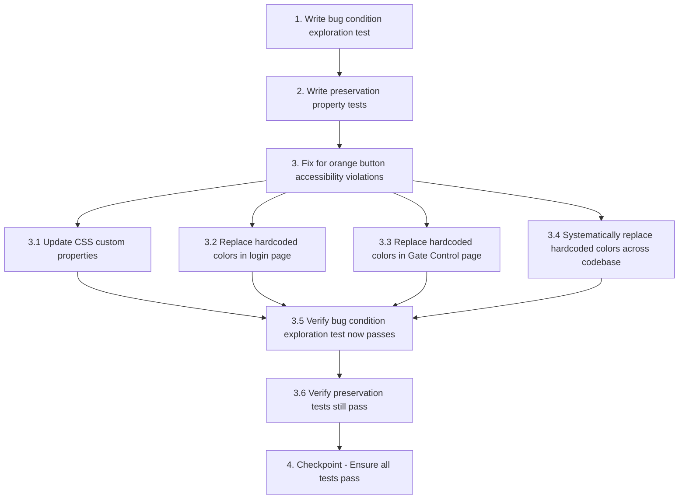

# Implementation Plan

## Overview

This implementation plan follows the bugfix workflow using the bug condition methodology. The tasks are ordered to:
1. **Explore** - Write tests BEFORE fix to understand the bug (Bug Condition)
2. **Preserve** - Write tests for non-buggy behavior (Preservation Requirements)
3. **Implement** - Apply the fix with understanding (Expected Behavior)
4. **Validate** - Verify fix works and doesn't break anything

## Tasks

- [x] 1. Write bug condition exploration test
  - **Property 1: Bug Condition** - Orange Button Contrast Violations
  - **CRITICAL**: This test MUST FAIL on unfixed code - failure confirms the bug exists
  - **DO NOT attempt to fix the test or the code when it fails**
  - **NOTE**: This test encodes the expected behavior - it will validate the fix when it passes after implementation
  - **GOAL**: Surface counterexamples that demonstrate the accessibility violations
  - **Scoped PBT Approach**: Scope the property to concrete failing cases - orange buttons with `#E5521A` color in light and dark themes
  - Test that orange buttons using `#E5521A` fail to meet WCAG AA contrast requirements (from Bug Condition in design)
  - Measure contrast ratios for:
    - Light theme: `#E5521A` background with white text (expect < 4.5:1)
    - Dark theme: `#E5521A` on dark background `#14203A` (expect insufficient distinguishability)
    - Opacity variations: `text-[#E5521A]` on `bg-[#E5521A]/10` (expect < 4.5:1)
    - Gradient button: `linear-gradient(135deg, #E5521A, #FF7A42)` with white text (expect sections < 4.5:1)
  - Test color blindness distinguishability using protanopia, deuteranopia, and tritanopia filters
  - The test assertions should match the Expected Behavior Properties from design:
    - Assert contrast ratio >= 4.5:1 for normal text (or >= 3.0:1 for large text ≥18pt/14pt bold)
    - Assert distinguishability for all CVD types
  - Run test on UNFIXED code
  - **EXPECTED OUTCOME**: Test FAILS (this is correct - it proves the bug exists)
  - Document counterexamples found:
    - Specific contrast ratio values below 4.5:1
    - Which CVD types have distinguishability issues
    - Which button instances fail (Register Vehicle, Register Visitor, Login gradient, etc.)
  - Mark task complete when test is written, run, and failures are documented
  - _Requirements: 1.1, 1.2, 1.3, 1.4, 1.5_

- [x] 2. Write preservation property tests (BEFORE implementing fix)
  - **Property 2: Preservation** - Non-Orange Button Behavior
  - **IMPORTANT**: Follow observation-first methodology
  - Observe behavior on UNFIXED code for non-buggy inputs (non-orange buttons and UI elements)
  - Document observed behavior:
    - Blue buttons (`bg-blue-500`, `bg-[#5B9BF5]`) render with existing colors
    - Green/emerald success buttons maintain their colors
    - Red/destructive action buttons maintain their colors
    - Gray/neutral buttons maintain their colors
    - Theme toggle switches all non-orange elements correctly
    - Hover, focus, active, and disabled states work as expected
    - Button icons render with proper sizing and alignment
    - Non-button orange elements (badges, borders) use existing colors
  - Write property-based tests capturing observed behavior patterns from Preservation Requirements:
    - For all non-orange buttons, verify computed styles match baseline
    - For all button states (hover, focus, active, disabled), verify behavior unchanged
    - For theme toggle, verify non-orange elements switch correctly
    - For non-button orange elements, verify colors unchanged
  - Property-based testing generates many test cases for stronger guarantees:
    - Generate random button configurations (different types, sizes, states, themes)
    - For each non-orange button, assert visual appearance matches baseline
    - Generate random theme toggle sequences and verify consistency
  - Run tests on UNFIXED code
  - **EXPECTED OUTCOME**: Tests PASS (this confirms baseline behavior to preserve)
  - Mark task complete when tests are written, run, and passing on unfixed code
  - _Requirements: 3.1, 3.2, 3.3, 3.4, 3.5, 3.6, 3.7_

- [ ] 3. Fix for orange button accessibility violations

  - [x] 3.1 Update CSS custom properties for accessible orange colors
    - Open `frontend/src/app/globals.css`
    - Update light theme `--accent` variable from `#E5521A` to darker, more saturated orange (e.g., `#C74416` or `#B83E12`)
    - Verify new light theme color provides ≥4.5:1 contrast with white text using WebAIM Contrast Checker
    - Update light theme `--accent-hover` to maintain visual hierarchy
    - Update dark theme `--accent` variable to adjusted shade (e.g., `#F06030` or `#E85A28`)
    - Verify new dark theme color provides ≥4.5:1 contrast and is distinguishable for CVD users
    - Create additional CSS variables for different orange use cases:
      - `--accent-button-bg`: For button backgrounds with white text
      - `--accent-text`: For orange text on light/dark backgrounds
      - `--accent-subtle-bg`: For low-opacity backgrounds with orange text
    - Test with color blindness simulators (Coblis, Color Oracle) for protanopia, deuteranopia, tritanopia
    - _Bug_Condition: isBugCondition(element) where element uses `#E5521A` with text content and fails contrast requirements_
    - _Expected_Behavior: Contrast ratio ≥ 4.5:1 for normal text (or ≥ 3.0:1 for large text) and distinguishable for all CVD types_
    - _Preservation: Non-orange buttons, theme switching, button states, and non-button orange elements remain unchanged_
    - _Requirements: 1.1, 1.2, 1.3, 1.4, 2.1, 2.2, 2.3, 2.4, 3.1, 3.2, 3.3, 3.4, 3.5, 3.6, 3.7_

  - [x] 3.2 Replace hardcoded orange colors in login page
    - Open `frontend/src/app/login/page.tsx`
    - Replace hardcoded `#E5521A` with CSS variable `var(--accent)` or `var(--accent-button-bg)`
    - Update gradient button `linear-gradient(135deg, #E5521A, #FF7A42)` to use CSS variables or new accessible color values
    - Ensure all points along gradient meet ≥4.5:1 contrast with white text
    - Update "Use" demo credential buttons to use CSS variables
    - Verify contrast requirements met for all button states (normal, hover, active, disabled)
    - _Bug_Condition: Login page buttons use `#E5521A` with insufficient contrast_
    - _Expected_Behavior: All login page buttons meet WCAG AA contrast standards_
    - _Preservation: Non-orange login page elements remain unchanged_
    - _Requirements: 1.1, 1.2, 1.4, 2.1, 2.2, 2.4, 3.2, 3.6, 3.7_

  - [x] 3.3 Replace hardcoded orange colors in Gate Control page
    - Open `frontend/src/components/depot/operations/GateConsolePage.tsx`
    - Replace hardcoded `#E5521A` in "Register Vehicle" button with CSS variable
    - Replace hardcoded `#E5521A` in "Register Visitor" button with CSS variable
    - Replace hardcoded `#E5521A` in gate selection buttons (e.g., "GATE-A - Gate A — North Entry") with CSS variable
    - Verify button text contrast in both light and dark themes meets ≥4.5:1 requirement
    - Test with color blindness simulators to ensure distinguishability
    - _Bug_Condition: Gate Control buttons use `#E5521A` with insufficient contrast_
    - _Expected_Behavior: All Gate Control buttons meet WCAG AA contrast standards_
    - _Preservation: Non-orange Gate Control elements remain unchanged_
    - _Requirements: 1.1, 1.2, 1.3, 1.4, 1.5, 2.1, 2.2, 2.3, 2.4, 2.5, 3.1, 3.2, 3.4_

  - [x] 3.4 Systematically replace hardcoded orange colors across codebase
    - Search for all instances of `bg-[#E5521A]` in the codebase
    - Search for all instances of `text-[#E5521A]` in the codebase
    - Search for all instances of `border-[#E5521A]` in the codebase
    - For each button or interactive element with text, replace with appropriate CSS variable
    - For non-button decorative elements, verify if they need contrast compliance (if they contain text)
    - Review opacity-based variations (`/10`, `/20`, `/30`) and ensure text on these backgrounds meets contrast requirements
    - May need to adjust opacity levels or use different CSS variables for subtle backgrounds
    - Document all files changed and verify no regressions
    - _Bug_Condition: Multiple components use hardcoded `#E5521A` with insufficient contrast_
    - _Expected_Behavior: All orange buttons meet WCAG AA contrast standards_
    - _Preservation: Non-button orange elements and non-orange UI elements remain unchanged_
    - _Requirements: 1.1, 1.2, 1.3, 1.4, 1.5, 2.1, 2.2, 2.3, 2.4, 2.5, 3.1, 3.2, 3.3, 3.4, 3.5, 3.6, 3.7_

  - [ ] 3.5 Verify bug condition exploration test now passes
    - **Property 1: Expected Behavior** - Orange Button Contrast Compliance
    - **IMPORTANT**: Re-run the SAME test from task 1 - do NOT write a new test
    - The test from task 1 encodes the expected behavior
    - When this test passes, it confirms the expected behavior is satisfied
    - Run bug condition exploration test from step 1
    - Verify all contrast ratio assertions now pass:
      - Light theme orange buttons: contrast ratio ≥ 4.5:1 with white text
      - Dark theme orange buttons: contrast ratio ≥ 4.5:1 and distinguishable for CVD users
      - Opacity variations: text on subtle backgrounds meets ≥ 4.5:1
      - Gradient button: all points along gradient meet ≥ 4.5:1 with white text
    - Verify color blindness distinguishability assertions pass for protanopia, deuteranopia, tritanopia
    - **EXPECTED OUTCOME**: Test PASSES (confirms bug is fixed)
    - Document that all previously failing cases now pass
    - _Requirements: 2.1, 2.2, 2.3, 2.4, 2.5_

  - [~] 3.6 Verify preservation tests still pass
    - **Property 2: Preservation** - Non-Orange Button Behavior
    - **IMPORTANT**: Re-run the SAME tests from task 2 - do NOT write new tests
    - Run preservation property tests from step 2
    - Verify all non-orange button assertions still pass:
      - Blue, green, red, gray buttons render identically to baseline
      - Theme toggle works correctly for all non-orange elements
      - Hover, focus, active, disabled states unchanged for non-orange buttons
      - Button icons render with proper sizing and alignment
      - Non-button orange elements (badges, borders) use existing colors
    - **EXPECTED OUTCOME**: Tests PASS (confirms no regressions)
    - Confirm all tests still pass after fix (no regressions)
    - If any preservation test fails, investigate and fix the regression before proceeding
    - _Requirements: 3.1, 3.2, 3.3, 3.4, 3.5, 3.6, 3.7_

- [~] 4. Checkpoint - Ensure all tests pass
  - Run full test suite including:
    - Bug condition exploration test (Property 1) - should PASS
    - Preservation property tests (Property 2) - should PASS
    - Unit tests for contrast ratio calculations
    - Integration tests for Gate Control and Login pages
    - Visual regression tests for non-orange elements
  - Verify all tests pass with no failures
  - Run manual accessibility checks:
    - WebAIM Contrast Checker for all orange buttons in both themes
    - Color blindness simulators (Color Oracle, Coblis) for protanopia, deuteranopia, tritanopia
    - Screen reader testing (NVDA, JAWS, VoiceOver)
    - Browser accessibility tools (Lighthouse, axe DevTools)
    - Cross-browser testing (Chrome, Firefox, Safari, Edge)
    - Mobile device testing with different brightness levels
  - Document any issues found and resolve before marking complete
  - If any questions or unexpected issues arise, ask the user for guidance
  - Ensure all requirements are satisfied and no regressions introduced


## Task Dependency Graph



```json
{
  "waves": [
    {
      "name": "Exploration",
      "tasks": ["1", "2"]
    },
    {
      "name": "Implementation",
      "tasks": ["3.1", "3.2", "3.3", "3.4"]
    },
    {
      "name": "Validation",
      "tasks": ["3.5", "3.6", "4"]
    }
  ]
}
```

## Notes

- **Critical**: Tasks 1 and 2 MUST be completed BEFORE implementing the fix (task 3)
- **Property 1 (Bug Condition)**: The exploration test will FAIL on unfixed code - this is expected and confirms the bug exists
- **Property 2 (Preservation)**: The preservation tests will PASS on unfixed code - this establishes the baseline behavior to preserve
- **Testing Tools**: Use WebAIM Contrast Checker, Color Oracle/Coblis simulators, and browser accessibility tools (Lighthouse, axe DevTools)
- **WCAG AA Standards**: Minimum 4.5:1 contrast ratio for normal text, 3.0:1 for large text (≥18pt or ≥14pt bold)
- **Color Vision Deficiencies**: Test for protanopia (red-blind), deuteranopia (green-blind), and tritanopia (blue-blind)
- **Scope**: Only orange buttons with `#E5521A` color are affected; all other UI elements must remain unchanged
