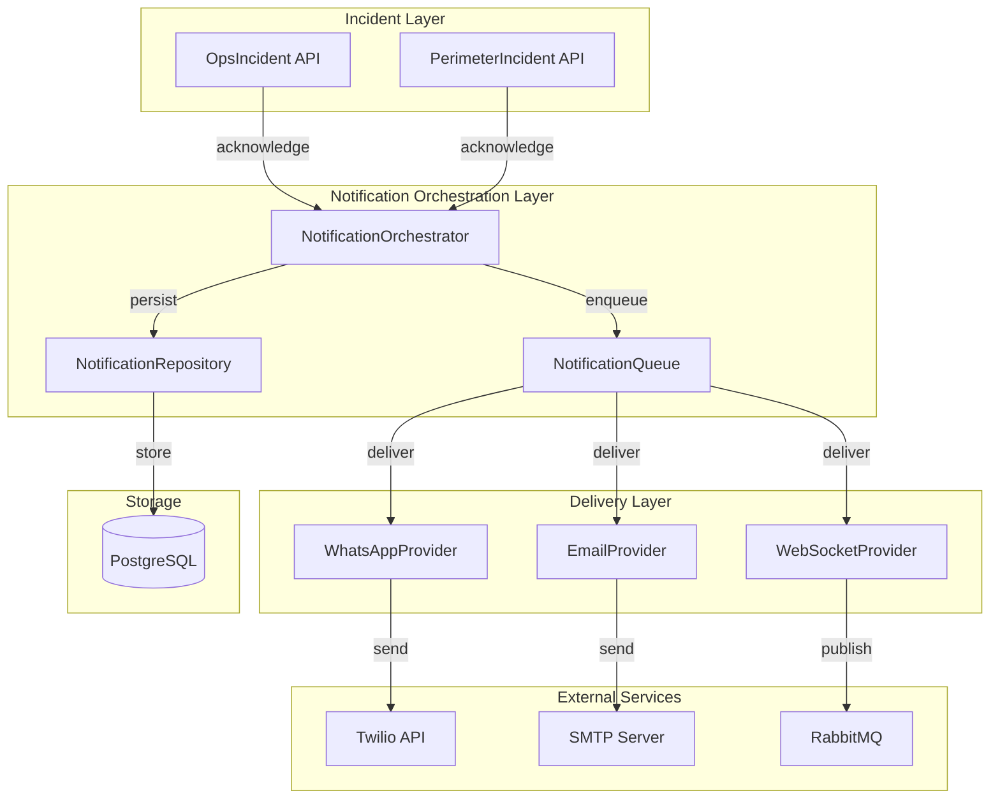

# Design Document: Incident Notification and Assignment Enhancement

## Overview

This feature enhances the incident acknowledgment workflow by implementing real notification delivery (WhatsApp and Email) and real-time assignment popup notifications. Currently, both OpsIncident and PerimeterIncident systems only log notifications without actually sending them. This design introduces a unified notification service that integrates with external providers (Twilio for WhatsApp, SMTP for Email) and WebSocket for real-time browser notifications. The system ensures reliable, trackable, and auditable notification delivery across multiple channels while maintaining backward compatibility with existing incident management workflows.

## Architecture

The notification enhancement follows a layered architecture with clear separation between incident management, notification orchestration, and delivery channels:



## Main Algorithm/Workflow

```mermaid
sequenceDiagram
    participant Client as Web Client
    participant API as Incident API
    participant Orch as NotificationOrchestrator
    participant Queue as NotificationQueue
    participant WA as WhatsAppProvider
    participant Email as EmailProvider
    participant WS as WebSocketProvider
    participant DB as Database
    
    Client->>API: PATCH /incidents/{id}/acknowledge
    API->>Orch: send_incident_notifications(incident, user)
    
    Orch->>DB: Create notification records
    Orch->>Queue: Enqueue WhatsApp notification
    Orch->>Queue: Enqueue Email notification
    Orch->>Queue: Enqueue WebSocket notification
    
    par Parallel Delivery
        Queue->>WA: deliver(notification)
        WA->>WA: Format WhatsApp message
        WA-->>Twilio: Send message
        Twilio-->>WA: Delivery status
        WA->>DB: Update status (sent/failed)
        
        Queue->>Email: deliver(notification)
        Email->>Email: Format HTML email
        Email-->>SMTP: Send email
        SMTP-->>Email: Delivery status
        Email->>DB: Update status (sent/failed)
        
        Queue->>WS: deliver(notification)
        WS->>WS: Format popup payload
        WS-->>RabbitMQ: Publish to user channel
        RabbitMQ-->>Client: Real-time popup
        WS->>DB: Update status (delivered)
    end
    
    Orch-->>API: Notification summary
    API-->>Client: 200 OK with incident data


## Components and Interfaces

### Component 1: NotificationOrchestrator

**Purpose**: Coordinates notification delivery across multiple channels for incident acknowledgment events

**Interface**:
```python
class NotificationOrchestrator:
    async def send_incident_notifications(
        self,
        incident: Union[OpsIncident, PerimeterIncident],
        acknowledged_by: User,
        db: AsyncSession
    ) -> NotificationSummary:
        """
        Orchestrate multi-channel notifications for incident acknowledgment.
        
        Args:
            incident: The incident being acknowledged
            acknowledged_by: User who acknowledged the incident
            db: Database session
            
        Returns:
            Summary of notification delivery status
        """
        pass
    
    async def get_notification_recipients(
        self,
        incident: Union[OpsIncident, PerimeterIncident]
    ) -> List[NotificationRecipient]:
        """Determine who should receive notifications based on incident properties."""
        pass
```

**Responsibilities**:
- Determine notification recipients based on incident properties
- Create notification records in database
- Enqueue notifications for async delivery
- Return delivery summary to caller
- Handle errors gracefully without blocking incident acknowledgment

### Component 2: NotificationProvider (Abstract Base)

**Purpose**: Define common interface for all notification delivery channels

**Interface**:
```python
class NotificationProvider(ABC):
    @abstractmethod
    async def send(
        self,
        notification: IncidentNotification,
        incident: Union[OpsIncident, PerimeterIncident],
        recipient: NotificationRecipient
    ) -> DeliveryResult:
        """Send notification through this channel."""
        pass
    
    @abstractmethod
    async def format_message(
        self,
        incident: Union[OpsIncident, PerimeterIncident],
        recipient: NotificationRecipient
    ) -> str:
        """Format incident data for this channel."""
        pass
```


**Responsibilities**:
- Define standard interface for all delivery channels
- Ensure consistent error handling across providers
- Support retry logic for failed deliveries

### Component 3: WhatsAppProvider

**Purpose**: Deliver notifications via WhatsApp using Twilio API

**Interface**:
```python
class WhatsAppProvider(NotificationProvider):
    def __init__(self, twilio_client: TwilioClient, config: WhatsAppConfig):
        """Initialize with Twilio client and configuration."""
        pass
    
    async def send(
        self,
        notification: IncidentNotification,
        incident: Union[OpsIncident, PerimeterIncident],
        recipient: NotificationRecipient
    ) -> DeliveryResult:
        """Send WhatsApp message via Twilio."""
        pass
    
    async def format_message(
        self,
        incident: Union[OpsIncident, PerimeterIncident],
        recipient: NotificationRecipient
    ) -> str:
        """Format incident as WhatsApp message with emojis and structure."""
        pass
```

**Responsibilities**:
- Format incident data as WhatsApp-friendly message
- Send message via Twilio WhatsApp API
- Handle Twilio-specific errors and rate limits
- Update notification status based on delivery result

### Component 4: EmailProvider

**Purpose**: Deliver notifications via Email using SMTP

**Interface**:
```python
class EmailProvider(NotificationProvider):
    def __init__(self, smtp_config: SMTPConfig):
        """Initialize with SMTP configuration."""
        pass
    
    async def send(
        self,
        notification: IncidentNotification,
        incident: Union[OpsIncident, PerimeterIncident],
        recipient: NotificationRecipient
    ) -> DeliveryResult:
        """Send email via SMTP."""
        pass
    
    async def format_message(
        self,
        incident: Union[OpsIncident, PerimeterIncident],
        recipient: NotificationRecipient
    ) -> str:
        """Format incident as HTML email."""
        pass
```


**Responsibilities**:
- Format incident data as HTML email with styling
- Send email via SMTP server
- Handle SMTP-specific errors and authentication
- Support email templates for consistent branding

### Component 5: WebSocketProvider

**Purpose**: Deliver real-time popup notifications to connected web clients

**Interface**:
```python
class WebSocketProvider(NotificationProvider):
    def __init__(self, rabbitmq_publisher: RabbitMQPublisher):
        """Initialize with RabbitMQ publisher for WebSocket fanout."""
        pass
    
    async def send(
        self,
        notification: IncidentNotification,
        incident: Union[OpsIncident, PerimeterIncident],
        recipient: NotificationRecipient
    ) -> DeliveryResult:
        """Publish popup notification to user's WebSocket channel."""
        pass
    
    async def format_message(
        self,
        incident: Union[OpsIncident, PerimeterIncident],
        recipient: NotificationRecipient
    ) -> dict:
        """Format incident as popup payload with assignment details."""
        pass
```

**Responsibilities**:
- Format incident data as popup notification payload
- Publish to user-specific RabbitMQ channel
- Support multiple connected clients per user
- Include assignment details prominently

### Component 6: NotificationRepository

**Purpose**: Persist and query notification records

**Interface**:
```python
class NotificationRepository:
    async def create_notification(
        self,
        incident_id: uuid.UUID,
        channel: NotificationChannel,
        recipient: NotificationRecipient,
        status: NotificationStatus,
        metadata: dict,
        db: AsyncSession
    ) -> IncidentNotification:
        """Create a new notification record."""
        pass
    
    async def update_status(
        self,
        notification_id: uuid.UUID,
        status: NotificationStatus,
        error_message: Optional[str],
        db: AsyncSession
    ) -> None:
        """Update notification delivery status."""
        pass
    
    async def get_incident_notifications(
        self,
        incident_id: uuid.UUID,
        db: AsyncSession
    ) -> List[IncidentNotification]:
        """Retrieve all notifications for an incident."""
        pass
```


**Responsibilities**:
- Create notification records with proper metadata
- Update delivery status atomically
- Query notification history for auditing
- Support filtering by channel, status, and time range

## Data Models

### Model 1: IncidentNotification (Enhanced)

```python
class IncidentNotification(DBBaseModel):
    """Enhanced notification record with delivery tracking."""
    __tablename__ = "incident_notifications"
    
    incident_id: uuid.UUID  # FK to ops_incidents or perimeter_incidents
    incident_type: str  # "ops" or "perimeter"
    channel: str  # "whatsapp", "email", "websocket"
    recipient_id: Optional[uuid.UUID]  # User ID if known
    recipient_identifier: str  # Phone number, email, or user ID
    status: str  # "pending", "sent", "delivered", "failed", "read"
    error_message: Optional[str]
    sent_at: Optional[datetime]
    delivered_at: Optional[datetime]
    read_at: Optional[datetime]
    retry_count: int = 0
    max_retries: int = 3
    metadata_json: dict  # Incident details, provider response, etc.
```

**Validation Rules**:
- `incident_id` must reference valid incident
- `channel` must be one of: "whatsapp", "email", "websocket"
- `status` must be one of: "pending", "sent", "delivered", "failed", "read"
- `recipient_identifier` must be non-empty
- `retry_count` must not exceed `max_retries`

### Model 2: NotificationRecipient

```python
class NotificationRecipient(BaseModel):
    """Recipient information for notifications."""
    user_id: Optional[uuid.UUID]
    name: str
    email: Optional[str]
    phone: Optional[str]
    role: str  # "assigned", "supervisor", "escalation"
    preferences: dict  # Channel preferences, quiet hours, etc.
```

**Validation Rules**:
- At least one of `email` or `phone` must be provided
- `phone` must be in E.164 format if provided
- `email` must be valid email format if provided
- `role` must be one of: "assigned", "supervisor", "escalation"

### Model 3: NotificationSummary

```python
class NotificationSummary(BaseModel):
    """Summary of notification delivery results."""
    total_sent: int
    successful: int
    failed: int
    pending: int
    by_channel: dict[str, int]  # Count per channel
    failed_channels: List[str]  # Channels that failed
    error_messages: List[str]  # Error details
```


**Validation Rules**:
- All counts must be non-negative
- `total_sent` should equal sum of `successful`, `failed`, and `pending`
- `by_channel` keys must be valid channel names

### Model 4: WhatsAppConfig

```python
class WhatsAppConfig(BaseModel):
    """Configuration for WhatsApp provider."""
    account_sid: str
    auth_token: str
    from_number: str  # WhatsApp-enabled Twilio number
    enabled: bool = True
    rate_limit_per_second: int = 10
    timeout_seconds: int = 30
```

**Validation Rules**:
- `from_number` must be in E.164 format
- `rate_limit_per_second` must be positive
- `timeout_seconds` must be between 5 and 120

### Model 5: SMTPConfig

```python
class SMTPConfig(BaseModel):
    """Configuration for Email provider."""
    host: str
    port: int
    username: str
    password: str
    from_email: str
    from_name: str = "IntelliDepo Alerts"
    use_tls: bool = True
    enabled: bool = True
    timeout_seconds: int = 30
```

**Validation Rules**:
- `port` must be valid port number (1-65535)
- `from_email` must be valid email format
- `timeout_seconds` must be between 5 and 120

## Algorithmic Pseudocode

### Main Notification Algorithm

```python
async def send_incident_notifications(
    incident: Union[OpsIncident, PerimeterIncident],
    acknowledged_by: User,
    db: AsyncSession
) -> NotificationSummary:
    """
    Main algorithm for sending multi-channel notifications.
    
    Preconditions:
    - incident is valid and acknowledged
    - acknowledged_by is authenticated user
    - db session is active
    
    Postconditions:
    - Notification records created in database
    - Notifications enqueued for delivery
    - Summary returned with delivery status
    """
    
    # Step 1: Determine recipients
    recipients = await get_notification_recipients(incident)
    assert len(recipients) > 0, "Must have at least one recipient"
    
    # Step 2: Initialize summary
    summary = NotificationSummary(
        total_sent=0, successful=0, failed=0, pending=0,
        by_channel={}, failed_channels=[], error_messages=[]
    )
    
    # Step 3: Create and send notifications for each recipient and channel
    for recipient in recipients:
        for channel in ["whatsapp", "email", "websocket"]:
            # Skip if recipient doesn't have contact info for channel
            if not can_send_to_channel(recipient, channel):
                continue
            
            try:
                # Create notification record
                notification = await create_notification_record(
                    incident, recipient, channel, db
                )
                
                # Enqueue for async delivery
                await enqueue_notification(notification, incident, recipient)
                
                summary.total_sent += 1
                summary.pending += 1
                summary.by_channel[channel] = summary.by_channel.get(channel, 0) + 1
                
            except Exception as e:
                summary.failed += 1
                summary.failed_channels.append(channel)
                summary.error_messages.append(f"{channel}: {str(e)}")
                logger.error(f"Failed to enqueue {channel} notification: {e}")
    
    # Step 4: Commit all notification records
    await db.commit()
    
    return summary
```


### WhatsApp Delivery Algorithm

```python
async def send_whatsapp_notification(
    notification: IncidentNotification,
    incident: Union[OpsIncident, PerimeterIncident],
    recipient: NotificationRecipient,
    config: WhatsAppConfig
) -> DeliveryResult:
    """
    Send WhatsApp message via Twilio.
    
    Preconditions:
    - notification.channel == "whatsapp"
    - recipient.phone is valid E.164 format
    - config.enabled == True
    - Twilio credentials are valid
    
    Postconditions:
    - Message sent to Twilio API
    - notification.status updated to "sent" or "failed"
    - notification.sent_at timestamp set
    - DeliveryResult returned with status
    """
    
    # Step 1: Format message
    message = format_whatsapp_message(incident, recipient)
    assert len(message) > 0, "Message must not be empty"
    assert len(message) <= 1600, "WhatsApp message too long"
    
    # Step 2: Initialize Twilio client
    client = TwilioClient(config.account_sid, config.auth_token)
    
    # Step 3: Send message with retry logic
    max_attempts = 3
    attempt = 0
    
    while attempt < max_attempts:
        try:
            # Send via Twilio
            response = await client.messages.create(
                from_=f"whatsapp:{config.from_number}",
                to=f"whatsapp:{recipient.phone}",
                body=message
            )
            
            # Update notification status
            notification.status = "sent"
            notification.sent_at = datetime.now(timezone.utc)
            notification.metadata_json["twilio_sid"] = response.sid
            
            return DeliveryResult(
                success=True,
                channel="whatsapp",
                provider_response=response.sid
            )
            
        except TwilioException as e:
            attempt += 1
            notification.retry_count = attempt
            
            if attempt >= max_attempts:
                notification.status = "failed"
                notification.error_message = str(e)
                return DeliveryResult(
                    success=False,
                    channel="whatsapp",
                    error_message=str(e)
                )
            
            # Exponential backoff
            await asyncio.sleep(2 ** attempt)
```


### Email Delivery Algorithm

```python
async def send_email_notification(
    notification: IncidentNotification,
    incident: Union[OpsIncident, PerimeterIncident],
    recipient: NotificationRecipient,
    config: SMTPConfig
) -> DeliveryResult:
    """
    Send email via SMTP.
    
    Preconditions:
    - notification.channel == "email"
    - recipient.email is valid email format
    - config.enabled == True
    - SMTP credentials are valid
    
    Postconditions:
    - Email sent via SMTP
    - notification.status updated to "sent" or "failed"
    - notification.sent_at timestamp set
    - DeliveryResult returned with status
    """
    
    # Step 1: Format HTML email
    html_body = format_email_html(incident, recipient)
    text_body = format_email_text(incident, recipient)
    subject = f"[{incident.priority}] Incident Assigned: {incident.title}"
    
    # Step 2: Create email message
    message = MIMEMultipart("alternative")
    message["Subject"] = subject
    message["From"] = f"{config.from_name} <{config.from_email}>"
    message["To"] = recipient.email
    message.attach(MIMEText(text_body, "plain"))
    message.attach(MIMEText(html_body, "html"))
    
    # Step 3: Send via SMTP with retry logic
    max_attempts = 3
    attempt = 0
    
    while attempt < max_attempts:
        try:
            # Connect to SMTP server
            if config.use_tls:
                server = smtplib.SMTP(config.host, config.port, timeout=config.timeout_seconds)
                server.starttls()
            else:
                server = smtplib.SMTP(config.host, config.port, timeout=config.timeout_seconds)
            
            # Authenticate and send
            server.login(config.username, config.password)
            server.send_message(message)
            server.quit()
            
            # Update notification status
            notification.status = "sent"
            notification.sent_at = datetime.now(timezone.utc)
            
            return DeliveryResult(
                success=True,
                channel="email",
                provider_response="sent"
            )
            
        except (smtplib.SMTPException, OSError) as e:
            attempt += 1
            notification.retry_count = attempt
            
            if attempt >= max_attempts:
                notification.status = "failed"
                notification.error_message = str(e)
                return DeliveryResult(
                    success=False,
                    channel="email",
                    error_message=str(e)
                )
            
            # Exponential backoff
            await asyncio.sleep(2 ** attempt)
```

